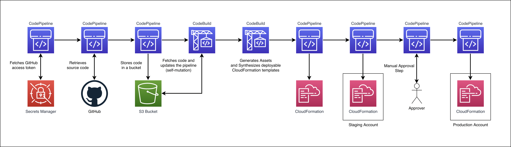
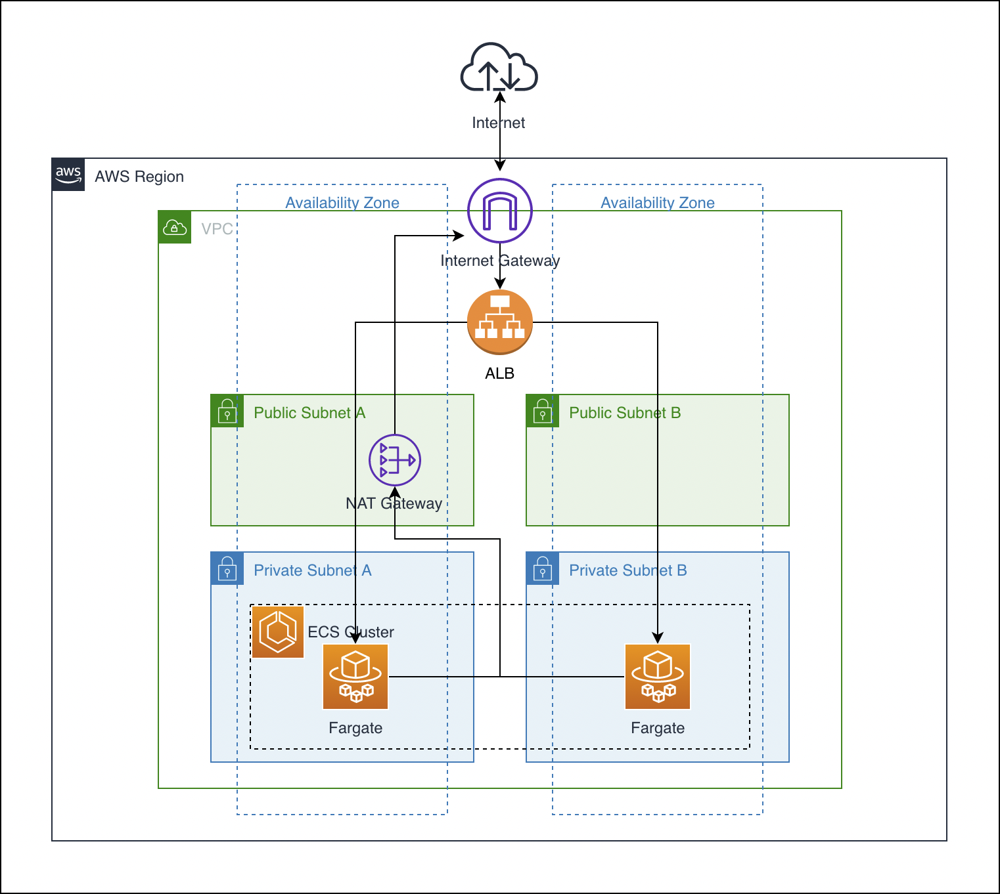

# **Cross-account ECS deployments using CDK Pipelines**

- [Overview](#overview)
- [Architecture](#architecture)
- [Solution overview](#solution-overview)
- [Running costs](#running-costs)
- [Prerequisites](#prerequisites)
- [Installation](#installation)
- [Usage](#usage)
- [Clean up](#clean-up)
- [Security](#security)
- [License](#license)

## Overview

This repository shows how to use CDK Pipelines to create a CI/CD pipeline that:

- Builds a container image from Dockerfile and pushes it to ECR
- Deploys an ECS cluster that runs the image
- Deploys the ECS cluster to staging and production accounts

## Architecture

The following diagram demonstrates what actions the pipeline executes:



In this stack we use [CDK Pipelines](https://aws.amazon.com/blogs/developer/cdk-pipelines-continuous-delivery-for-aws-cdk-applications/) construct to create a CI/CD pipeline that pulls source code from a GitHub repository, builds application (Docker image) and infrastructure (CDK) code, and deploys it all in three different accounts.

The infrastructure deployed by the pipeline looks like following:



The infrastructure consists of the following:

- A [VPC](https://docs.aws.amazon.com/vpc/latest/userguide/what-is-amazon-vpc.html) spanning two Availability Zones with one Public subnet and one Private subnet in each Availability Zone.
- An [ECS Cluster](https://docs.aws.amazon.com/AmazonECS/latest/developerguide/Welcome.html) deployed in Private Subnets and using [AWS Fargate](https://docs.aws.amazon.com/AmazonECS/latest/developerguide/AWS_Fargate.html) as a capacity provider.
- [Application Load Balancer](https://docs.aws.amazon.com/elasticloadbalancing/latest/application/introduction.html) fronting the ECS Cluster.
- In order to minimise the running cost of this demo infrastructure, a NAT Gateway deployed in one Availability Zone instead of two.

## Solution overview

The CDK application is structured as follows:

- `lib/cdk-pipeline-stack.ts` contains the definition of the CI/CD pipeline. The main component here is the `CodePipeline` construct that creates the pipeline for us, all we need to do is specify the source repository and personal access token name stored in Secrets Manager

```tsx
const pipeline = new CodePipeline(this, 'Pipeline', {
  crossAccountKeys: true,
  synth: new ShellStep('Synth', {
    input: CodePipelineSource.gitHub(GITHUB_REPO, BRANCH_NAME, {
      authentication: SecretValue.secretsManager(GITHUB_TOKEN)
    }),
    commands: ['npm ci', 'npm run build', 'npx cdk synth']
  })
});
```

Note that this version of `CodePipeline` construct is imported from `@aws-cdk/pipelines` library and is different from a regular pipeline from `@aws-cdk/codepipeline` library.
Since this CDK application is written in TypeScript, the commands used in the `synth` step are specific to TypeScript. In case you want to adopt this code to, for example, Python, you will need to change the commands accordingly, check [here](https://docs.aws.amazon.com/cdk/api/v2/python/aws_cdk.pipelines/README.html#commands-for-other-languages-and-package-managers) for reference.

We instruct the pipeline to deploy our application resources by adding **Stages** to it:

```tsx
const devStage = new BaseStage(this, 'DevStage', {
  env: {
    account: DEV_ACCOUNT_ID,
    region: AWS_REGION
  },
  customGreeting: 'Hi from Dev account',
  bg: '#FF0000'
});
```

Each stage of the pipeline must be an instance of `Stage` class. In this project, we create our  `BaseStage` class that extends `Stage` class and accepts custom properties `customGreeting` and `bg` , these props are simple strings that we pass down to our resources. `env` property is used to specify which account and region to deploy the resources to.

- `lib/base-stage.ts` contains the definition of our custom `BaseStage` class.

First of all, we define custom properties that we’d like to use with our class:

```tsx
export interface baseStageProps extends StageProps {
  customGreeting: string,
  bg: string
}
```

For demonstration purposes, our Stage consists of two stacks: `baseStack` and `appStack`.

`baseStack` defines a VPC and an ECS cluster without any resources in it. While in this example it does not have much sense to separate stacks and resources like that, in real-life use case you might want to have such separation between your stacks.

`appStack` defines the internals of our ECS cluster. Note how we pass Stage properties down to the stack so they can be used with the resources within the stack. We also pass `cluster` property from `baseStack` to `appStack` .

```tsx
const baseStack = new BaseStack(this, 'BaseStack');
const appStack = new AppStack(this, 'AppStack', {
    cluster: baseStack.cluster,
    greeting: props.customGreeting,
    bg: props.bg
});
```

We also expose `albAddress` property which is a DNS name of the Application Load Balancer defined in `appStack` so that we can use it with our pipeline for testing:

```tsx
this.albAddress = new CfnOutput(appStack, 'albAddress', {
  value: `http://${appStack.alb.loadBalancerDnsName}/`
});
```

- `lib/base-stack.ts` defines the BaseStack consisting of VPC and ECS Cluster. We expose the ECS cluster so it can be used in AppStack.
- `lib/app-stack.ts` defines most of the resources in our application. Note that we build the container image straight from the source code:

```tsx
const asset = new DockerImageAsset(this, 'FlaskAppImage', {
  directory: path.join(__dirname, '..', 'src')
});
```

Since we use CDK Pipelines, this build process will happen in an AWS CodeBuild environment so you do not need to have Docker running on your machine in order to deploy this solution.

In the ECS Container Definition we use `bg` and `customGreeting` properties passed down from the stage definition, and assign them to environment variables, which can later be used by our application:

```tsx
const container = new ecs.ContainerDefinition(this, 'FargateContainer', {
    image: ecs.EcrImage.fromDockerImageAsset(asset),
    taskDefinition: fargateTaskDefinition,
    environment: {
        'CUSTOM_ENVVAR': props.greeting,
        'BG_COLOR': props.bg
    },
    portMappings: [{ containerPort: 80 }]
});
```

- In our pipeline we have a step after `devStage` and `stagingStage` that validates whether the application has been deployed successfully. We do it by checking if the application load balancer returning responds with code 2XX. If not, the step will fail and the pipeline execution will be terminated.

```tsx
pipelineDevStage.addPost(new ShellStep("albTest", {
  envFromCfnOutputs: {albAddress: devStage.albAddress},
  commands: ['curl -f -s -o /dev/null -w "%{http_code}" $albAddress']
}));
```

- After successful deployment of `devStage` and `stagingStage` we have a Manual Approval step before deploying the application to Production environment. While in this solution, the Approval step is quite basic, you may want to customise it to suit your needs. Check [here](https://docs.aws.amazon.com/codepipeline/latest/userguide/approvals.html) to learn more about the capabilities you can add to Manual Approval Step.

## Running costs

Even though every attempt has been made to keep the running costs of this solution as low as possible, there are still resources that charge “per-hour” such as Application Load Balancer, NAT Gateway, and ECS Fargate tasks. **Approximate costs of running this solution is 3.5 USD per day (~100 USD per month) per environment**. It is therefore recommended to delete the resources when not in use anymore, check Clean up section for more information.

## Prerequisites

- At least 2 AWS accounts
- [AWS CDK v2](https://docs.aws.amazon.com/cdk/v2/guide/home.html) installed and [AWS credentials](https://docs.aws.amazon.com/cli/latest/userguide/cli-configure-files.html) configured
- GitHub repository and an [access token](https://docs.github.com/en/authentication/keeping-your-account-and-data-secure/creating-a-personal-access-token)

## Installation

```bash
git clone https://github.com/aws-samples/cdk-pipelines-ecs-cross-account
cd cdk-pipelines-ecs-cross-account
npm install
```

## Usage

Prior to deploying the stack, create an empty GitHub repository and generate a [personal access token](https://docs.github.com/en/authentication/keeping-your-account-and-data-secure/creating-a-personal-access-token). Store your personal access token as a secret in AWS Secrets Manager. Note the name of your secret as you will have to enter it as a value for GITHUB_TOKEN variable in `lib/cdk-pipeline-stack.ts`

In order for cross-account deployments to work, you will need to bootstrap your “Staging” and “Production” accounts so that they trust the “Development” account. For example, in order to make “Staging” account trust “Development” account to perform cross-account deployments, you will need to bootstrap the “Staging” account using CDK CLI like following:

```bash
cdk bootstrap aws://<staging-account-id>/<aws-region> --trust <development-account-id>
```

To learn more about CDK Bootstrapping, check [here](https://docs.aws.amazon.com/cdk/v2/guide/bootstrapping.html)

In the `lib/params.ts` file, provide values for the variables:

- `GITHUB_REPO` — empty repository you created as part of the prerequisites. You will push your CDK code to this repository. Should be in the following format: “\<username\>/\<repository-name\>”
- `BRANCH_NAME` — name of the branch you intend to use in your repository.
- `GITHUB_TOKEN` — name of the secret you created in AWS Secrets Manager. This secret must store your GitHub personal access token.
- `AWS_REGION` — AWS region where you intend to deploy your stack, e.g. “eu-west-1” or “us-east-1”.
- `DEV_ACCOUNT_ID` — ID of the account where you will deploy the pipeline. For demonstration purposes, this account will also be used as a developer environment where we will do the first deployment.
- `STAGING_ACCOUNT_ID` — ID of the account to be used as a staging environment account. The stack will be deployed to this account after successful deployment to Developer environment.
- `PROD_ACCOUNT_ID` — ID of the account to be used as a production environment account. The stack will be deployed to this account after successful deployment to Staging environment.

Save your changes and run the following command, make sure you use AWS credentials from your "Development" account:
```bash
cdk synth
```
Running the command generates, among other things, a `cdk.context.json` file, which is required for our cross-account deployment to work.

Push the changes to your empty GitHub repo:

```bash
git remote set-url origin <YOUR_GITHUB_REPO_URL>
git add .
git commit -m ‘updated vars’
git push
```

Deploy your CDK application using CDK CLI (Note that since we are deploying the pipeline into DEV_ACCOUNT, this action must performed using your DEV_ACCOUNT credentials):

```bash
cdk deploy
```

## Useful commands

* `npm run build`   compile typescript to js
* `npm run watch`   watch for changes and compile
* `npm run test`    perform the jest unit tests
* `npx cdk deploy`  deploy this stack to your default AWS account/region
* `npx cdk diff`    compare deployed stack with current state
* `npx cdk synth`   emits the synthesized CloudFormation template

## Clean up

Note that running `cdk destroy` in this application will only delete the pipeline stack. In order to delete the stacks deployed by the pipeline, go to AWS Console, open CloudFormation page and delete the stacks manually in the following order:

1. \<StageName\>-AppStack
2. \<StageName\>-BaseStack

You will need to do it in all accounts you’ve deployed the stacks to.

## Security

See [CONTRIBUTING](CONTRIBUTING.md#security-issue-notifications) for more information.

## License

This library is licensed under the MIT-0 License. See the [LICENSE](LICENSE) file.
