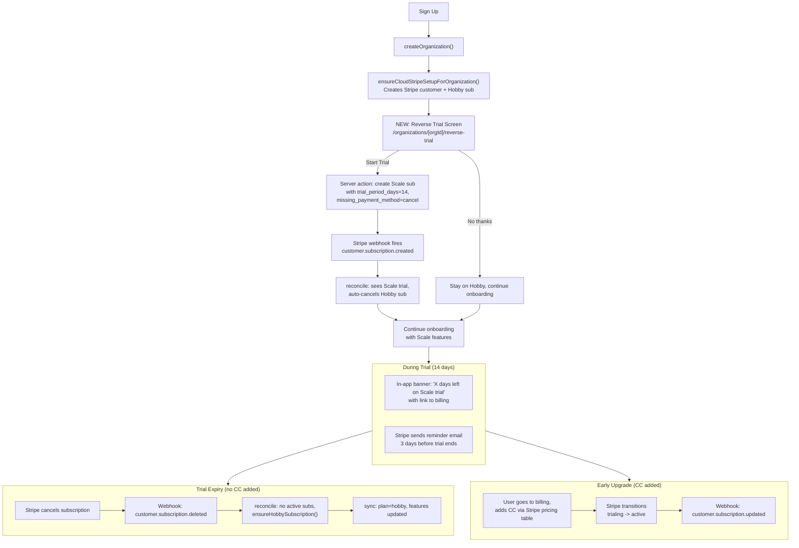

# Reverse Trial for Formbricks Cloud

## Design Decisions

- **Plan**: Scale only (not Pro)
- **Duration**: 14 days
- **Audience**: New Cloud sign-ups only
- **Opt-out**: Users can skip to Hobby
- **Stripe end behavior**: `missing_payment_method = cancel` -- when trial expires without CC, Stripe cancels the subscription, which triggers the existing `reconcileCloudStripeSubscriptionsForOrganization` to auto-create a Hobby subscription
- **Reminders**: Stripe's built-in trial emails (3 days before) + in-app nudge banner
- **Data on downgrade**: Existing soft-lock behavior (keep data, prevent creation above limits)

## How It Works (End-to-End)



## Why This Is Simple

The existing billing infrastructure already handles the hard parts:

- **Downgrade**: `reconcileCloudStripeSubscriptionsForOrganization` creates a Hobby sub when no active subs remain ([organization-billing.ts](apps/web/modules/ee/billing/lib/organization-billing.ts) line 606)
- **Hobby cleanup**: When a paid/trial sub exists, reconcile auto-cancels any Hobby subs (line 591-603)
- **Entitlements**: Stripe entitlements API controls feature access; revoking happens automatically when subscription changes
- **Status tracking**: `subscriptionStatus: "trialing"` is already synced to `billing.stripe` and shown as a badge in the billing UI
- **Upgrade path**: Stripe pricing table + customer portal already work for adding CC and upgrading

## Implementation (Johannes's Scope)

### 1. Reverse Trial Onboarding Screen

**New page**: `apps/web/app/(app)/(onboarding)/organizations/[organizationId]/reverse-trial/page.tsx`

- Cloud-only screen shown after org creation, before workspace setup
- Explains Scale features the user gets for 14 days (contacts, multi-language, teams, whitelabel, etc.)
- Two CTAs: "Start 14-Day Trial" and "Continue with Free Plan"
- "Start Trial" calls a server action, then redirects to `/organizations/[orgId]/workspaces/new/mode`
- "Skip" redirects directly to `/organizations/[orgId]/workspaces/new/mode`

**Routing change**: Modify [apps/web/app/page.tsx](apps/web/app/page.tsx) (line 68-69) so that when `IS_FORMBRICKS_CLOUD && isOwner && org has no projects && org billing is hobby`, redirect to `/organizations/[orgId]/reverse-trial` instead of `/organizations/[orgId]/workspaces/new/mode`.

To prevent showing the screen again after skipping, **Matti will add a data model flag** (e.g., `reverseTrialOffered` on `OrganizationBilling`). Until that's in place, a pragmatic fallback: check `billing.stripe?.subscriptionStatus === "trialing"` to know they already accepted, and check if the org has any projects to know they already went through onboarding.

### 2. Server Action: Create Scale Trial Subscription

**New function**: `createScaleTrialSubscription` in [apps/web/modules/ee/billing/lib/organization-billing.ts](apps/web/modules/ee/billing/lib/organization-billing.ts)

Mirrors `ensureHobbySubscription` (line 246-292) but for Scale:

```typescript
const createScaleTrialSubscription = async (organizationId: string, customerId: string): Promise<void> => {
  // Find Stripe product with metadata.formbricks_plan === "scale"
  // Find its monthly price
  // Create subscription:
  //   trial_period_days: 14,
  //   trial_settings: { end_behavior: { missing_payment_method: "cancel" } },
  //   payment_settings: { save_default_payment_method: "on_subscription" },
  //   metadata: { organizationId }
};
```

**New server action**: `startReverseTrialAction` in `apps/web/modules/ee/billing/actions.ts`

- Validates user is org owner/manager
- Calls `createScaleTrialSubscription`
- Triggers `syncOrganizationBillingFromStripe` to update local state

### 3. In-App Trial Nudge Banner

**New component**: `TrialBanner` in `apps/web/modules/ui/components/trial-banner/index.tsx`

Similar to [LimitsReachedBanner](apps/web/modules/ui/components/limits-reached-banner/index.tsx) but for trials:

- Shows when `billing.stripe?.subscriptionStatus === "trialing"`
- Displays days remaining (needs `trialEnd` date -- see below)
- Links to `/environments/[envId]/settings/billing` to upgrade
- Dismissible but reappears on next session

**Mount point**: [apps/web/app/(app)/environments/[environmentId]/components/EnvironmentLayout.tsx](<apps/web/app/(app)/environments/[environmentId]/components/EnvironmentLayout.tsx>) alongside the existing `LimitsReachedBanner`.

### 4. Trial End Date in Billing Snapshot

To show "X days remaining" in the banner, we need the trial end date. Currently not stored.

**Option A (quick, for Johannes)**: Fetch trial end date from Stripe on-demand via `isSubscriptionCancelled`-style function. This avoids schema changes.

**Option B (Matti's scope)**: Add `trialEnd` to `TOrganizationStripeBilling` type and sync it in `syncOrganizationBillingFromStripe`. This is cleaner and avoids extra Stripe API calls.

Start with Option A; Matti can migrate to Option B when he does the data model work.

### 5. Stripe Dashboard Configuration

- Enable trial reminder emails in [Stripe Dashboard > Settings > Billing > Automatic](https://dashboard.stripe.com/settings/billing/automatic)
- Configure "Link to a Stripe-hosted page" for payment collection
- Set cancellation policy URL

### 6. Webhook: Handle `customer.subscription.trial_will_end`

Add `"customer.subscription.trial_will_end"` to `relevantEvents` in [stripe-webhook.ts](apps/web/modules/ee/billing/api/lib/stripe-webhook.ts) (line 10-17). The existing reconcile + sync will run, updating the local billing state. No additional logic needed beyond ensuring the event triggers a sync.

## Matti's Scope (Not Built by Johannes)

These items are called out for completeness and coordination:

- **Data model flag**: Add `reverseTrialOffered: boolean` (or similar) to `OrganizationBilling` to prevent showing the trial screen again after skip
- `**trialEnd` in billing snapshot: Add to `TOrganizationStripeBilling` and sync from `subscription.trial_end`
- **Verify auto-downgrade**: End-to-end test that trial expiry -> webhook -> reconcile -> hobby works correctly with Scale trial subscriptions
- **Entitlement verification**: Confirm Scale entitlements are granted during trial and revoked on expiry

## i18n Keys Needed

- `organizations.reverse_trial.title` -- e.g., "Try Scale for free"
- `organizations.reverse_trial.subtitle` -- value prop explanation
- `organizations.reverse_trial.start_trial` -- "Start 14-Day Trial"
- `organizations.reverse_trial.skip` -- "Continue with Free Plan"
- `organizations.reverse_trial.feature_` -- feature bullet points
- `common.trial_banner_message` -- "Your Scale trial ends in {days} days"
- `common.trial_banner_upgrade` -- "Upgrade now"
