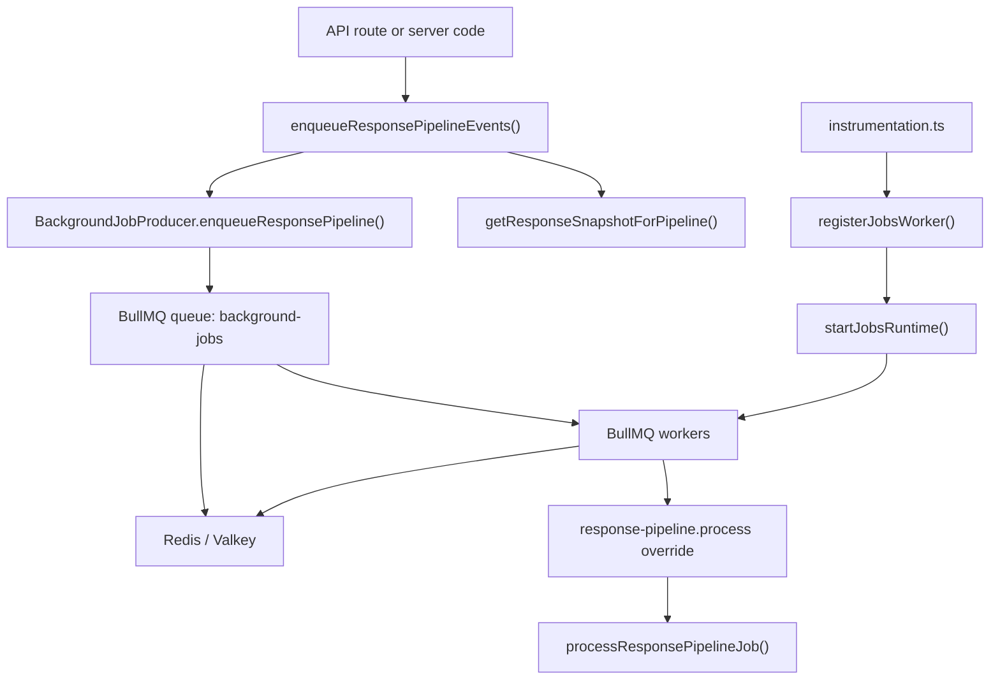

This page documents the current BullMQ-based background job system in Formbricks and the first real workload that now runs on it: the response pipeline.

## Current State

Formbricks now uses BullMQ as an in-process background job system inside the Next.js web application.

The current implementation includes:

- a shared `@formbricks/jobs` package that owns queue creation, schemas, scheduling, and worker runtime concerns
- a Next.js startup hook that starts one BullMQ worker runtime per Node.js process without blocking app boot
- app-level enqueue helpers for request handlers
- an app-owned BullMQ response pipeline processor that replaces the legacy internal HTTP pipeline route

The first migrated workload is:

- `response-pipeline.process`

This means response-related side effects no longer depend on an internal `fetch()` back into the same app process.

## Why This Exists

The original response pipeline lived behind an internal Next.js route:

```text
apps/web/app/api/(internal)/pipeline
```

That model had a few problems:

- it was tightly coupled to the request lifecycle
- it relied on an internal HTTP hop instead of a typed background-job boundary
- it was harder to observe, retry, and scale safely

BullMQ addresses that by moving post-response work behind a queue while keeping the first version operationally simple for self-hosted users.

## High-Level Architecture



## Responsibilities By Layer

### App Layer

- `apps/web/app/lib/pipelines.ts`
  Owns enqueueing for response pipeline events. It gates queueing, hydrates the response snapshot once, logs failures, and never throws back into request handlers.
- `apps/web/modules/response-pipeline/lib/process-response-pipeline-job.ts`
  Owns app-specific execution of response-pipeline jobs.
- `apps/web/modules/response-pipeline/lib/handle-integrations.ts`
  Owns Slack, Notion, Airtable, and Google Sheets integration fan-out for the pipeline.
- `apps/web/modules/response-pipeline/lib/telemetry.ts`
  Owns telemetry dispatch logic used by the response-created path.
- `apps/web/instrumentation-jobs.ts`
  Registers the app-owned response-pipeline handler override with the shared BullMQ runtime and schedules retry after transient startup failures.
- `apps/web/lib/jobs/config.ts`
  Turns environment configuration into queueing and worker-bootstrap decisions. Queue producers depend on `REDIS_URL`; worker startup additionally depends on `BULLMQ_WORKER_ENABLED`.

### Shared Jobs Layer

- `packages/jobs/src/types.ts`
  Defines typed payload schemas such as `TResponsePipelineJobData`.
- `packages/jobs/src/definitions.ts`
  Defines stable job names and payload validation.
- `packages/jobs/src/queue.ts`
  Owns producer-side enqueueing and scheduling.
- `packages/jobs/src/runtime.ts`
  Starts workers, connects Redis, and handles graceful shutdown.
- `packages/jobs/src/processors/registry.ts`
  Validates payloads and dispatches named jobs, applying app-provided handler overrides when registered.

## Response Pipeline Flow

The response pipeline now runs fully in the background worker.

### Enqueueing

When a response is created or updated, the request path calls:

```ts
enqueueResponsePipelineEvents({
  environmentId,
  surveyId,
  responseId,
  events,
});
```

That helper:

1. deduplicates requested events
2. checks whether BullMQ queueing is enabled
3. uses the just-written response snapshot when the caller already has it
4. otherwise loads the latest response snapshot once via `getResponseSnapshotForPipeline(responseId)` using an uncached read
5. enqueues one BullMQ job per event with the shared snapshot payload
6. waits for the enqueue attempt to complete, then logs enqueue failures without failing the original request

### Execution

At worker startup, `apps/web/instrumentation-jobs.ts` registers an app-owned override for:

- `response-pipeline.process`

That override delegates to `processResponsePipelineJob(...)`, which performs:

- webhook delivery for all pipeline events
- integrations for `responseFinished`
- response-finished notification emails
- follow-up delivery
- survey auto-complete updates and audit logging
- response-created billing metering
- response-created telemetry dispatch

Current retry semantics are intentionally asymmetric:

- webhook delivery failures fail early BullMQ attempts so retries can happen at the job level
- if webhook delivery is still failing on the final BullMQ attempt, the worker logs that retries are exhausted and continues with the remaining event-specific side effects
- integration, email, telemetry, metering, follow-up, and survey auto-complete failures are logged inside the processor and do not fail the whole job

## Acceptance Criteria Review

### Pipeline Execution

Satisfied.

- New response create/update flows enqueue BullMQ jobs instead of calling an internal HTTP route.
- The job payload contains `environmentId`, `surveyId`, `event`, and an authoritative response snapshot.
- The response pipeline executes inside the BullMQ worker runtime.

### Feature Parity

Mostly satisfied for the legacy response pipeline behavior that existed in the old route.

The migrated BullMQ processor preserves:

- webhook delivery
- integrations
- response-finished emails
- follow-up execution
- survey auto-complete and audit logging
- response-created billing metering
- response-created telemetry

One important behavior change still exists today:

- webhook delivery failures delay the remaining side effects until the final BullMQ attempt

That is closer to the legacy route, because the pipeline eventually continues even if webhook delivery never succeeds. It is still not exact feature parity, though, because the legacy route continued immediately while the BullMQ worker waits until retries are exhausted before it degrades webhook failure into a logged condition.

### Architecture

Satisfied.

- Enqueueing lives in the app layer through `apps/web/app/lib/pipelines.ts`.
- Execution lives in the worker path under `apps/web/modules/response-pipeline/lib`.
- `@formbricks/jobs` stays responsible for queue/runtime concerns and typed job contracts.

### Cleanup

Satisfied.

The legacy internal route has been removed:

```text
apps/web/app/api/(internal)/pipeline/route.ts
```

The runtime path no longer depends on the old internal-route folder structure, and the remaining pipeline-only test mock under that deleted folder has been removed as part of the migration cleanup.

### Reliability

Satisfied at the current ticket scope.

BullMQ jobs use shared default retry behavior:

- `attempts: 3`
- exponential backoff starting at `1000ms`

Failures are logged with structured metadata such as:

- `jobId`
- `attempt`
- `jobName`
- `queueName`
- `environmentId`
- `surveyId`
- `responseId`

Request handlers remain non-blocking:

- if Redis is unavailable
- if queueing is disabled
- if snapshot hydration fails
- if enqueueing fails

the request still completes, and the failure is logged.

Worker startup is also non-blocking:

- Next.js boot does not await BullMQ readiness
- startup failures are logged
- the web app schedules a retry instead of requiring an immediate process restart

### Worker Integration

Satisfied.

The response pipeline is processed by the same BullMQ worker runtime started from Next.js instrumentation. No standalone worker service was introduced as part of this migration.

### Developer Experience

Satisfied.

The public app-level API for request handlers is intentionally small:

- `enqueueResponsePipelineEvents(...)`

This keeps queue names, Redis concerns, and BullMQ details out of response routes.

## Comparison With The Legacy Route

### Previous Implementation

The legacy internal route accepted a full response payload directly and then executed the entire pipeline synchronously inside the route handler.

Key characteristics of that model:

- request handlers performed an internal authenticated `fetch()` back into the same app
- the route received the response payload directly instead of hydrating it from a queue-side snapshot
- webhook failures were logged and did not block the rest of the pipeline
- response-finished integrations, emails, follow-ups, and survey auto-complete ran in the same route execution
- response-created metering was fire-and-forget while telemetry was awaited

### Current BullMQ Implementation

The current branch enqueues a typed snapshot-based BullMQ job and executes the pipeline inside the in-process worker registered from Next.js instrumentation.

Key characteristics of the current model:

- request handlers enqueue directly through `enqueueResponsePipelineEvents(...)`
- handlers now pass the just-written `TResponse` snapshot when they already have it
- callers that do not already have a response snapshot use an uncached pipeline-specific lookup
- worker startup is non-blocking and retries after transient failures
- webhook failures fail early attempts so BullMQ can retry them
- on the final attempt, webhook failures are logged and the remaining side effects continue
- response-created metering is awaited before the BullMQ job completes

### Net Result

Compared to the legacy route, the current branch is:

- architecturally stronger
- safer to scale and operate
- easier to observe through structured job logging
- closer to legacy feature parity than the earlier BullMQ iterations on this branch

The main remaining semantic difference is timing:

- the legacy route continued past webhook failures immediately
- the BullMQ worker now continues only after webhook retries are exhausted

That is an intentional trade-off in the current branch, not an accident.

## Current Queue Model

The queue remains intentionally small:

- queue name: `background-jobs`
- prefix: `formbricks:jobs`
- job names:
  - `system.test-log`
  - `response-pipeline.process`

The response pipeline is the first production workload on this queue.

## Local Development

Local development works end to end as long as Redis is available and the worker is enabled.

Required inputs:

- `REDIS_URL`
- optionally `BULLMQ_WORKER_ENABLED`
- optionally `BULLMQ_WORKER_COUNT`
- optionally `BULLMQ_WORKER_CONCURRENCY`

Behavior:

- if `REDIS_URL` is missing, queueing is skipped
- if `BULLMQ_WORKER_ENABLED=0`, the worker is not started, but request-side enqueueing can still stay enabled in deployments that point at a separate BullMQ worker
- outside tests, the worker is enabled by default

This makes it possible to develop request flows without hard-failing when Redis is absent, while still supporting full local end-to-end verification when Redis is running.

## Operational Notes

### Logging

The current implementation logs:

- worker startup failures
- Redis connection failures
- enqueue failures
- job failures
- webhook delivery failures
- integration failures
- email delivery failures
- follow-up failures
- survey auto-complete update failures
- metering failures
- telemetry failures

### Shutdown

The worker runtime registers `SIGTERM` and `SIGINT` handlers, closes workers and queue handles, and then closes Redis connections. This keeps shutdown behavior predictable inside the web process.

## Current Limitations

The migration satisfies the ticket, but a few larger architectural limits remain by design.

### Dual-Write Boundary

Response writes happen in Postgres and background jobs are enqueued in Redis. Those are separate systems, so this remains a dual-write boundary.

This means Formbricks currently has:

- non-blocking enqueue semantics
- at-least-once background execution
- no transactional guarantee that the product write and Redis enqueue succeed together

That trade-off was accepted for this BullMQ phase.

### In-Process Workers

Workers run inside the Next.js app process.

That keeps self-hosting simple, but it also means:

- job capacity still shares resources with the web process
- heavy background work is still Node.js-local
- scaling job throughput also scales the app runtime

### Webhook-Gated Retries

Webhook delivery still happens before the rest of the `responseFinished` side effects.

That gives Formbricks job-level retries for webhook delivery, but it also means:

- `responseFinished` side effects do not run on the early retry attempts
- the remaining side effects only continue after webhook retries are exhausted
- this is closer to legacy behavior than failing forever, but it is still not immediate parity

This is the current behavior of the branch and should be evaluated explicitly if we want stricter feature parity with the legacy route.

### Logs-First Observability

The current system has strong structured logging, but it does not yet provide:

- queue dashboards
- retry tooling
- latency metrics
- product-native workflow inspection

Those are future improvements, not blockers for the current migration.

## Recommended Next Steps

Now that the response pipeline is on BullMQ, the most useful next steps are:

1. migrate additional low-risk async workloads behind the same producer/runtime boundary
2. add queue metrics and worker health visibility beyond logs
3. define explicit idempotency rules for side-effect-heavy jobs
4. decide which future workloads should remain Node-local and which should eventually move to a different runtime

## Practical Conclusion

Formbricks now has:

- a production-capable BullMQ foundation
- a real migrated workload
- a clean separation between request-time enqueueing and background execution

The response pipeline migration should be considered complete for the current ticket scope.
