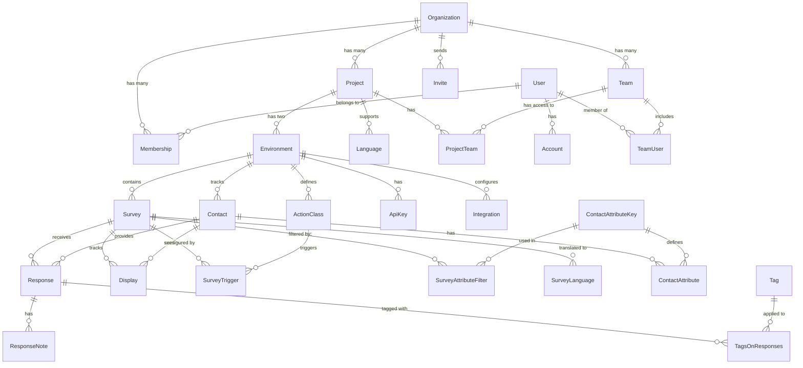

Formbricks uses PostgreSQL as its primary database and [Prisma](https://www.prisma.io/) as the Object-Relational Mapping (ORM) tool. The database schema is designed to support multi-tenancy, survey management, and response collection while maintaining data isolation between organizations.

## Entity Relationship Diagram

The following diagram shows the core entities and their relationships in the Formbricks database:

## Core Models

### Organization & Project Management

1. **Organization**

   - Top-level entity for multi-tenancy
   - Contains multiple projects and team members
   - Manages billing and whitelabel settings

2. **Project**

   - Groups related surveys and configurations
   - Has two environments (production/development)
   - Controls branding and display settings

3. **Environment**
   - Isolates production and development resources
   - Contains surveys, contacts, and actions
   - Manages API keys and integrations

### Survey Management

1. **Survey**

   - Central model for questionnaires
   - Configurable with multiple questions and display rules
   - Supports multiple languages and targeting filters

2. **Response**

   - Records user answers to surveys
   - Links to contact information when available
   - Supports tagging and notes for analysis

3. **ActionClass**
   - Defines triggering points for surveys
   - Can be code-based or no-code configurations
   - Links surveys to specific user actions

### User Management

1. **User**

   - Represents system users (admins/team members)
   - Manages authentication and preferences
   - Can belong to multiple organizations

2. **Contact**

   - Represents survey respondents
   - Stores attributes for targeting
   - Tracks survey displays and responses

3. **Team**
   - Groups users within organizations
   - Controls project access permissions
   - Facilitates collaborative survey management

## Data Isolation

The database schema ensures proper data isolation through:

1. **Organization-level isolation**

   - Each organization has its own projects
   - Users can belong to multiple organizations
   - Resources are scoped to organizations

2. **Environment-level isolation**

   - Separate production and development environments
   - Independent surveys, contacts, and actions
   - Isolated API keys and integrations

3. **Project-level isolation**
   - Project-specific configurations
   - Separate language settings
   - Team-based access control

## Schema Management

The database schema is managed through Prisma, which provides:

- Type-safe database client
- Automatic migration generation
- Schema versioning
- Data validation
- Query optimization

For detailed information about specific models and their properties, refer to the [schema.prisma](https://github.com/formbricks/formbricks/blob/main/packages/database/schema.prisma) file in the repository.

## PostgreSQL Database Tables

Formbricks stores all data in PostgreSQL tables. Here's a comprehensive list of all database tables and their purposes:

| Table Name            | Description                                                            |
| --------------------- | ---------------------------------------------------------------------- |
| Account               | Stores third-party authentication accounts (OAuth) and their tokens    |
| ActionClass           | Defines triggerable events that can launch surveys                     |
| ApiKey                | Stores API authentication keys for environment-specific access         |
| Contact               | Records information about user that can receive and respond to surveys |
| ContactAttribute      | Stores attribute values for contacts (e.g., role, company size)        |
| ContactAttributeKey   | Defines available attribute types for contacts                         |
| DataMigration         | Tracks the status of database schema migrations                        |
| Display               | Records when and to whom surveys were shown                            |
| Document              | Stores processed survey responses for analysis                         |
| DocumentInsight       | Links analyzed documents to derived insights                           |
| Environment           | Manages production/development environments within projects            |
| Insight               | Contains analyzed patterns and information from responses              |
| Integration           | Stores configuration for third-party service integrations              |
| Invite                | Manages pending invitations to join organizations                      |
| Language              | Defines supported languages for multi-lingual surveys                  |
| Membership            | Links users to organizations with specific roles                       |
| Organization          | Top-level container for projects and team management                   |
| Project               | Groups related surveys and environments                                |
| ProjectTeam           | Manages team access permissions to projects                            |
| Response              | Stores survey responses and associated metadata                        |
| ResponseNote          | Contains team member comments on survey responses                      |
| Segment               | Defines groups of contacts based on attributes                         |
| Survey                | Stores survey configurations, questions, and display rules             |
| SurveyAttributeFilter | Defines targeting rules for surveys based on contact attributes        |
| SurveyFollowUp        | Configures automated actions based on survey responses                 |
| SurveyLanguage        | Links surveys to their supported languages                             |
| SurveyTrigger         | Connects surveys to their triggering actions                           |
| Tag                   | Stores labels for categorizing responses                               |
| TagsOnResponses       | Junction table linking tags to responses                               |
| Team                  | Groups users within organizations                                      |
| TeamUser              | Links users to teams with specific roles                               |
| User                  | Stores user account information and preferences                        |
| Webhook               | Manages webhook endpoints for event notifications                      |

## Schema Reference

For detailed information about the database schema, including:

- Complete field definitions
- Relationships between tables
- Enums and custom types
- Field constraints and indices
- JSON field structures

Please refer to the [Prisma schema file](https://github.com/formbricks/formbricks/blob/main/packages/database/schema.prisma) in our GitHub repository.

The schema.prisma file contains extensive documentation comments for each model, making it the authoritative reference for the database structure.
