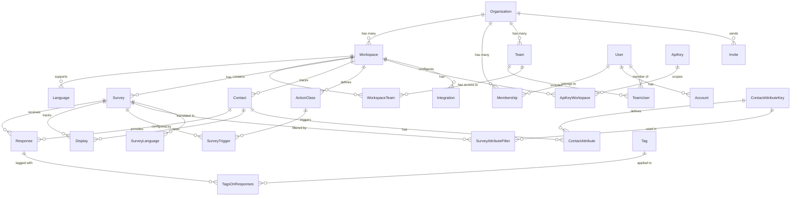

Formbricks uses PostgreSQL as its primary database and [Prisma](https://www.prisma.io/) as the Object-Relational Mapping (ORM) tool. The database schema is designed to support multi-tenancy, survey management, and response collection while maintaining data isolation between organizations.

## Entity Relationship Diagram

The following diagram shows the core entities and their relationships in the Formbricks database:

```mermaid
erDiagram
    Organization ||--o{ Workspace : "has many"
    Organization ||--o{ Membership : "has many"
    Organization ||--o{ Team : "has many"
    Organization ||--o{ Invite : "sends"

    Workspace ||--o{ Language : "supports"
    Workspace ||--o{ WorkspaceTeam : "has"

    Workspace ||--o{ Survey : "contains"
    Workspace ||--o{ Contact : "tracks"
    Workspace ||--o{ ActionClass : "defines"
    Workspace ||--o{ ApiKeyWorkspace : "has"
    Workspace ||--o{ Integration : "configures"

    Survey ||--o{ Response : "receives"
    Survey ||--o{ Display : "tracks"
    Survey ||--o{ SurveyTrigger : "configured by"
    Survey ||--o{ SurveyAttributeFilter : "filtered by"
    Survey ||--o{ SurveyLanguage : "translated to"

    Contact ||--o{ Response : "provides"
    Contact ||--o{ Display : "sees"
    Contact ||--o{ ContactAttribute : "has"

    User ||--o{ Membership : "belongs to"
    User ||--o{ Account : "has"
    User ||--o{ TeamUser : "member of"

    Team ||--o{ TeamUser : "includes"
    Team ||--o{ WorkspaceTeam : "has access to"
    ApiKey ||--o{ ApiKeyWorkspace : "scopes"


    Response ||--o{ TagsOnResponses : "tagged with"

    Tag ||--o{ TagsOnResponses : "applied to"

    ActionClass ||--o{ SurveyTrigger : "triggers"

    ContactAttributeKey ||--o{ ContactAttribute : "defines"
    ContactAttributeKey ||--o{ SurveyAttributeFilter : "used in"
```

## Core Models

### Organization & Workspace Management

1. **Organization**

   - Top-level entity for multi-tenancy
   - Contains multiple workspaces and team members
   - Manages billing and whitelabel settings

2. **Workspace**

   - Main grouping mechanism for surveys and related configuration
   - Belongs to a single organization
   - Controls branding and display settings

3. **WorkspaceTeam**
   - Maps teams to workspaces
   - Controls workspace-level access permissions
   - Enables scoped collaboration across teams

### Survey Management

1. **Survey**

   - Central model for questionnaires
   - Configurable with multiple questions and display rules
   - Supports multiple languages and targeting filters

2. **Response**

   - Records user answers to surveys
   - Links to contact information when available
   - Supports tagging for analysis

3. **ActionClass**
   - Defines triggering points for surveys
   - Can be code-based or no-code configurations
   - Links surveys to specific user actions

### User Management

1. **User**

   - Represents system users (admins/team members)
   - Manages authentication and preferences
   - Can belong to multiple organizations

2. **Contact**

   - Represents survey respondents
   - Stores attributes for targeting
   - Tracks survey displays and responses

3. **Team**
   - Groups users within organizations
   - Controls workspace access permissions
   - Facilitates collaborative survey management

## Data Isolation

The database schema ensures proper data isolation through:

1. **Organization-level isolation**

   - Each organization has its own workspaces
   - Users can belong to multiple organizations
   - Resources are scoped to organizations

2. **Workspace-level isolation**

   - Independent surveys, contacts, action classes, and integrations
   - Isolated API key workspace assignments
   - Workspace-specific configuration and styling defaults

3. **Team-based access isolation**

   - Teams are linked to workspaces through `WorkspaceTeam`
   - Permissions are scoped per workspace
   - Access can be delegated without exposing all organization resources

## Schema Management

The database schema is managed through Prisma, which provides:

- Type-safe database client
- Automatic migration generation
- Schema versioning
- Data validation
- Query optimization

For detailed information about specific models and their properties, refer to the [schema.prisma](https://github.com/formbricks/formbricks/blob/main/packages/database/schema.prisma) file in the repository.

## PostgreSQL Database Tables

Formbricks stores all data in PostgreSQL tables. Here's a comprehensive list of all database tables and their purposes:

| Table Name            | Description                                                            |
| --------------------- | ---------------------------------------------------------------------- |
| Account               | Stores third-party authentication accounts (OAuth) and their tokens    |
| ActionClass           | Defines triggerable events that can launch surveys                     |
| ApiKey                | Stores API authentication keys for organization-level access          |
| ApiKeyWorkspace       | Maps API keys to the workspaces they can access                      |
| Contact               | Records information about user that can receive and respond to surveys |
| ContactAttribute      | Stores attribute values for contacts (e.g., role, company size)        |
| ContactAttributeKey   | Defines available attribute types for contacts                         |
| DataMigration         | Tracks the status of database schema migrations                        |
| Display               | Records when and to whom surveys were shown                            |
| Workspace             | Main container for surveys, contacts, actions, integrations, and settings |
| Integration           | Stores configuration for third-party service integrations              |
| Invite                | Manages pending invitations to join organizations                      |
| Language              | Defines supported languages for multi-lingual surveys                  |
| Membership            | Links users to organizations with specific roles                       |
| Organization          | Top-level container for workspaces and team management                |
| Response              | Stores survey responses and associated metadata                        |
| Segment               | Defines groups of contacts based on attributes                         |
| Survey                | Stores survey configurations, questions, and display rules             |
| SurveyAttributeFilter | Defines targeting rules for surveys based on contact attributes        |
| SurveyFollowUp        | Configures automated actions based on survey responses                 |
| SurveyLanguage        | Links surveys to their supported languages                             |
| SurveyTrigger         | Connects surveys to their triggering actions                           |
| Tag                   | Stores labels for categorizing responses                               |
| TagsOnResponses       | Junction table linking tags to responses                               |
| Team                  | Groups users within organizations                                      |
| TeamUser              | Links users to teams with specific roles                               |
| WorkspaceTeam         | Manages team access permissions to workspaces                          |
| User                  | Stores user account information and preferences                        |
| Webhook               | Manages webhook endpoints for event notifications                      |

## Schema Reference

For detailed information about the database schema, including:

- Complete field definitions
- Relationships between tables
- Enums and custom types
- Field constraints and indices
- JSON field structures

Please refer to the [Prisma schema file](https://github.com/formbricks/formbricks/blob/main/packages/database/schema.prisma) in our GitHub repository.

The schema.prisma file contains extensive documentation comments for each model, making it the authoritative reference for the database structure.
