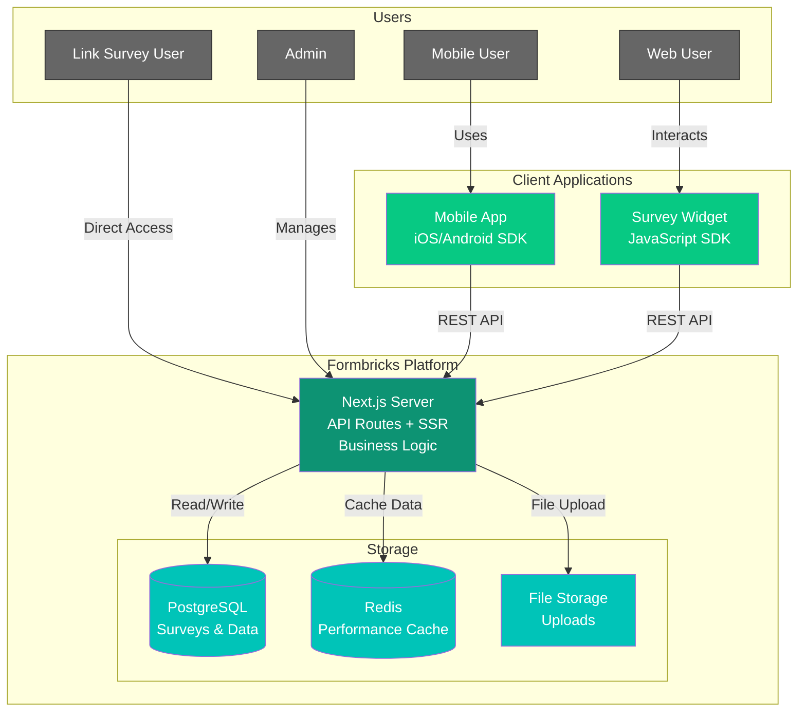

The Formbricks platform is designed with a modern, unified architecture that prioritizes developer experience and performance. This overview outlines the system's architecture, key technology choices, and how different components interact.

## System Architecture

Formbricks uses a unified architecture with Next.js at its core, serving both the frontend and backend capabilities. Here's an interactive overview of the system:

### Key Components

#### Users

- **Mobile Users**: Access surveys through native mobile applications
- **Web Users**: Interact with embedded survey widgets on websites
- **Link Survey Users**: Access surveys directly through shared URLs
- **Admins**: Manage surveys and view responses through the web dashboard

#### Client Applications

- **Survey Widget**: A JavaScript component that can be embedded in web applications
- **Mobile Application**: Native iOS/Android apps that integrate with the Formbricks SDK
- **Web Dashboard**: The admin interface for managing surveys and viewing responses

#### Core Platform

- **Next.js Server**: The central component that handles:
  - Frontend rendering and SSR
  - API routes for client communication
  - Business logic implementation
  - Survey display and response collection

#### Data Storage

- **PostgreSQL Database**: Primary data store for:
  - Survey definitions
  - Response data
  - User and organization information
- **Redis Cache**: Performance optimization through:
  - Caching frequently accessed data
  - Reducing database load
  - Improving response times

### Communication Flow

1. **Client Interaction**

   - Web users interact with embedded survey widgets
   - Mobile users engage with surveys through native apps
   - Link survey users access surveys directly via URLs
   - Admins manage the system through the web dashboard

2. **Data Flow**

   - Clients communicate with the Next.js server via REST APIs
   - Survey data is fetched and responses are submitted over HTTPS
   - The server processes requests and interacts with the database using Prisma ORM
   - Frequently accessed data is cached in Redis for performance

3. **Data Storage**
   - Persistent data is stored in PostgreSQL
   - Frequently accessed data is cached in Redis
   - File attachments are handled through the configured storage provider

## Technology Stack

- **Frontend**: React, TailwindCSS, Radix UI
- **Backend**: Next.js App Router with API Routes
- **Database**: PostgreSQL with Prisma ORM
- **Caching**: Redis
- **API**: REST with OpenAPI specification
- **Testing**: Playwright for E2E, Vitest for unit tests
