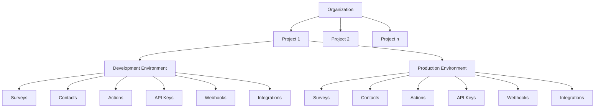

Formbricks Cloud is designed to support multiple tenants, each with their own set of surveys and data. This page describes the different ways to configure and use Formbricks for multi-tenancy.

<Note>
This documentation only applies to Formbricks Cloud instances. On-premise deployments handle tenant separation differently based on your specific setup and requirements.
</Note>

## Multi-Tenancy in Formbricks Cloud

Formbricks Cloud is architected as a true multi-tenant system where each organization operates in its own isolated environment while sharing the underlying infrastructure. This approach allows multiple organizations to use the platform independently without visibility into each other's data.

### Organizational Structure

The multi-tenant architecture in Formbricks Cloud is built around three key levels of isolation:

### 1. Organization-Level Isolation

- Each tenant is represented by an Organization entity
- Organizations are completely separated from each other
- Users can be members of multiple organizations simultaneously
- All resources and data belong exclusively to a single organization
- Role-based access control (RBAC) with specific roles:
  - Owner: Full access to all organization resources
  - Manager: Can manage members and billing
  - Member: Basic access to organization resources
  - Billing: Access to billing information only
- Billing and subscription management occurs at the organization level

### 2. Project-Level Isolation

Projects provide an additional layer of isolation within an organization:

- Organizations can have multiple projects to separate different applications or product lines
- Projects have their own configuration, branding, and style settings
- Team-based access control allows fine-grained permission management within projects
- Language settings and customizations are project-specific

### 3. Environment-Level Isolation

Within each organization's projects, further isolation is maintained through environments:

- Each project has separate production and development environments
- Complete separation of resources between environments:
  - Surveys and responses
  - Contacts and attributes
  - Action classes and triggers
  - API keys and integrations
  - Webhooks and notifications
  - Segments and targeting rules
- Environments are created automatically when a project is created
- Changes in development environments have no impact on production
- Surveys can be copied between environments
- Each environment has its own dedicated resources and settings

## Data Security in Multi-Tenant Environment

Formbricks ensures data security in its multi-tenant environment through:

- **Database Layer Isolation**: 
  - Foreign key constraints enforce data isolation
  - Each resource is scoped to its organization
  - Cascading deletes maintain referential integrity

- **Authentication Boundaries**: 
  - Role-based access control (RBAC)
  - Session management per organization
  - Multi-factor authentication support

- **API Access Control**: 
  - API keys are scoped to specific environments
  - Rate limiting per organization
  - Request validation and sanitization

- **Resource Quotas**: 
  - Organization-level limits based on billing plan

This multi-layered approach to tenant separation ensures that organizations can safely use Formbricks Cloud with complete data privacy and isolation from other tenants.

