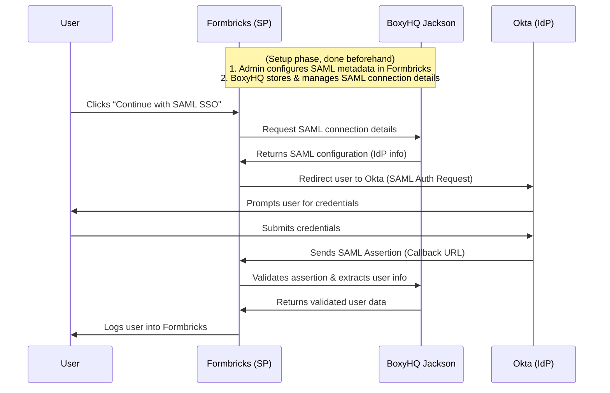

<Note>You require an Enterprise License along with a SAML SSO add-on to avail this feature.</Note>

## Overview

Formbricks supports SAML Single Sign-On (SSO) to enable secure, centralized authentication. With SAML, organizations can integrate their existing Identity Provider (IdP) infrastructure for streamlined access management. Formbricks internally uses BoxyHQ's SAML Jackson to manage SAML connections. SAML Jackson is a service provided by BoxyHQ that manages SAML connection details and validates assertions. It is part of the Formbricks server.

To learn more about SAML Jackson, please refer to the [BoxyHQ SAML Jackson documentation](https://boxyhq.com/docs/jackson/deploy).

## How SAML Works in Formbricks

SAML (Security Assertion Markup Language) is an XML-based standard for exchanging authentication and authorization data between an Identity Provider (IdP) and Formbricks. Here's how the integration works with BoxyHQ Jackson embedded into the flow:

1. **Login Initiation:**  
   The user clicks `Continue with SAML SSO` on Formbricks.

2. **Configuration Retrieval via BoxyHQ:**  
   Formbricks requests the SAML connection details from BoxyHQ Jackson. BoxyHQ securely stores and manages the IdP configuration, including endpoints, certificates, and other metadata.

3. **Redirection:**  
   With the configuration details from BoxyHQ, Formbricks redirects the user to the IdP’s login page (e.g., Okta).

4. **Authentication:**  
   The user authenticates directly with the IdP.

5. **SAML Response:**  
   Upon successful authentication, the IdP sends a signed SAML response back to Formbricks via the user’s browser.

6. **Validation via BoxyHQ:**  
   BoxyHQ Jackson validates the SAML assertion—verifying the signature and extracting user details—before sending the validated data back to Formbricks.

7. **Access Granted:**  
   Formbricks logs the user in using the verified information.

## SAML Authentication Flow Sequence Diagram

Below is a sequence diagram illustrating the complete SAML authentication flow with BoxyHQ Jackson integrated:

## Setting Up SAML SSO

To configure SAML SSO in Formbricks, follow these steps:

1. **Database Setup:** Configure a dedicated database for SAML by setting the `SAML_DATABASE_URL` environment variable in your `docker-compose.yml` file (e.g., `postgresql://postgres:@localhost:5432/formbricks-saml`). If you're using a self-signed certificate for Postgres, include the `sslmode=no-verify` parameter.
2. **IdP Application:** Create a SAML application in your IdP by following your provider's instructions([SAML Setup](/development/guides/auth-and-provision/setup-saml-with-identity-providers))
3. **User Provisioning:** Provision users in your IdP and configure access to the IdP SAML app for all your users (who need access to Formbricks).
4. **Metadata:** Keep the XML metadata from your IdP handy for the next step.
5. **Metadata Setup:** Set the `SAML_RAW_METADATA` environment variable in your `docker-compose.yml` file to the XML metadata from your IdP(e.g., `SAML_RAW_METADATA='<?xml version="1.0" encoding="UTF-8"?><...>'`, please paste the metadata in single quotes)
6. **Restart Formbricks:** Restart Formbricks to apply the changes. You can do this by running `docker compose down` and then `docker compose up -d`.
