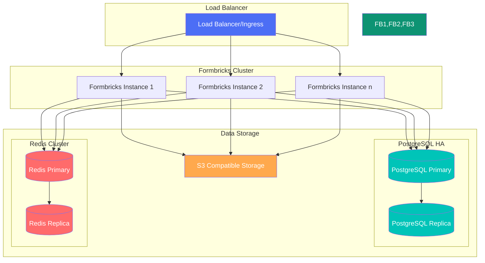

<Note>
  Running Formbricks in a multi-instance cluster configuration is an Enterprise Edition feature and requires
  an enterprise license key.
</Note>

## Overview

Running Formbricks as a cluster of multiple instances offers several key advantages:

- **High Availability**: Ensure your surveys remain accessible even if some instances fail

- **Load Distribution**: Handle higher traffic by distributing requests across multiple instances

- **Scalability**: Easily scale horizontally by adding more instances as your needs grow

- **Zero-Downtime Updates**: Rolling updates without service interruption

## Requirements

To run Formbricks in a cluster setup, you'll need:

- Enterprise Edition license key

- Shared PostgreSQL database

- Shared Redis cache for session management and caching

- Load balancer to distribute traffic

## Architecture

The Formbricks cluster setup consists of multiple components working together to provide a scalable and highly available system. Here's a detailed overview of the architecture:



### Component Description

1. **Formbricks Cluster**

   - Multiple Formbricks instances (1..n) running in parallel
   - Each instance is stateless and can handle any incoming request
   - Automatic failover if any instance becomes unavailable

2. **PostgreSQL Database**

   - Primary database storing all survey, response, and contact data
   - Optional high-availability setup with primary-replica configuration
   - Handles all persistent data storage needs

3. **Redis Cluster**

   - Acts as a distributed cache layer
   - Improves performance by caching frequently accessed data
   - Can be configured in HA mode with primary-replica setup
   - Handles session management and real-time features

4. **S3 Compatible Storage**

   - Stores file uploads and attachments
   - Can be any S3-compatible storage service (AWS S3, MinIO, etc.)
   - Provides reliable and scalable file storage

5. **Load Balancer**
   - Distributes incoming traffic across all Formbricks instances
   - Performs health checks and removes unhealthy instances
   - Ensures even load distribution and high availability

## Redis Configuration

<Note>Redis integration is an Enterprise Edition feature and requires an enterprise license key.</Note>

Configure Redis by adding the following environment variables to your instances:

```sh env
REDIS_URL=redis://your-redis-host:6379
REDIS_DEFAULT_TTL=86400
REDIS_HTTP_URL=http://your-redis-host:8000
```

## S3 Configuration

Configure S3 storage by adding the following environment variables to your instances:

```sh env
# Required for file uploads in serverless environments
S3_ACCESS_KEY=your-access-key
S3_SECRET_KEY=your-secret-key
S3_REGION=your-region
S3_BUCKET_NAME=your-bucket-name

# For S3-compatible storage (e.g., StorJ, MinIO)
# Leave empty for Amazon S3
S3_ENDPOINT_URL=https://your-s3-compatible-endpoint

# Enable for S3-compatible storage that requires path style
# 0 for disabled, 1 for enabled
S3_FORCE_PATH_STYLE=0
```

When using S3 in a cluster setup, ensure that:

- All Formbricks instances have access to the same S3 bucket
- The bucket has appropriate CORS settings configured
- IAM roles/users have sufficient permissions for read/write operations

## Disabling Docker Cron Jobs

When running Formbricks in a cluster setup, you should disable the built-in cron jobs in the Docker image to prevent them from running on multiple instances simultaneously. Instead, you should set up cron jobs in your orchestration system (like Kubernetes) to run on a single instance or as separate jobs.

To disable the Docker cron jobs, set the following environment variable:

```sh env
# Disable Docker cron jobs (0 = disabled, 1 = enabled)
DOCKER_CRON_ENABLED=0
```

This will prevent the cron jobs from starting in the Docker container while still allowing all other Formbricks functionality to work normally.

## Kubernetes Setup

Formbricks provides an official Helm chart for deploying the entire cluster stack on Kubernetes. The Helm chart is available in the [Formbricks GitHub repository](https://github.com/formbricks/formbricks/tree/main/helm-chart).

### Features of the Helm Chart

The Helm chart provides a complete deployment solution that includes:

- Formbricks application with configurable replicas
- PostgreSQL database (with optional HA configuration)
- Redis cluster for caching
- Optional Traefik ingress controller for routing and SSL termination
- Automatic configuration of dependencies and networking

### Installation Steps

1. Add the Formbricks Helm repository:

```sh
helm repo add formbricks https://raw.githubusercontent.com/formbricks/formbricks/main/helm-chart
helm repo update
```

2. Install the chart:

```sh
helm install formbricks formbricks/formbricks
```

### Configuration Options

The Helm chart can be customized using a `values.yaml` file to configure:

- Number of Formbricks replicas
- Resource limits and requests
- Database configuration
- Redis settings
- Ingress rules and TLS
- Environment variables and secrets

Refer to the [Helm chart documentation](https://github.com/formbricks/formbricks/tree/main/helm-chart) for detailed configuration options and examples.
