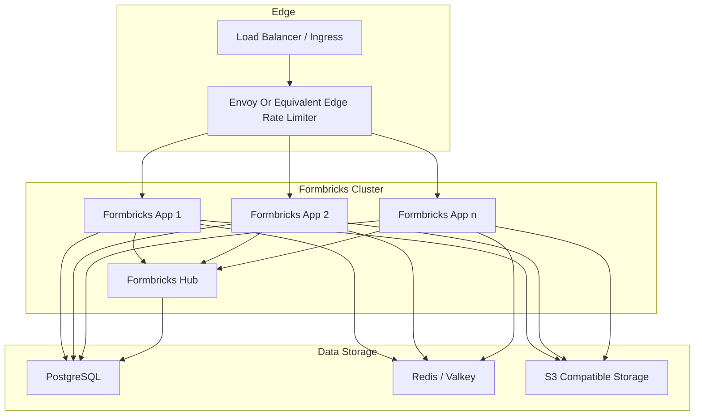

## Overview

Running Formbricks as a cluster of multiple instances gives you:

- **High Availability**: surveys remain accessible even if one app pod becomes unavailable
- **Load Distribution**: traffic can be spread across multiple stateless Formbricks app instances
- **Scalability**: you can scale app replicas horizontally as usage grows
- **Zero-Downtime Updates**: rolling deployments are possible with the right orchestration setup

## Requirements

For a Formbricks v5 cluster setup, plan for:

- shared PostgreSQL for Formbricks and Hub, with `pgvector` support if Hub shares the same database
- shared Redis/Valkey for caching, rate limiting, and audit-related flows
- shared S3-compatible storage if you use file uploads or organization branding assets
- a load balancer or ingress layer in front of the app
- Formbricks Hub as part of the runtime
- Envoy Gateway or an equivalent external edge rate limiter for the v5-covered public and API-key routes

## Architecture


```mermaid
graph TD
    subgraph Edge
        LB["Load Balancer / Ingress"]
        RL["Envoy Or Equivalent Edge Rate Limiter"]
    end

    subgraph Formbricks Cluster
        FB1["Formbricks App 1"]
        FB2["Formbricks App 2"]
        FB3["Formbricks App n"]
        HUB["Formbricks Hub"]
    end

    subgraph Data Storage
        PSQL["PostgreSQL"]
        REDIS["Redis / Valkey"]
        S3["S3 Compatible Storage"]
    end

    LB --> RL
    RL --> FB1
    RL --> FB2
    RL --> FB3

    FB1 --> PSQL
    FB2 --> PSQL
    FB3 --> PSQL
    HUB --> PSQL

    FB1 --> REDIS
    FB2 --> REDIS
    FB3 --> REDIS

    FB1 --> HUB
    FB2 --> HUB
    FB3 --> HUB

    FB1 --> S3
    FB2 --> S3
    FB3 --> S3
```

### Component Description

1. **Formbricks App Replicas**

   - stateless application instances that serve the UI, APIs, and survey flows
   - can be scaled horizontally behind a load balancer

2. **Formbricks Hub**

   - required in Formbricks v5
   - stores and serves Hub-backed feedback record data
   - can share the same PostgreSQL database as the main app when configured that way

3. **PostgreSQL**

   - primary persistent store for the Formbricks app and, by default, Hub
   - should be backed up and monitored like any other stateful production dependency

4. **Redis / Valkey**

   - required for caching, remaining application-enforced rate limits, and audit-related flows
   - should be shared across all app replicas

5. **S3-Compatible Storage**

   - used for file uploads and media-related features
   - should be shared across all replicas

6. **Edge Layer**

   - terminates or routes incoming traffic
   - enforces rate limiting for the route groups that moved out of the application server in v5

## Redis Configuration

<Note>
  Redis/Valkey is required for Formbricks to function. The application will not start without `REDIS_URL`.
</Note>

```sh env
REDIS_URL=redis://your-redis-host:6379
```

## S3 Configuration

```sh env
S3_ACCESS_KEY=your-access-key
S3_SECRET_KEY=your-secret-key
S3_REGION=your-region
S3_BUCKET_NAME=your-bucket-name

# For S3-compatible storage (e.g., StorJ, RustFS)
# Leave empty for Amazon S3
S3_ENDPOINT_URL=https://your-s3-compatible-endpoint

# Enable for RustFS and most third-party S3-compatible storage
# Set to 0 (or omit) for Amazon S3
S3_FORCE_PATH_STYLE=1
```

When using S3 in a cluster setup, ensure:

- all replicas use the same bucket
- the bucket has the required CORS settings
- the credentials have read/write access for the assets you expect Formbricks to manage

## v5 Cluster Notes

### Hub Is Mandatory

Formbricks v5 self-hosting requires Hub. Do not plan a cluster upgrade that keeps Hub disabled.

### Edge Rate Limiting Must Exist Somewhere

You do not have to use the Formbricks Helm chart's Envoy bundle, but you do need equivalent edge protection for
the v5-covered public and API-key routes. Use the
[rate-limiting guide](/self-hosting/advanced/rate-limiting) for the exact route coverage.

### Cube Is Optional

Cube is only needed for analytics dashboards or other analysis flows that depend on Cube queries. It is not part
of the baseline Formbricks v5 cluster runtime.

## Kubernetes Setup

The current Kubernetes deployment path uses the OCI chart published from
[`charts/formbricks`](https://github.com/formbricks/formbricks/tree/main/charts/formbricks):

```sh
helm install formbricks oci://ghcr.io/formbricks/helm-charts/formbricks \
  -n formbricks \
  --create-namespace \
  -f values.yaml
```

For the Kubernetes-specific installation flow, mandatory Hub behavior, and Envoy bundle modes, use the dedicated
[Kubernetes deployment guide](/self-hosting/setup/kubernetes).
