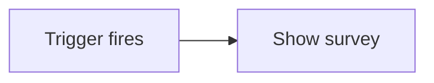
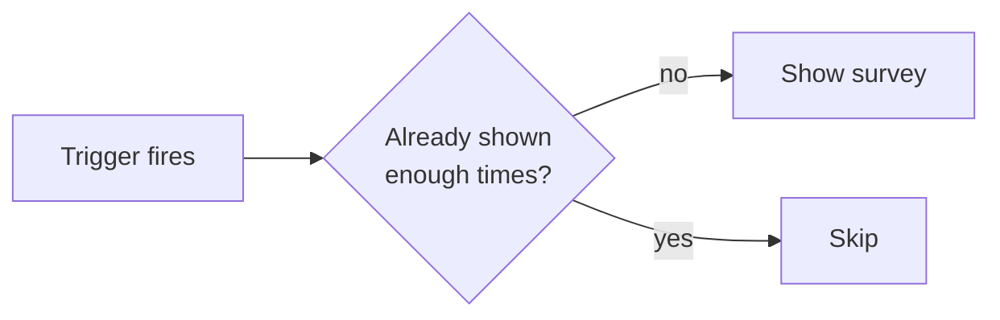
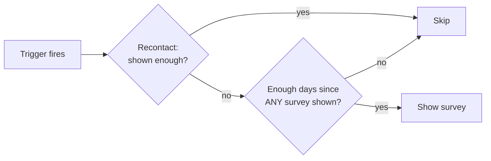
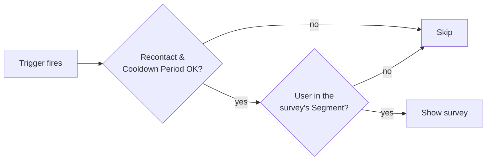
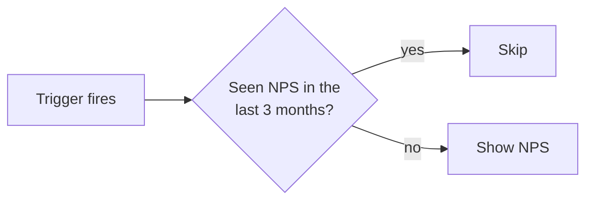
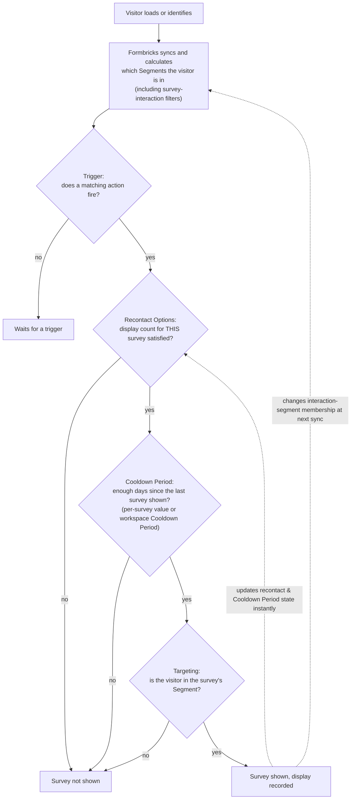

Whether an app survey is shown to a given user comes down to a few independent layers. A survey appears only when **all** of them pass **and** a matching trigger fires. This page builds that model up one layer at a time, from the simplest case to the most advanced.

The layers, in the order Formbricks applies them:

1. **Recontact Options** — how often may *this* survey be shown to the same user?
2. **Cooldown Period** — has enough time passed since the user last saw *any* survey?
3. **Targeting** — is the user in the survey's audience?
4. **Trigger** — did a matching action fire?

## Level 0 — Always show

Take a survey with **no targeting**, **no Cooldown Period**, and Recontact set to **"Keep showing while conditions match"**. Nothing gates it, so it shows **every time its trigger fires**. Simple, but usually too aggressive for anything but a persistent feedback button.

## Level 1 — Recontact Options (per survey)

Recontact Options control how often a single survey may reappear. They count *this* survey's own displays and responses, so they are genuinely **per survey**:

| Option | Shows the survey… |
| --- | --- |
| **Show only once** (default) | once, ever |
| **Show a limited number of times** | up to N displays, or until the user responds |
| **Ask until they submit a response** | on each trigger until the user responds |
| **Keep showing while conditions match** | on every trigger (Level 0) |

**Example:** an onboarding survey set to *Ask until they submit a response* keeps appearing on each trigger until the user answers, then stops.

See [Recontact Options](/surveys/website-app-surveys/recontact) for setup.

## Level 2 — Cooldown Period between surveys

On top of per-survey recontact, a **Cooldown Period** enforces a minimum gap between surveys. Two settings feed it, but they share **one clock**:

- **Workspace Cooldown Period** (default **7 days**): after a user sees *any* survey, no survey shows again for the Cooldown Period.
- **Per-survey override** (*Ignore Cooldown Period* / *Set custom Cooldown Period*): replaces the workspace number **for that survey only**.

<Warning>
  The Cooldown Period is measured from the last time the user saw **any** survey — not from the last time they saw *this* one. So a per-survey "wait 90 days" really means "90 days since the user saw *any* survey," which frequently-shown surveys keep resetting. The per-survey number changes the *value*, not the *clock*. To gate one survey on its **own** schedule, use interaction-based segments (Level 4).
</Warning>

**Example:** with the default 7-day Cooldown Period, showing any short survey today blocks *every* survey — including a quarterly NPS — for the next 7 days.

See [Cooldown Period](/surveys/website-app-surveys/cooldown-period) for setup.

## Level 3 — Targeting with Segments

<Note>
  Targeting is part of [Attribute-based Targeting](/surveys/website-app-surveys/attribute-based-targeting), included in the [Enterprise Edition](/self-hosting/advanced/license).
</Note>

Targeting restricts **who** is eligible. A survey can be assigned a Segment built from **Attributes**, other **Segments**, and **Devices**. Only users who match the Segment pass this layer; everyone else never sees the survey, regardless of triggers or the Cooldown Period.

**Example:** a Segment `plan = "pro"` means only Pro users are eligible for the survey.

See [Attribute-based Targeting](/surveys/website-app-surveys/attribute-based-targeting) for setup.

## Level 4 — Interaction-based Segments

Interaction-based segments add a fourth Segment filter type: target users by **how they interacted with your surveys** — seen, started, or completed within a recent window. Because these look at a *specific* survey's own displays and responses, they do what the shared Cooldown Period clock cannot.

A filter reads as one sentence:

> `<operator>` `<any survey | specific surveys>` **within** `<number>` `<days | weeks | months>`

### Interaction operators

| Operator | Matches users who… |
| --- | --- |
| **have seen** | were shown the survey within the window |
| **have not seen** | were **not** shown the survey within the window |
| **have started responding to** | opened and answered at least one question (finished or not) |
| **have completed** | submitted a completed response within the window |
| **have not completed** | have **no** completed response within the window |

<Note>
  **"have started responding to" vs "have not completed" are not opposites.** *Have started* requires the user to have engaged at least once. *Have not completed* is the negation of *have completed*, so it also matches everyone who never saw or started the survey — use it as an **exclusion**, not stand-alone targeting. To target **drop-offs**, combine both with `AND`: *have started responding to A* **AND** *have not completed A*.
</Note>

### Primary use case: a true per-survey Cooldown Period

This is what interaction segments unlock over the built-in Cooldown Period. To show an **NPS survey every 3 months regardless of other surveys**:

- **Recontact:** *Keep showing while conditions match*.
- **Cooldown Period:** set a **small** custom value (e.g. *1 day*) — a short guard so it can't repeat within a session (see the note below). Do **not** use *Ignore Cooldown Period*.
- **Targeting Segment:** `have not seen NPS within 3 months` (specific survey = NPS).

The Segment provides the real 3-month per-survey cadence; the small Cooldown Period is only a short-term guard. 

### Other use cases

- **Follow-up funnel:** a detail survey targets `have completed NPS within 30 days`.
- **Re-engage drop-offs:** `have started responding to Onboarding AND have not completed Onboarding within 14 days`.

<Note>
  **Interaction membership refreshes on sync, not instantly.** Recontact and the Cooldown Period react the moment a survey is shown; interaction-segment membership is recalculated when the user's data syncs (on load, on `identify`/`setAttributes`, and periodically). This lag is irrelevant for long windows like the 3-month cadence above — the short Cooldown Period guard covers it — but don't rely on interaction filters for *instant* re-display suppression, and don't pair one with *Show only once*, which already blocks re-display permanently.
</Note>

## Putting it all together

---

Still have questions or seeing unexpected behavior? [Join us in GitHub Discussions](https://github.com/formbricks/formbricks/discussions) and we'll be glad to help.
