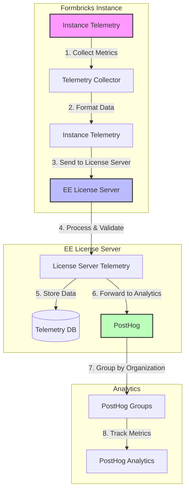

# Unified Telemetry System Plan

## 1. Core Architecture

### Instance Identification
- **Base Identifier System**
  - Use `organizationId` as the primary identifier for all instances
  - For Community Edition: Hash the `organizationId` before transmission
  - For Enterprise Edition: Use raw `organizationId` for detailed insights
  - Store mapping between hashed and raw IDs in a secure database for EE instances

### Architecture Diagram


### Data Collection Structure
```typescript
interface TelemetryData {
  // Anonymous Metrics (Both Editions)
  instanceId: string;                    // Hashed organizationId
  alivePing: {
    timestamp: string;
    version: string;
  };
  activityMetrics: {
    totalResponses: number;
    totalUsers: number;
    totalDisplays: number;
    totalProjects: number;
    totalContacts: number;
    appSetupComplete: boolean;
  };
  
  // Non-Anonymous Metrics (Enterprise Only)
  enterpriseMetrics?: {
    deploymentUrl: string;
    adminEmail?: string;                 // Only if consented during setup
    hashedLicenseKey: string;            // For EE license validation
  };
}
```

## 2. Implementation Details

### Data Flow Architecture
```typescript
// apps/web/lib/telemetry/instance.ts
export class InstanceTelemetry {
  private static instance: InstanceTelemetry;
  private isEnterprise: boolean;

  private constructor() {
    this.isEnterprise = await this.checkEnterpriseStatus();
  }

  public async sendTelemetry(organizationId: string) {
    const metrics = await this.gatherMetrics(organizationId);
    
    // Send to our EE License Server
    await fetch('https://license.formbricks.com/api/telemetry', {
      method: 'POST',
      headers: {
        'Content-Type': 'application/json',
        'Authorization': `Bearer ${process.env.LICENSE_SERVER_API_KEY}`
      },
      body: JSON.stringify({
        organizationId,
        metrics,
        timestamp: new Date().toISOString(),
        isEnterprise: this.isEnterprise
      })
    });
  }
}
```


### Data Collection Service
```typescript
// apps/web/lib/telemetry/collector.ts
export class TelemetryCollector {
  public async collectMetrics(organizationId: string) {
    const [
      responseCount,
      userCount,
      displayCount,
      projectCount,
      contactCount,
      appSetupStatus
    ] = await Promise.all([
      this.getResponseCount(organizationId),
      this.getUserCount(organizationId),
      this.getDisplayCount(organizationId),
      this.getProjectCount(organizationId),
      this.getContactCount(organizationId),
      this.getAppSetupStatus(organizationId)
    ]);

    return {
      totalResponses: responseCount,
      totalUsers: userCount,
      totalDisplays: displayCount,
      totalProjects: projectCount,
      totalContacts: contactCount,
      appSetupComplete: appSetupStatus
    };
  }
}
```

## 3. Collection Schedule

### Regular Collection Points
1. **Alive Ping**
   - Every 24 hours
   - Aligned with EE license check
   - Includes basic instance health

2. **Activity Metrics**
   - Every 6 hours
   - Aggregated counts
   - No personal data

3. **Enterprise Metrics**
   - On significant changes
   - License updates
   - Admin changes

## 4. Privacy & Security

### Data Handling
- **Anonymous Data**
  - All metrics except deployment URL, admin email, and license key
  - Aggregated counts only
  - No personal identifiers

- **Enterprise Data**
  - Stored separately
  - Access controlled
  - Encrypted at rest

### Consent Management
```typescript
// apps/web/lib/telemetry/consent.ts
export class ConsentManager {
  public async checkConsent(organizationId: string) {
    const organization = await prisma.organization.findUnique({
      where: { id: organizationId },
      select: { telemetryConsent: true }
    });
    
    return organization?.telemetryConsent ?? false;
  }
}
```

## 5. Integration Points

### Alive Ping Integration
```typescript
// apps/web/lib/telemetry/alive-ping.ts
export class AlivePingService {
  public async sendAlivePing(organizationId: string) {
    const telemetry = new InstanceTelemetry();
    
    await telemetry.sendTelemetry({
      organizationId,
      alivePing: {
        timestamp: new Date().toISOString(),
        version: process.env.NEXT_PUBLIC_VERSION
      }
    });
  }
}
```

### License Check Integration
```typescript
// apps/web/modules/ee/license-check/lib/license.ts
export const getEnterpriseLicense = reactCache(
  async (): Promise<{
    active: boolean;
    features: TEnterpriseLicenseFeatures;
    limits: YearlyLimit;
  }> => {
    const license = await fetchLicenseFromServerInternal();
    
    // Track license status through our server
    if (license) {
      const telemetry = new InstanceTelemetry();
      await telemetry.sendTelemetry({
        organizationId: env.ORGANIZATION_ID,
        enterpriseMetrics: {
          hashedLicenseKey: hashString(env.ENTERPRISE_LICENSE_KEY),
          deploymentUrl: env.DEPLOYMENT_URL
        }
      });
    }
    
    return license;
  }
);
```

## 6. Migration Strategy

### Phase 1: Basic Metrics
- Implement instance telemetry
- Set up EE License Server endpoint
- Add basic activity metrics

### Phase 2: Enterprise Integration
- Add enterprise-specific fields
- Implement consent management
- Set up license tracking

### Phase 3: Validation & Cleanup
- Verify data collection
- Remove old telemetry system
- Update documentation

## 7. Monitoring & Validation

### Health Checks
```typescript
// apps/web/lib/telemetry/health.ts
export class TelemetryHealth {
  public async validateCollection() {
    const metrics = await this.collectMetrics();
    const expectedFields = [
      'totalResponses',
      'totalUsers',
      'totalDisplays',
      'totalProjects',
      'totalContacts',
      'appSetupComplete'
    ];
    
    return expectedFields.every(field => field in metrics);
  }
}
```

This plan provides a focused approach to telemetry that:
1. Sends data through our EE License Server first
2. Collects specific KPIs for both editions
3. Maintains clear separation between anonymous and non-anonymous data
4. Integrates with existing license check logic
5. Provides flexibility to change analytics providers
