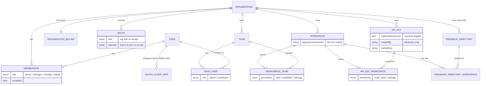
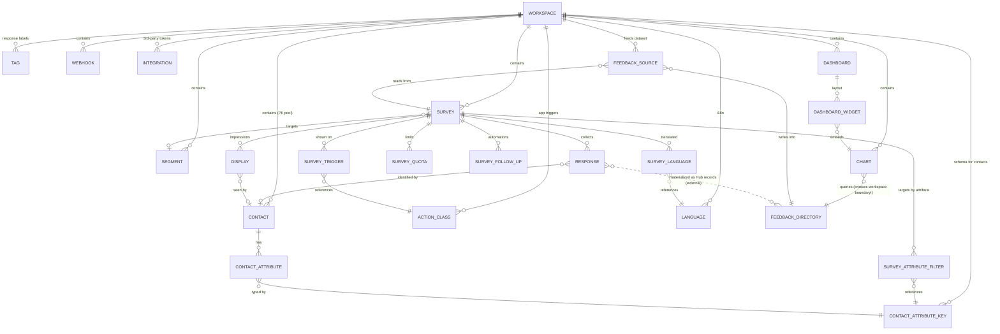
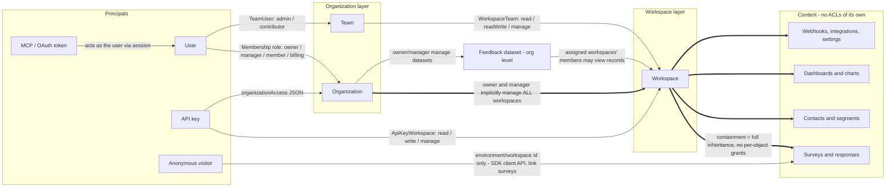

# Status Quo — how authorization works (and hurts) today

_Objective / audience: this document maps how Formbricks authorization actually works today and catalogues everything that is broken or missing. It is the descriptive reference for the authorization-redesign effort — written for engineers, designers, and anyone onboarding to the problem. It contains no solutions and no target model; those live in the companion split docs._

This is the reference map of today's system and its problems. It lays out the entity, content, and grant graphs (§1.1–1.3), where authorization is actually enforced and how far that sprawl reaches (§1.4), the complete list of existing item-level access mechanisms (§1.5), the canonical issue inventory that every other doc cites by ID (§3, I-1…I-35), and a full per-model inventory of how each Prisma model is protected today (§10). It is descriptive only — no target model, no proposed fixes. Pointers are repo-relative and were verified in the July 2026 code sweep.

---

## 1. The system today

### 1.1 Entity map — tenancy & principals

Source of truth: `[packages/database/schema.prisma](../../packages/database/schema.prisma)`. Good news first: the v5 consolidation already removed the old **Environment** layer (production/development duplication) — `Workspace` carries a `legacyEnvironmentId` for backward-compatible public API routing. One historical complexity is already gone.

Auth-relevant observations:

- **Five permission vocabularies** exist side by side, with no common denominator: org roles (`owner|manager|member|billing`), team roles (`admin|contributor`), workspace-team permissions (`read|readWrite|manage`), API-key workspace permissions (`read|write|manage`) plus `organizationAccess` on keys — whose only axis today is `accessControl.{read,write}`, yet it gates the users, teams, workspace-teams _and_ roles endpoints alike — and OAuth scopes (`surveys:read|write`) on MCP tokens. The v3 API already hard-codes a translation table between the key ladder and the team ladder (`write→readWrite`).
- **Teams are the only sharing primitive.** There is no direct user↔workspace edge — a user reaches a workspace either via org role (owner/manager see everything) or via team membership. "Give one person access to one workspace" requires creating a one-person team.
- `FeedbackDirectory` **is the outlier — and the preview of the target model.** It is the only content resource owned at the org level and _assigned_ to workspaces via a join table. Everything else is hard-parented to exactly one workspace.
- `createdBy` **fields** (Survey, Chart, Dashboard, FeedbackSource, ApiKey) are pure attribution today — they confer zero rights. This matches the direction memo (ownership ≠ attribution), but note the Figma draft shows an "Owner" chip in the share dialog, so _some_ owner semantics will need to exist (see Q12).

### 1.2 Entity map — content graph (all hard-scoped to one workspace)

Two edges here cross the workspace boundary and therefore cross today's _permission_ boundary:

1. `Chart → FeedbackDirectory` — a chart lives in workspace A but queries a dataset that may aggregate data from workspaces A, B, C (via `FeedbackSource`s in each). Hub records carry **no workspace dimension**, so a chart cannot be sub-scoped to its own workspace's data. This is the already-accepted-and-documented leak from the Unify-Feedback revamp (workspace gate does not partition dataset data), explicitly deferred to this auth rework.
2. `Webhook.surveyIds` is a plain `String[]` — no FK, referential integrity and workspace-scoping depend on application-level validation.

### 1.3 The grant graph today — every way an actor reaches a resource

The core structural fact: **all authorization is container inheritance.** Access is decided at the org or workspace level and everything inside is all-or-nothing at the granted level. There is no object-level grant anywhere in the system (the closest thing, the old public `resultShareKey` results link, was removed in v5 — `grep resultShareKey` returns nothing). This is exactly the gap BI describes: per-object sharing vs. workspace-inherited rights.

### 1.4 Where authorization is enforced today

Seven distinct enforcement stacks, each with its own helper family and slightly different semantics:

| # | Layer | Mechanism | Key helpers |
| --- | --- | --- | --- |
| 1 | **Server actions** | next-safe-action; `authenticatedActionClient` proves _authentication only_ ([index.ts:50](../../apps/web/lib/utils/action-client/index.ts)) — authorization is a per-action call | `checkAuthorizationUpdated({access: [{type: organization / workspaceTeam / team}]})` with weight tables `read:1 < readWrite:2 < manage:3` ([action-client-middleware.ts:39,94](../../apps/web/lib/utils/action-client/action-client-middleware.ts)) + org-id resolvers in `lib/utils/helper.ts` |
| 2 | **Pages / layouts (RSC)** | per-page guards | `getOrganizationAuth` ([organization/lib/utils.ts:16](../../apps/web/modules/organization/lib/utils.ts)), `getWorkspaceAuth` ([workspaces/lib/utils.ts:33](../../apps/web/modules/workspaces/lib/utils.ts) — computes `isReadOnly = isMember && hasReadAccess`), layout loaders via `hasUserWorkspaceAccess` |
| 3 | **REST v1** | `x-api-key` / `Bearer fbk_…` | `withV1ApiWrapper` ([with-api-logging.ts:298](../../apps/web/app/lib/api/with-api-logging.ts)) + `hasPermission` with `GET→read, POST/PUT/PATCH→write, DELETE→manage` ([api-keys/lib/utils.ts:5](../../apps/web/modules/organization/settings/api-keys/lib/utils.ts)); accepts legacy `environmentId` via workspace resolver |
| 4 | **REST v2** | same key auth, `Result`-typed | `apiWrapper` ([api-wrapper.ts:44](../../apps/web/modules/api/v2/auth/api-wrapper.ts)); org endpoints gate on `organizationAccess.accessControl` + **creator-role anchoring** for user management (self-hosted only, fails safe if the creator left — [users/lib/utils.ts:56](../../apps/web/modules/api/v2/organizations/[organizationId]/users/lib/utils.ts)) |
| 5 | **REST v3 + MCP** | _the beginnings of normalization_: one union `TV3Authentication = ApiKey \| Session` | `requireV3WorkspaceAccess` branches session→`checkAuthorizationUpdated`, API-key→rank check with a hardcoded `write→readWrite` translation table ([v3/lib/auth.ts:14,80](../../apps/web/app/api/v3/lib/auth.ts)); MCP tools guard OAuth scopes `surveys:read/write`, then delegate resource authz to v3 ([modules/mcp/auth.ts](../../apps/web/modules/mcp/auth.ts)) |
| 6 | **Client / public API** | **no auth by design** (SDK + respondents) | `/api/v1/client/[workspaceId]/`\*, `/s/[surveyId]`, `/c/[jwt]`, `/p/[slug]`, storage; ids resolved via `OR(id, legacyEnvironmentId)` ([resolve-client-id.ts:14](../../apps/web/lib/utils/resolve-client-id.ts)) |
| 7 | **Middleware** | coarse session redirect only — no permission logic | [proxy.ts:12](../../apps/web/proxy.ts) + `app/middleware/endpoint-validator.ts` |

Cross-cutting: **~16 EE license getters** ([license-check/lib/utils.ts](../../apps/web/modules/ee/license-check/lib/utils.ts)) gate whole features — `accessControl` gates role management, and _all_ enterprise features default to `false` without a license (roles in the DB stay untouched; RBAC UI/actions just become unavailable). The **EE audit module** has a good event vocabulary (28 target types, 34 actions) but writes to the _logger stream_ — fire-and-forget via `setImmediate`, only when `AUDIT_LOG_ENABLED` + license, with `organizationId` falling back to `UNKNOWN_DATA` ([audit-logs/lib/handler.ts:203](../../apps/web/modules/ee/audit-logs/lib/handler.ts)).

**Sprawl, measured:** 51 files call `checkAuthorizationUpdated`; 33 use `getAccessFlags`; 29 contain inline `isOwner || isManager` checks (mostly UI gating); 82 REST route files across v1/v2/v3/client; ~40 distinct authorization helper functions across the seven stacks; "is owner or manager" is independently re-implemented in at least 5 server-side code paths.

**The flagship inconsistency:** the question _"may user U access workspace W?"_ has **three different answers in code** — `hasUserWorkspaceAccess` (billing role ⇒ **yes**; _any_ team membership counts, permission level ignored — [workspace/auth.ts:97](../../apps/web/lib/workspace/auth.ts)), `hasUserWorkspaceAccessForAction` (billing ⇒ **no**; rank-checked — :42), and the `checkAuthorizationUpdated` paths (owner/manager bypass + weights). The code itself carries a warning that the first one "should not be used for routes that mutate or expose workspace data" (:38).

### 1.5 Existing item-level access mechanisms (the complete list)

Everything item-level today is a **respondent capability** (possession of a link/token) — never a collaborator grant:

| Mechanism                                                                                                                                                      | Identity-bound? | Revocable?                                                                               | Pointer                                                                                                                                                                                 |
| -------------------------------------------------------------------------------------------------------------------------------------------------------------- | --------------- | ---------------------------------------------------------------------------------------- | --------------------------------------------------------------------------------------------------------------------------------------------------------------------------------------- |
| Personal contact links `/c/<jwt>` — JWT carries encrypted `contactId`+`surveyId`, optional expiry; minting gated on owner/manager **or** workspace `readWrite` | contact-bound   | **weak**: optional JWT expiry or rotating the global `ENCRYPTION_KEY`; no per-link store | [contact-survey-link.ts:36](../../apps/web/modules/ee/contacts/lib/contact-survey-link.ts)                                                                                              |
| Single-use links (`suId` / encrypted `suToken`), uniqueness via `Response.singleUseId`                                                                         | no              | disable single-use on the survey                                                         | [responses/route.ts:149](../../apps/web/app/api/v1/client/[workspaceId]/responses/route.ts)                                                                                             |
| Multi-use link `/s/[surveyId]` + optional PIN, email verification; `/p/[slug]` (self-hosted)                                                                   | no              | survey status / disable-link modal                                                       | [link/actions.ts](../../apps/web/modules/survey/link/actions.ts)                                                                                                                        |
| Email embed / website embed                                                                                                                                    | no              | n/a                                                                                      | `…/shareEmbedModal/`                                                                                                                                                                    |
| "Private" segments (`isPrivate=true`)                                                                                                                          | —               | —                                                                                        | not sharing at all: per-survey inline-targeting artifacts (title = surveyId) hidden from segment lists ([segments.ts:300](../../apps/web/modules/ee/contacts/segments/lib/segments.ts)) |

`grep resultShareKey / sharingKey / "/share/"` → empty: the old public-results link is fully gone. **No collaborator-facing per-object grant exists anywhere** — the only content-access primitive is `WorkspaceTeam.permission`. The personal-link minting gate (owner/manager or readWrite) is the one existing precedent for _permission-gated capability minting_; share links (Q9) generalize exactly this pattern.

---

## 3. Issue inventory — what is broken or missing today

_(Numbered for ticket creation. Pointers are repo-relative; all verified in the July 2026 code sweep.)_

### A. Structural gaps (blocking for BI/CMS)

- **I-1 No per-object grants.** No mechanism to grant a user/team access to a single survey, dashboard, or dataset. Workaround (one-person team + dedicated workspace) breaks dependencies (targeting, sources) because moving a survey across workspaces is not supported.
- **I-2 No identity-bound share links.** The old `resultShareKey` public-results link was removed; nothing replaced it (§1.5). The Figma draft (links with audience/expiry/password) is entirely net-new capability.
- **I-3 Flat "workspace read" = full analytics reach.** Any read-level member can view **every** dashboard/chart, **execute arbitrary Cube queries** over the whole dataset (`executeQueryAction` requires only `read` — [charts/actions.ts:265](../../apps/web/modules/ee/analysis/charts/actions.ts)), pull raw records, and see all topics. The Cube `queryRewrite` injects only `tenantId = feedbackDirectoryId` (docker/cube/cube.js:246) — `workspaceId` rides along in the JWT for _audit only_. Since Hub records have **no workspace dimension** (confirmed: `docker/cube/schema/FeedbackRecords.js` has no such column), a dataset assigned to workspaces A+B exposes A's data to every B reader. Accepted + documented during the Unify-Feedback revamp; this rework owns the fix.
- **I-4 No queryable audit trail.** The EE audit module has a solid vocabulary (28 targets / 34 actions) but writes to the **logger stream**, fire-and-forget (`setImmediate`), only when `AUDIT_LOG_ENABLED` + license, with `organizationId` falling back to `UNKNOWN_DATA` ([handler.ts:203](../../apps/web/modules/ee/audit-logs/lib/handler.ts)). No grant-change history, no access-decision record, nothing queryable for BI's audit requirement.
- **I-5 No expiry anywhere.** Memberships, team grants, and API keys cannot be time-boxed (`ApiKey` has no `expiresAt`; grep confirmed). BI's external-agency scenario needs expiring grants (Figma: "until 20 Jan 2027").
- **I-6 API keys are immortal org-shared bearer credentials, not PATs.** Not user-bound (`createdBy` is a bare non-FK string; a departed employee's key keeps working — the _only_ creator-anchored path is org user-management, which fails safe: [users/lib/utils.ts:56](../../apps/web/modules/api/v2/organizations/[organizationId]/users/lib/utils.ts)). No expiry; `updateApiKey` edits **only the label**, so scope changes = delete + recreate ([api-key.ts:211](../../apps/web/modules/organization/settings/api-keys/lib/api-key.ts)). Workspace granularity at best — a `read` key reads all response PII, and un-parameterized `GET /v1/management/responses` **fans out across every workspace the key touches** ([responses/route.ts:44](../../apps/web/app/api/v1/management/responses/route.ts)). `organizationAccess` has exactly one axis (`accessControl.{read,write}`) gating users/teams/workspace-teams/roles endpoints alike.
- **I-7 Contacts are all-or-nothing PII.** Any workspace member (read level) sees the full contact table incl. email/name/userId — `isReadOnly` only hides the CTA ([contacts-page-layout.tsx:41](../../apps/web/modules/ee/contacts/components/contacts-page-layout.tsx)); the EE `contacts` license is the only additional gate. No separation between "use directory for targeting" and "read PII"; cross-border rules (BI EX) unexpressible.
- **I-8 No custom roles / user types** (Qualtrics parity gap). Fixed 4 org roles + 2 team roles + 3 workspace permission levels.
- **I-9 No delegated administration.** Org owner/manager only, for everything org-level — including Feedback Datasets, where even a workspace-`manage` member cannot create/assign/rename/archive a directory ([feedback-directory/actions.ts:37-113](../../apps/web/modules/ee/feedback-directory/actions.ts)). BI's 60k-user self-service governance has no primitive.

### B. Model-consistency problems (make every feature harder)

- **I-10 Five permission vocabularies** that don't compose: org roles, team roles (`admin|contributor`), workspace-team permissions (`read|readWrite|manage`), API-key permissions (`read|write|manage` + `organizationAccess`), OAuth scopes (`surveys:read|write`). v3 already hard-codes a translation table between the key ladder and the team ladder (`write→readWrite`, [v3/lib/auth.ts:14](../../apps/web/app/api/v3/lib/auth.ts)) — drift between ladders is a latent bug class.
- **I-11 Org owner/manager implicit bypass, re-implemented everywhere.** At least 5 distinct server-side code paths + 29 inline `isOwner || isManager` component checks (§1.4 sprawl metrics). Divergence between them is invisible until it's an incident.
- **I-12 Teams are overloaded.** Simultaneously people-groups and the _only_ grant mechanism — real-world team structure and access structure can't diverge without one-person-team hacks.
- **I-13 Enforcement is scattered across seven stacks** (§1.4) with no central `can()`. v3's `TV3Authentication` union is the first normalization attempt — Phase 0 should generalize it.
- **I-14 UI-gating ≠ enforcement, with footguns.** `getTeamPermissionFlags` returns **mutually exclusive** booleans — a `manage` user has `hasReadAccess === false` ([teams/utils/teams.ts:25](../../apps/web/modules/ee/teams/utils/teams.ts)); `getWorkspaceAuth`'s `isReadOnly = isMember && hasReadAccess` depends on this quirk. Components gating on `hasReadAccess` alone silently mis-handle higher roles.
- **I-15 License-gating couples entitlement with authorization.** `accessControl` (EE) gates role management; without a license all EE features are `false` (roles in the DB persist — losing a license does _not_ make everyone owner, verified). CE and EE differ in code paths, not data. The target model should make entitlements an app-level concern cleanly separated from grants (Q10).
- **I-16 Weakly-modeled references, weakly enforced.** `Webhook.surveyIds: String[]` (no FK): v1 stores them **verbatim with no workspace check** ([v1/webhooks/lib/webhook.ts:23](../../apps/web/app/api/v1/webhooks/lib/webhook.ts)); v2 checks all ids share _one_ workspace but **never compares it to the webhook's authorized workspace** ([v2/management/webhooks/route.ts:65](../../apps/web/modules/api/v2/management/webhooks/route.ts)) — a key holder can attach another workspace's surveys to a webhook. `Invite.teamIds: String[]` follows the same pattern.
- **I-17 Dead vocabulary lying around.** Legacy `ZMembershipRole` (`owner/admin/editor/developer/viewer`) still exported next to the live `ZOrganizationRole` ([memberships.ts:3](../../packages/types/memberships.ts)); `hasOrganizationAuthority`/`hasOrganizationOwnership`/`isOwner`/`isManagerOrOwner` appear test-only; `hasPermission`/`hasWorkspacePermission` are byte-identical duplicates. Cleanup belongs in Phase 0.

### C. Public-surface & machine-credential weaknesses

- **I-18 Unauthenticated response mutation.** `PUT /api/v1|v2/client/[workspaceId]/responses/[responseId]` has **no per-response ownership or token check** — anyone knowing a responseId + workspaceId can append data to any _unfinished_ response ([put-response-handler.ts:226](../../apps/web/app/api/v1/client/[workspaceId]/responses/[responseId]/lib/put-response-handler.ts)). Needs a capability token (e.g. suid/display-bound) regardless of the SpiceDB work.
- **I-19 Workspace id = catalog read.** `GET /api/v1/client/[workspaceId]/environment` returns _all_ in-progress app-survey definitions (questions, triggers, styling) to anyone holding a workspace id **or legacy environment id** (widely distributed in old embeds). Segment filters are sanitized (good — only `hasFilters` leaks). By design for the SDK, but should be modeled as an explicit _public/anonymous_ relation in the target model, not an implicit bypass.
- **I-20 Personal links are effectively non-revocable** — no per-link store; only optional JWT expiry or rotating the global `ENCRYPTION_KEY` (which invalidates _every_ link, single-use token and more). Contact deletion doesn't invalidate issued JWTs (render-time lookups just fail).
- **I-21 MCP/OAuth blast radius = the whole user.** Delegated tokens carry only `surveys:read|write` scopes; resource authorization is _entirely_ the user's memberships — no per-resource consent or narrowing ([modules/mcp/auth.ts:298](../../apps/web/modules/mcp/auth.ts)). Dynamic Client Registration is open + unauthenticated (rate-limited only, [mcp-oauth-provider-options.ts:21](../../apps/web/modules/auth/lib/mcp-oauth-provider-options.ts)). Per-object grants would let consent screens offer "this survey only".
- **I-22 Hub trust model is app-side only.** One global `HUB_API_KEY`; `tenant_id` is caller-supplied per request ([hub-client.ts:20](../../apps/web/modules/hub/hub-client.ts)). The Prisma assignment tables + app checks are the _only_ thing preventing cross-tenant reads. Same story for Cube (`CUBEJS_API_SECRET`-signed JWT, good pattern — but directory-scoped only, see I-3).
- **I-23** `CRON_SECRET` **is defined but no enforcement site was found** in this tree (grep) — verify cron-route protection exists somewhere before assuming it.
- **I-24 Secrets-at-rest inconsistency** (adjacent, worth a ticket): integration OAuth tokens for Google/Airtable/Slack and webhook secrets appear stored **unencrypted** in `config`/`secret`; only Notion, 2FA and link tokens use `ENCRYPTION_KEY`/`BETTER_AUTH_SECRET`. Whoever holds workspace access (or DB access) holds live third-party tokens. **Verified 2026-07-12:** [googleSheet/service.ts:186-199](../../apps/web/lib/googleSheet/service.ts) writes `refresh_token`/`access_token` into `config.key` verbatim, whereas [notion/callback/route.ts:117](../../apps/web/app/api/v1/integrations/notion/callback/route.ts) does `symmetricEncrypt(tokenData.access_token, ENCRYPTION_KEY)` — a DB dump leaks usable long-lived Google refresh tokens. High-severity; hotfix candidate.

### D. Scale & operational constraints (BI: 5–6k surveys, 3–4M responses, 60k users)

- **I-25 List endpoints assume container filtering.** "Surveys I can see" is `WHERE workspaceId = X` today; with per-object grants every list becomes authorization-filtered — needs `LookupResources` (cursored) or a mirrored-grants join, decided per endpoint.
- **I-26 Row-level rules must not become tuples.** Manager-scoped EX, min-thresholds, cross-border filters over 3–4M responses stay in the data layer (SQL predicates / Cube security context), _parameterized_ by the auth layer (caveats), never per-response relationships.
- **I-27 No ownership semantics on content.** Any `readWrite` member can update/**delete**/duplicate _any_ chart or dashboard (delete does not even require `manage` — [dashboards/actions.ts:144](../../apps/web/modules/ee/analysis/dashboards/actions.ts)); `createdBy` is informational (`onDelete: SetNull`). Per-object `owner` (Q12) fixes the class.
- **I-28 Directory data lifecycle vs governance.** Archive-only in-app; the only hard purge of Hub data runs on _organization deletion_, best-effort ([organization/service.ts:313](../../apps/web/lib/organization/service.ts)). Archived directories retain records indefinitely — relevant for BI data-retention/audit posture.

### E. Added by the 2026-07-12 code sweep (validated the above; these are net-new)

_A four-area read-only sweep (enforcement layers, Hub/analytics, contacts/public surface, machine credentials) confirmed I-1…I-28 with the pointers above and surfaced the following. The three HIGH items map onto existing entries (I-5/I-6/I-24); the new distinct findings are I-29…I-34._

- **I-29 Unauthenticated contact enumeration + attribute overwrite.** `POST /api/v1|v2/client/[workspaceId]/user` has **no caller auth** (keyed only by the public `workspaceId`). It upserts a `Contact` by `(workspaceId, userId)`, overwrites caller-supplied attributes, and **returns the contact's segment IDs, display history, and responded surveyIds** ([contacts/api/v1/client/[workspaceId]/user/route.ts:46](<../../apps/web/modules/ee/contacts/api/v1/client/[workspaceId]/user/route.ts>)). Anyone who knows a workspaceId (it's in the JS snippet on the customer's site) can, with a guessed/known `userId`, learn a person's segment/survey membership and corrupt their attributes. Worse than I-18 (read + write of PII). Needs a signed identity for the client `user` flow. _Security; hotfix candidate._
- **I-30 Billing-role users reach workspace product data (incl. contact PII) by direct navigation.** The two workspace-access helpers **disagree**: `hasUserWorkspaceAccess` returns **true** for the billing role, `hasUserWorkspaceAccessForAction` returns **false** ([workspace/auth.ts:44 vs :101](../../apps/web/lib/workspace/auth.ts)). Because the workspace **layout** gates on the former and product pages (contacts, survey summary/responses, dashboards) don't re-check `isBilling`, a finance user invited as _billing_ can open `/workspaces/{id}/contacts` or a dashboard and read customer emails/attributes and feedback aggregates. Independently reported by three sweep agents. _Over-privilege + inconsistency._
- **I-31 Team roles never downgraded when an org role is demoted.** `updateMembership` promotes **all** of a user's `TeamUser` rows to `admin` when they become owner/manager, but there is **no inverse branch** on demotion ([role-management/lib/membership.ts:41](../../apps/web/modules/ee/role-management/lib/membership.ts)). A promoted-then-demoted user keeps Team Admin on every team — able to manage membership and workspace links they should no longer control. _Over-privilege._
- **I-32 Org-API team-creation skips the creator-role clamp that user-creation enforces.** `POST /organizations/[id]/users` clamps to the API-key creator's **live** role; `POST /organizations/[id]/teams` gates only on `accessControl.write` with no creator check ([teams/route.ts:42-77](<../../apps/web/modules/api/v2/organizations/[organizationId]/teams/route.ts>)). A key whose creator was demoted/removed can't create users (fail-closed) but **can still create/rename teams**. _Inconsistency; compounds I-6._
- **I-33 Segment/targeting builder leaks the whole contact attribute schema to any survey editor.** The targeting UI loads `getContactAttributeKeys(workspaceId)` + sampled values for autocomplete, gated only by workspace `readWrite` (any survey editor), with no contacts-specific role and `isPrivate` being UI-only ([segments/components/add-filter-modal.tsx:218](../../apps/web/modules/ee/contacts/segments/components/add-filter-modal.tsx)). This is the **live, current-state version of the Q7a concern** — it's exactly why `use_for_targeting` must be a distinct grant from `view_contacts` (D4). _Leak._
- **I-34 Minor hardening cluster.** (a) Legacy (non-`fbk_`) API keys authenticate via bare unsalted **SHA-256** with no bcrypt step and no migration deadline ([api-key.ts:96-105](../../apps/web/modules/organization/settings/api-keys/lib/api-key.ts)) — cheaper to brute-force from a DB leak than v2 keys. (b) The contacts page calls `getContacts` **unconditionally**, so an org whose `contacts` entitlement lapsed still browses stored PII ([contacts/page.tsx:21](../../apps/web/modules/ee/contacts/page.tsx)). (c) `getWorkspaceAuth` never calls `hasUserWorkspaceAccess` — it delegates to the layout, so any _new_ page/route reusing it for authz admits org members with **zero** team grants, and `isReadOnly` mislabels them as writers ([workspaces/lib/utils.ts:33](../../apps/web/modules/workspaces/lib/utils.ts)). _Adjacent to I-14._
- **I-35 Feedback record writes cross workspace boundaries in a shared dataset.** Beyond the I-3 read leak: `deleteFeedbackRecordAction`/`updateFeedbackRecordAction` gate on workspace `readWrite` + `assertRecordBelongsToWorkspace`, which only checks the record's tenant is one of the caller's assigned directories — so a `readWrite` member of workspace B can **delete records created by workspace A's surveys** in a shared dataset ([unify-feedback/actions.ts:198](../../apps/web/modules/ee/unify-feedback/actions.ts)). Same root cause as I-3 (no workspace dimension on Hub records); this rework owns it.

---

## 10. Appendix: full model inventory

Every Prisma model, its scope parent, and how it's protected today:

| Model                                                                                                     | Scoped by                           | Authorization today                        | Notes                                                                                                               |
| --------------------------------------------------------------------------------------------------------- | ----------------------------------- | ------------------------------------------ | ------------------------------------------------------------------------------------------------------------------- |
| Organization                                                                                              | — (root)                            | org role                                   |                                                                                                                     |
| OrganizationBilling                                                                                       | Organization                        | owner + billing                            | plan limits live here (stay out of SpiceDB, Q10)                                                                    |
| Membership                                                                                                | Org × User                          | org role (owner/manager manage)            | the org-role store                                                                                                  |
| Invite                                                                                                    | Organization                        | org owner/manager                          | carries future role + teamIds (I-16)                                                                                |
| Team / TeamUser                                                                                           | Organization                        | org owner/manager + team admin             | the only grouping primitive                                                                                         |
| Workspace                                                                                                 | Organization                        | org role OR WorkspaceTeam                  | `legacyEnvironmentId` for old client routes                                                                         |
| WorkspaceTeam                                                                                             | Workspace × Team                    | org owner/manager                          | the only content-grant store                                                                                        |
| ApiKey / ApiKeyWorkspace                                                                                  | Organization / ×Workspace           | org owner/manager manage; key bears grants | no expiry; scope edits impossible (label-only updates); `organizationAccess` JSON (I-6, I-10)                       |
| Survey                                                                                                    | Workspace                           | inherited                                  | `createdBy` attribution; `slug` globally unique; no object ACL                                                      |
| Response / Display / TagsOnResponses                                                                      | Survey                              | inherited (via workspace)                  | 3–4M rows @ BI — never tuples (I-26); client PUT gap (I-18)                                                         |
| SurveyQuota / ResponseQuotaLink / SurveyFollowUp / SurveyTrigger / SurveyAttributeFilter / SurveyLanguage | Survey                              | inherited                                  | dependency edges (see Product-Inherent Dependencies)                                                               |
| Contact / ContactAttribute / ContactAttributeKey                                                          | Workspace                           | inherited                                  | full PII at workspace-read; EE `contacts` license is the only extra gate (I-7)                                      |
| Segment                                                                                                   | Workspace                           | inherited                                  | `isPrivate` = per-survey inline-targeting segment (title = surveyId), hidden from lists — not a sharing feature     |
| ActionClass                                                                                               | Workspace                           | inherited                                  | app-survey dependency                                                                                               |
| Tag / Language / Integration / Webhook                                                                    | Workspace                           | inherited                                  | Webhook.surveyIds unvalidated FK (I-16); Integration configs hold 3rd-party OAuth tokens, mostly unencrypted (I-24) |
| Chart                                                                                                     | Workspace **and** FeedbackDirectory | inherited from workspace                   | the boundary-crossing edge (I-3)                                                                                    |
| Dashboard / DashboardWidget                                                                               | Workspace                           | inherited                                  | sharing target (Q6)                                                                                                 |
| FeedbackSource (+ mappings)                                                                               | Workspace × FeedbackDirectory       | composite-FK enforced pairing              | survey→dataset feed                                                                                                 |
| FeedbackDirectory / FeedbackDirectoryWorkspace                                                            | Organization / ×Workspace           | org owner/manager manage; hybrid view gate | the target-model preview (§1.1)                                                                                     |
| User / Account / Session / TwoFactor / VerificationToken / PasswordResetToken                             | global                              | self                                       | authn, not authz                                                                                                    |
| oauthClient / oauthAccessToken / oauthRefreshToken / oauthConsent / jwks                                  | User/global                         | Better-Auth (MCP)                          | fifth vocabulary: OAuth scopes (I-10)                                                                               |
| DataMigration                                                                                             | global                              | internal                                   |                                                                                                                     |
