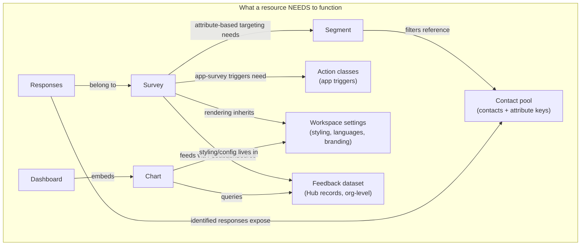

# Product Lens — direction, dependencies & open questions

_Objective / audience:_ This document captures the **product research and direction** behind the authorization redesign, to share with Designers and to record the reasoning. Audience: product + design. It covers why Formbricks resources cannot be shared like a Linear issue (their functional dependencies), the foundational decisions and open questions that shape the sharing model, and how enterprise (BI) requirements map onto the target — plus the concrete questions to put to BI on Thursday.

---

## ⚠️ Framing: this is direction, not committed near-term scope

**The Project Team has decided to NOT change anything from the product angle for now, and to focus on the technical implementation first.** Everything in this document is product _direction and research_ — it is **not** committed near-term scope.

Phase 1 (see Migration Plan) is **plumbing-only**: get today's exact behavior running on SpiceDB — day-0 parity, nothing user-visible changes — and only _then_ progressively refactor toward the direction described below. Read the decisions (D1–D8) and questions (Q1–Q14) here as the destination we are steering toward, not as a build list.

The schema realization of this direction lives in the Target Model doc and its companion `[spicedb-schema-draft.zed](./spicedb-schema-draft.zed)`.

---

## Product direction decisions (D1–D8)

_These are the decisions taken (with their reasoning) as of 2026-07-12. They are recorded here as **direction**. The discussion trail is in the decision log further down; the individual questions each decision resolves are Q1–Q14 below._

| #      | Decision                                                                                                                    | Why (the short version)                                                                                                                                                                                                                                                                                                                                                                                                                                     |
| ------ | --------------------------------------------------------------------------------------------------------------------------- | ----------------------------------------------------------------------------------------------------------------------------------------------------------------------------------------------------------------------------------------------------------------------------------------------------------------------------------------------------------------------------------------------------------------------------------------------------------------------------------------------------------------------------------------------------------------------------------------------------------------------------------------------------------------------------------------------------------------------------------------------------------------------------------------------------------- |
| **D1** | **SpiceDB is a hard dependency** (Q13) — ships in compose/helm, no Prisma fallback engine.                                  | A fallback engine = maintaining two authorization semantics forever, which is the disease we're curing. SpiceDB gives per-object grants, expiry, and `LookupSubjects`/`LookupResources` (the exact primitives the share dialog and list pages need) out of the box. Cost: one Go service + its DB.                                                                                                                                                          |
| **D2** | **Keep the container, but demote it** (Q1). Sharing becomes per-object; the workspace stops being the _only_ ACL mechanism. | Today the workspace is overloaded as both container _and_ sole access boundary (I-12) — that's the complexity. We split them. The container survives because when a user is in several teams with different resource access, "which context am I creating in?" needs a concrete answer. The "1 workspace = 1 app" and per-workspace-styling limits are _not_ reasons to keep it — those get removed by moving contacts and brand kits to org level.         |
| **D3** | **Grant-in-place, never build "move"** (Q2). Personal spaces + per-object grants replace "move it to a workspace."          | Responses and tags are physically bound to a survey; a cross-workspace move strands workspace-scoped Tags/ActionClasses/Segments — confirmed, the existing `copySurveyToOtherWorkspace` already drops them. Qualtrics/Medallia use grant-in-place; Typeform's move model drops data across accounts. So the personal-space blocker ("does the workspace inherit my tags?") dissolves — you never move.                                                      |
| **D4** | **Contacts move to org-level directories** (Q5), split `view_contacts` (PII) from `use_for_targeting` (attenuated).         | BI needs cross-border PII partitioning and single-survey shares that don't leak the contact schema. The `FeedbackDirectory` (org-owned, workspace-assigned) pattern already works; the PII/targeting split is the seam that makes survey-sharing safe (Q7a).                                                                                                                                                                                                |
| **D5** | **Dashboards are first-class shareable objects**, grant _independent_ of dataset access (Q6).                               | Every serious tool (Qualtrics CX dashboards, Tableau) decouples the report from the data store. "Summary-only" is enforced by _what the view exposes_, not one flag; the sensitive/EX case = row-level restriction, copying the category leaders rather than inventing.                                                                                                                                                                                     |
| **D6** | **New: an app-survey "Deployment" object** — the runtime-vs-authoring split.                                                | Confirmed in code: the SDK snippet carries one `workspaceId`, so snippet = workspace = ACL boundary, and everyone who can author on a site sees every survey on it. A Deployment object (Qualtrics "Website/App Feedback project" precedent) owns the snippet + per-site runtime settings and resolves its served surveys _through the auth layer_; it defaults 1:1 with the workspace and stays invisible for the simple case, so we beat Qualtrics on UX. |
| **D7** | **Transferable** `owner` **relation** (Q12); `createdBy` stays immutable attribution.                                       | Today `createdBy` is never re-assignable, so a leaver's content has no one who can re-share it. Owner grants _manage-access only_.                                                                                                                                                                                                                                                                                                                          |
| **D8** | **One** `can()` **gateway; entitlements stay app-level** (Q10).                                                             | Five vocabularies that don't compose (I-10) + enforcement scattered across seven stacks (I-13). Plan limits, EE license gates, and row-level data filters (regions) stay _out_ of SpiceDB — parameterized by caveats, executed in SQL/Cube.                                                                                                                                                                                                     |

---

## Product-inherent dependencies — why we are not Linear

Sharing a Linear issue or a Google Sheet is self-contained: the object carries everything needed to render it. Formbricks resources are **not** self-contained — they have functional dependencies on sibling resources. Any per-object sharing model must answer, per dependency: _does the grant tunnel through, and if yes, how attenuated?_

The dependency closure, spelled out per sharing scenario:

| You share…                                           | It functionally needs                                                                                                                        | Attenuation question                                                                                                                                                                                                                    |
| ---------------------------------------------------- | -------------------------------------------------------------------------------------------------------------------------------------------- | ----------------------------------------------------------------------------------------------------------------------------------------------------------------------------------------------------------------------------------------- |
| **Survey (edit)** — the BI agency case               | Segments + contact attribute keys (targeting editor), action classes (app surveys), workspace styling/languages, response data (results tab) | Does an external editor see segment definitions (= attribute-key metadata, potentially PII-adjacent)? Can they change targeting (= widen who gets surveyed)? Or is targeting read-only/hidden for object-level editors? |
| **Survey (view results)**                            | Responses, response PII (identified contacts!), tags, quotas                                                                                 | "View summary only" (Figma) = aggregates without individual responses — this is a _data-shaping_ rule, not a pure ACL. Where is it enforced?                                                                            |
| **Dashboard (view)** — the BI "dashboard leaks" case | Charts → feedback dataset → Hub records possibly aggregating _other_ workspaces' data                                                         | Does dashboard-view imply scoped dataset read-through (only the chart's stored query), or full dataset query access? Today it's effectively the latter.                                                                 |
| **Segment / contact pool**                           | Contact PII, attribute schema                                                                                                                | Targeting **use** (evaluate membership, list attribute keys) is much weaker than contact **read** (PII). Today there is no such distinction.                                                                            |
| **Workspace (today's only unit)**                    | Everything above at once                                                                                                                     | This is why workspace-sharing over-grants: it's the union of all closures.                                                                                                                                             |

**Key design consequence:** these edges must be _explicit, attenuated permissions_ in the target model (e.g. `survey.use_contact_directory ≠ contact_directory.view_contacts`), not accidental side effects of container inheritance. That's the "conscious decision" the entity map is for.

---

## The foundational questions

These are the decisions to make _consciously_ — grouped by who owns them. Each with the options and a lean (to be challenged).

> **Decision log**
>
> - **2026-07-12 — Q5 DECIDED: contacts move to org level.** Contacts + attribute keys become an org-owned `contact_directory` assigned to workspaces (the `FeedbackDirectory` pattern). Migration starts 1:1 (one directory per existing workspace) so nothing moves on day one.
> - **2026-07-12 — Q13 DECIDED: SpiceDB is a hard dependency.** No Prisma fallback engine; self-hosted ships SpiceDB in compose/helm against the same Postgres (separate DB). Installer upgrade path must run SpiceDB migrations zero-touch.
> - **2026-07-12 — Q1: leaning KEEP the container** — but the _reason_ shifted. The "1 workspace = 1 app/SDK context" and "styling is per-workspace" arguments are **arbitrary limitations, not justifications**: in-app _distributions_ and _brand kits_ should both move to org-level and be auth-gated per team/workspace (Qualtrics has separable distributions). The container survives on a _different_ argument: **creation-context disambiguation** — if a user is in 2 teams with different contact-directory / asset access, "which context am I creating this survey in?" needs a concrete answer, and a shared container gives it. Rename "Workspace"→"Project" still open (Figma sidebar already says "Project").
> - **2026-07-12 — Q12 DECIDED: transferable owner.** Explicit `owner` relation (defaults to creator, reassignable by managers), grants manage-access only; `createdBy` stays immutable attribution.
> - **2026-07-12 — Q2: RESOLVED (direction) — grant-in-place, do NOT build "move".** Competitive evidence (see Competitive Reference, share-in-place vs. move): Qualtrics & Medallia use grant-in-place; Typeform's move-at-workspace model strands data (cross-account move drops all responses); the codebase's `copySurveyToOtherWorkspace` already drops responses/tags because a true move is structurally incoherent (see Competitive Reference, distributions & brand kits). So the personal-space blocker dissolves: you never move a survey, you grant a team access to it in place. **Remaining sub-decision:** where a personal survey's tag vocabulary lives — Tags are workspace-scoped today (`@@unique([workspaceId, name])`); lean is to make tags **survey-scoped** (or give the personal space its own vocabulary) so nothing needs to migrate. Confirm before implementation.
> - **2026-07-12 — Q6: RESOLVED (direction) — dashboard is a first-class shareable object, grant independent of dataset access.** Validated against Qualtrics (CX dashboards) + Tableau (embedded-credential read-through). "View summary only" is enforced at the _rendering layer_ (which widgets/exports are exposed), not a single flag; sensitive/EX case = row-level restriction. See Competitive Reference (dashboard/report sharing).
> - **2026-07-12 — Q1 nuance: link/email distributions stay per-survey; the in-app deployment becomes its own object.** Competitive research (see Competitive Reference, distributions & brand kits): link/email collectors are per-survey (reusable org primitive = the Q5 contact directory). Brand kits at org level ARE precedented (Qualtrics brand themes) → proceed.
> - **2026-07-12 — NEW: app-survey "deployment" object (the runtime-vs-authoring split).** Confirmed in code: the SDK snippet carries ONE `workspaceId` (`/api/v1/client/[workspaceId]/environment`); `getWorkspaceStateData` does `workspace.findUnique → ALL app surveys (type:app,status:inProgress) + action classes + runtime settings` ([data.ts:76-176](apps/web/app/api/v1/client/%5BworkspaceId%5D/environment/lib/data.ts)). So today **snippet = workspace = ACL boundary**: everyone who can author app surveys on a site sees every app survey on that site. **Direction:** introduce a first-class **Deployment/App** object (Qualtrics "Website/App Feedback project" precedent) that owns the snippet id + per-site runtime settings (recontactDays, placement, styling, action classes) and **resolves its served survey set through the auth layer** (`LookupResources(deployment, serves, survey)`) — surveys may come from one or several workspaces via serve-grants, without the workspace ceasing to be the authoring/ACL boundary. **Defaults 1:1 with the workspace and stays invisible** for the simple single-team case (drop snippet, all workspace app-surveys run — identical to today); only the multi-team-one-site case opts into cross-workspace serve-grants. Beats Qualtrics on UX (their 3-object dance is always mandatory; ours is progressive disclosure). The naive "SDK accepts an array of workspaceIds and unions" is rejected: it re-couples runtime to authoring and has no coherent answer for conflicting per-workspace runtime settings.
> - **2026-07-12 — Q7: expanded** with the attribute-metadata sub-question (see Q7 below).

### Product-shape questions (with Design, feeds the July 16 UX proposal)

**Q1 — Do we keep the Workspace concept?**
Options: (a) keep as-is (the permission boundary), (b) keep but _demote_: workspace = app/SDK context + default-ACL container, while sharing happens per object, (c) kill it (org + folders only).
**Lean: (b).** The workspace is genuinely load-bearing for _app_ surveys — widget config, action classes, contact sync, styling are per-app by nature — and it's the natural default container ("everything in Product-X-workspace is visible to Product-X teams"). It is _incidental_ for link surveys and dashboards, which is where per-object sharing takes over. Killing it entirely would force us to reinvent it for SDK config.

**Q2 — Personal workspaces ("My Surveys")?**
The Drive/Qualtrics model: created items land in a private space, shared explicitly.
**Lean: yes, as product packaging on top of (b)** — a personal workspace is just a workspace with one user-manager and no team grants; zero schema cost. Real questions are lifecycle: offboarding takeover (org admin can claim? privacy expectations?), whether app-type surveys are even allowed there (they need SDK context → probably link surveys only), billing attribution, quota. Also the org-policy question: enterprises like BI may want personal spaces _disabled_ or takeover-able by policy.

**Q3 — Do we keep the four org roles?**
**Lean: yes** (owner / manager / member / billing) as coarse RBAC — they map to org administration verbs, not content access. Custom roles are additive later (Q11); don't block v1 on them.

**Q4 — Do we keep Teams and team→workspace roles?**
**Lean: yes, unchanged mechanics** — but teams stop being the _only_ sharing mechanism and become ordinary grant subjects (`team#member`) usable on workspaces _and_ individual objects. The Figma note "user changes role but stays in the team → retains access" is exactly union semantics; no work needed. Decide: do team _admins_ get anything beyond team-membership management? (Today: effectively no.)

**Q5 — Contacts: workspace-scoped or org-level directories? ✅ DECIDED (2026-07-12): org level.**
Today hard-scoped per workspace. BI needs cross-border partitioning and PII discipline; the `FeedbackDirectory` pattern (org-owned, workspace-assigned) already exists and works.
**Decision:** `contact_directory` **is an org-level pool assigned to workspaces** (migration starts 1:1 workspace↔directory so nothing moves; a Prisma migration reparents `Contact`/`ContactAttributeKey`/`Segment` from `workspaceId` to `contactDirectoryId` — the largest data-migration in this project, sequence it early). Separate `view_contacts` (PII) from `use_for_targeting` (attenuated) — this is also the seam that makes survey-sharing safe (see Q7). Answers "how do Contacts relate to shared workspaces": via assignment, like datasets — not by copying contacts around.
**Follow-on to settle:** attribute-key _uniqueness_ becomes org/directory-scoped (today `@@unique([key, workspaceId])`) — collisions across merged workspaces need a resolution rule; and segments currently reference keys by _string_, so the reparent must keep key strings stable.

**Q6 — Dashboards: same sharing as surveys?**
**Lean: yes, identical grant mechanics** (viewer/editor/links) — _plus_ the read-through decision: a shared dashboard renders its charts (pinned to stored queries) even for viewers without dataset access. Ad-hoc data exploration stays gated on the dataset itself. This turns the accepted I-3 leak into a deliberate, curated exposure.

**Q7 — What does sharing a survey imply about its dependencies?** (the closure in "Product-inherent dependencies" above)
For each edge, pick tunnel / attenuate / block. Straw-man: results & summary tunnel (that's the point of sharing); targeting **attenuates** (object-level editors see targeting read-only unless they hold directory access); workspace settings tunnel read-only (styling must render); dataset feed unaffected (server-side pipeline). This single question drives most of the sharing UX edge cases — recommend a dedicated design session on the survey-editor-for-external-collaborator state.

**Q7a — Implicit sharing of contact _attributes_ (raised 2026-07-12).** Sharing a survey exposes contact data in **three distinct tiers**, and the design must gate them separately:

| Tier                               | What it reveals                                                                                                                     | Gate                                                                                              |
| ---------------------------------- | ----------------------------------------------------------------------------------------------------------------------------------- | ------------------------------------------------------------------------------------------------- |
| **Contact identities + values**    | "person X's `region` = DE" — full PII                                                                                               | `contact_directory.view_contacts` — **never** granted by a survey share                           |
| **Attribute _schema_ (keys)**      | _which_ attributes exist org-wide (`salary_band`, `nps_last`, …) — sensitive metadata, since it reveals what you track about people | `contact_directory.use_for_targeting` — the attenuated grant; needed to open the attribute picker |
| **This survey's stored targeting** | the specific keys+values baked into _this_ survey's segment/attribute filters (e.g. "targets `country`=DE")                         | lives _in the survey object_; visible to anyone who can see the targeting tab at all              |

Recommended handling: (1) the attribute **picker** (enumerate all keys, add/widen filters) is gated on `use_for_targeting`, **not** on the survey grant — an external editor without directory access sees targeting **read-only** and cannot discover the full schema; (2) for "view / summary-only" collaborators, **hide the targeting tab entirely** (they don't need it to read results); (3) what remains unavoidably visible is only the targeting already stored on the shared survey — so if _that_ is itself sensitive, the guidance is "don't share that survey's editor; share summary-only." Net: the `view_contacts` vs `use_for_targeting` split (Q5) is exactly what prevents a one-survey share from leaking the attribute schema.

### Platform questions (eng)

**Q8 — API keys → service accounts?** Lean: represent each key as `service_account:<keyId>` with ordinary grants (day-0: mirror `ApiKeyWorkspace`); add per-object grants and expiry; decide whether to _also_ introduce user-bound PATs (DigitalOcean-style, auto-attenuated by the owner's rights — dies/attenuates when the owner leaves) vs. keeping keys org-owned only. `organizationAccess` JSON dissolves into org-level relations.

**Q9 — Share links as principals?** Lean: yes (`share_link` objects with expiring tuples; password + audience checks at redemption in the app). Decide link _creation_ rights (who may mint an "anyone can view" link — org policy flag?).

**Q10 — What stays out of SpiceDB?** Proposed hard line: plan limits & EE entitlements; response/contact row filtering (thresholds, regions, manager scoping) — parameterized by caveats, executed in SQL/Cube; survey delivery gates (status/pin/singleUse/segments); rate limiting. Write this down as policy so the schema doesn't accrete row-level tuples under pressure.

**Q11 — Custom roles: v1 or later?** Qualtrics parity says eventually; SpiceDB supports the role-object pattern without schema surgery. Lean: **later** — ship fixed verbs first; revisit once BI's concrete role matrix exists.

**Q12 — Owner semantics.** Direction memo says `createdBy` = attribution only; Figma shows an "Owner" chip. Lean: introduce an explicit, transferable `owner` _relation_ on shareable objects (defaults to creator at creation, org/workspace managers can reassign); keep `createdBy` as immutable attribution. Owner = `manage_access`, nothing more.

**Q13 — Deployment & self-hosting. ✅ DECIDED (2026-07-12): hard dependency.** SpiceDB ships in compose/helm against the same Postgres instance (separate DB); no Prisma fallback engine. Follow-ons: installer must run SpiceDB migrations zero-touch on upgrade; E2E/CI gets a SpiceDB container (memdb datastore is fine); document the added footprint (one Go service + its DB) in self-hosting docs; decide managed AuthZed vs. self-run SpiceDB for Formbricks Cloud.

**Q14 — Audit.** The EE audit module already has a usable event _vocabulary_ (28 target types, 34 actions) — reuse it, but move storage from the fire-and-forget logger stream (I-4) to a queryable append-only store. Add: grant-change log fed by SpiceDB `Watch`; decision log at the `can()` gateway (sampled or full, retention policy — logging _denies_ matters as much as grants); admin-facing "who has access to X" via `LookupSubjects` (which is also the share dialog's data source). BI's hard audit requirement deserves its own requirements pass.

---

## BI requirements → target mapping

| BI requirement                                     | Today                                                                                                 | Target mechanism                                                                                                                             |
| -------------------------------------------------- | ----------------------------------------------------------------------------------------------------- | -------------------------------------------------------------------------------------------------------------------------------------------- |
| External agency user, single-survey access         | Impossible (workspace-wide or nothing)                                                                | `survey#editor@user` (+ expiration); no workspace grant at all                                                                               |
| Dashboard access without data leak                 | Workspace read ⇒ full dataset query reach (I-3)                                                       | `dashboard#viewer` + chart read-through pinned to stored queries; dataset stays gated                                                        |
| Manager-scoped EX + cross-border rules             | Unexpressible                                                                                         | `summary_viewer` verb + caveat parameters; row scoping in data layer (Q10)                                                                   |
| Hard audit logging                                 | EE audit module logs to app log stream only — fire-and-forget, env+license gated, not queryable (I-4) | `Watch`-fed grant log + `can()` decision log in a queryable store (Q14)                                                                      |
| Self-service governance, 60k users                 | Org owner/manager only (I-9)                                                                          | Team admins + (later) delegated workspace/division admins; SCIM→team sync                                                                    |
| Divisions / sub-team siloing                       | Flat workspaces under one org                                                                         | Workspaces as silos + per-object sharing across; folders/divisions addable later without schema surgery (nested containers are one relation) |
| Per-project collaboration roles (Qualtrics parity) | 3 workspace permission levels via teams only                                                          | Per-object viewer/summary_viewer/editor/owner for any principal type                                                                         |
| Custom user types                                  | None                                                                                                  | Role-object pattern, phase 5 (Q11)                                                                                                           |
| 5–6k surveys, 3–4M responses, 60k users            | n/a                                                                                                   | Tuples only at object granularity (I-26); lists via `LookupResources` or mirrored-grant joins (I-25); responses stay SQL-scoped              |

> **Minimum-response / anonymity thresholds: deferred, out of near-term scope.** (Formerly a BI-mapping row and a clause on the dashboard/EX decisions; considered too far in the future.)

---

## Questions to clarify with BI (Thursday)

1. **Division/hierarchy shape:** how many levels of siloing (division → sub-team)? Strict tree, or can teams span divisions? How deep?
2. **External agency access:** typical scope (a single survey? a single dashboard? a whole project?), expected volume, and who provisions/deprovisions them (BI IT, or self-service by internal owners)?
3. **Concrete role matrix:** which custom user types/roles do you actually need (names + capabilities)? We are deferring custom roles to a later phase and need your real matrix to design for it.
4. **Manager-scoped EX + cross-border:** which data must be scoped by manager hierarchy, what is the source of that hierarchy (HRIS / SCIM / SSO attributes?), and what are the concrete cross-border rules (which data may not cross which borders)?
5. **Audit:** exactly which events must be logged, retention duration, export/format expectations, tamper-evidence/immutability requirement, and who consumes the trail (internal security? works council? external regulator?)?
6. **Self-service governance at 60k users:** what does "self-service" mean operationally — who approves grants, is there an approval workflow, and do you expect SSO/SCIM group→team provisioning?
7. **Offboarding:** when a user leaves, what should happen to the surveys/dashboards they own and the grants they issued?
8. **Data residency:** must data physically stay in a region (per division/country)? Single-region or multi-region?
9. **Link-sharing policy:** does BI security permit "anyone-with-the-link" access, or must every grant be identity-bound? (Drives share-link design.)
10. **Scale distribution:** are the 5–6k surveys / 3–4M responses concentrated per division/workspace or spread org-wide? (Drives list/authorization-filter design.)
