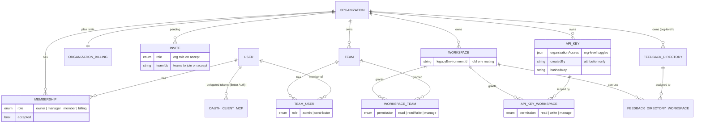
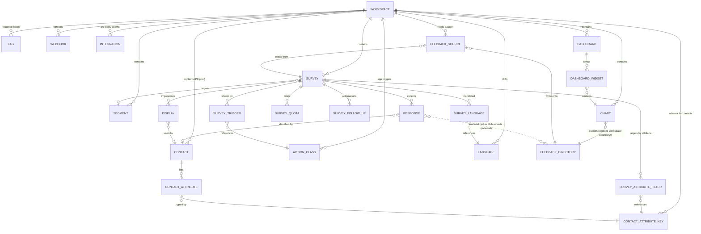
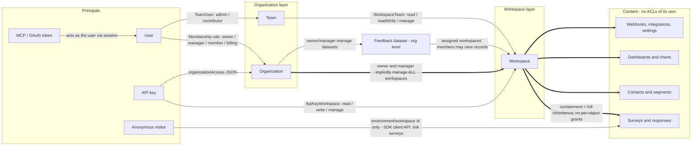
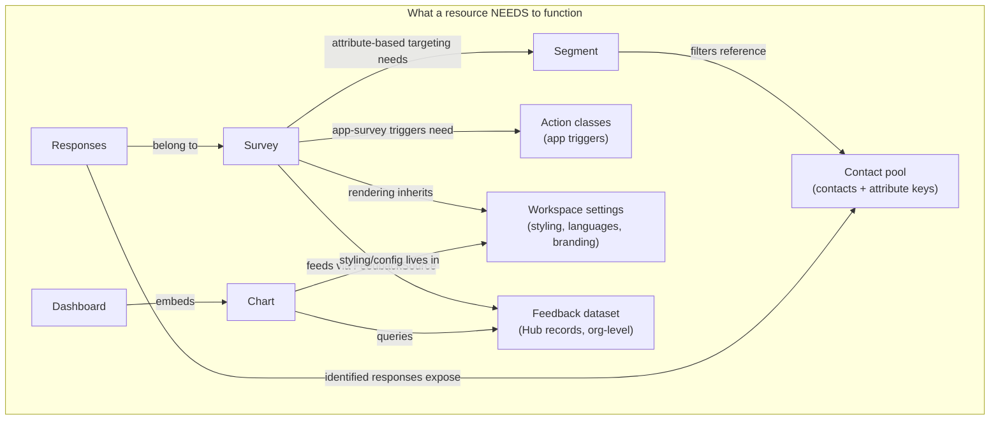
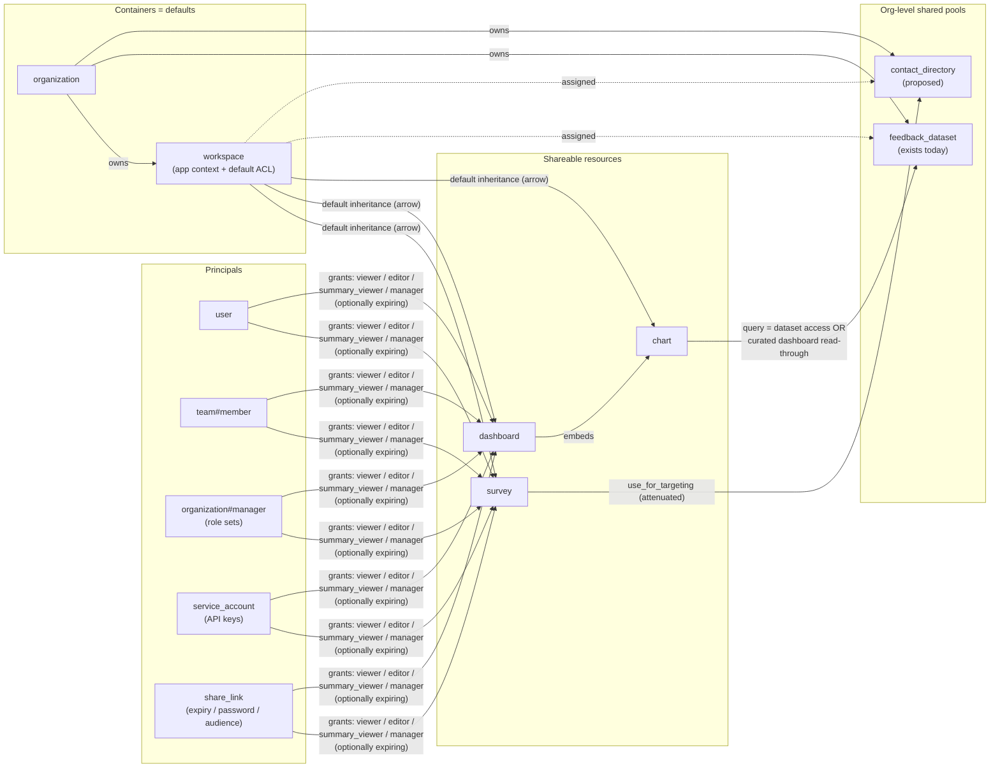

# Authorization Redesign — Entity Map, Issues & SpiceDB Target Model

> Research document, July 2026. Status: **draft for discussion** — the target model is a straw-man to be challenged, per the project brief.
>
> Inputs: BI/CMS enterprise requirements, the internal direction memo (hybrid RBAC + ReBAC + small ABAC, central `can()` layer), the decision to build on **SpiceDB**, and the [Figma sharing-UX starting point](https://www.figma.com/design/0Pzfoc0QjX481WBjqIZVgr/Formbricks-UI?node-id=8545-459) (per-survey share dialog with People / Teams / Roles / Links tabs).
>
> Companion file: [`spicedb-schema-draft.zed`](./spicedb-schema-draft.zed) — the runnable schema draft referenced in §5.

**How to read this:** §1–§2 map what exists today (entities, grants, enforcement, dependencies). §3 is the issue inventory. §4 is a short SpiceDB primer for the team. §5 is the proposed target model. §6 is the list of foundational decisions we need to make consciously. §7 is competitive reference (how Qualtrics/Medallia/BI tools solve the hard parts). §8 maps BI requirements to the target. §9 sketches migration.

---

## 0. Executive summary — decisions, reasoning, open points

*This section is the TL;DR for teammates joining the discussion. It records **what we decided, why, and what is still open** as of 2026-07-12. Everything below it is the supporting evidence. The decisions are captured in more detail (with the discussion trail) in the §6 decision log.*

### What we're building and why

Formbricks' authorization is **home-grown, spread across seven enforcement stacks, and has no per-object sharing** — which blocks the BI and CMS enterprise deals (external agency users who need single-survey access, dashboard access that leaks to anyone with workspace-read, manager-scoped EX data, hard audit logging). The plan is to move to **SpiceDB** (Zanzibar-style ReBAC) behind a single in-repo `can(actor, action, resource)` gateway, normalizing today's five permission vocabularies into one.

### Decisions taken (with the reasoning)

| # | Decision | Why (the short version) |
|---|---|---|
| **D1** | **SpiceDB is a hard dependency** (Q13) — ships in compose/helm, no Prisma fallback engine. | A fallback engine = maintaining two authorization semantics forever, which is the disease we're curing. SpiceDB gives per-object grants, expiry, and `LookupSubjects`/`LookupResources` (the exact primitives the share dialog and list pages need) out of the box. Cost: one Go service + its DB. |
| **D2** | **Keep the container, but demote it** (Q1). Sharing becomes per-object; the workspace stops being the *only* ACL mechanism. | Today the workspace is overloaded as both container *and* sole access boundary (I-12) — that's the complexity. We split them. The container survives because when a user is in several teams with different resource access, "which context am I creating in?" needs a concrete answer. The "1 workspace = 1 app" and per-workspace-styling limits are *not* reasons to keep it — those get removed by moving contacts and brand kits to org level. |
| **D3** | **Grant-in-place, never build "move"** (Q2). Personal spaces + per-object grants replace "move it to a workspace." | Responses and tags are physically bound to a survey; a cross-workspace move strands workspace-scoped Tags/ActionClasses/Segments — confirmed, the existing `copySurveyToOtherWorkspace` already drops them. Qualtrics/Medallia use grant-in-place; Typeform's move model drops data across accounts. So the personal-space blocker ("does the workspace inherit my tags?") dissolves — you never move. |
| **D4** | **Contacts move to org-level directories** (Q5), split `view_contacts` (PII) from `use_for_targeting` (attenuated). | BI needs cross-border PII partitioning and single-survey shares that don't leak the contact schema. The `FeedbackDirectory` (org-owned, workspace-assigned) pattern already works; the PII/targeting split is the seam that makes survey-sharing safe (Q7a). |
| **D5** | **Dashboards are first-class shareable objects**, grant *independent* of dataset access (Q6). | Every serious tool (Qualtrics CX dashboards, Tableau) decouples the report from the data store. "Summary-only" is enforced by *what the view exposes*, not one flag; the sensitive/EX case = row-level restriction + a minimum-response threshold (a caveat), copying the category leaders rather than inventing. |
| **D6** | **New: an app-survey "Deployment" object** — the runtime-vs-authoring split. | Confirmed in code: the SDK snippet carries one `workspaceId`, so snippet = workspace = ACL boundary, and everyone who can author on a site sees every survey on it. A Deployment object (Qualtrics "Website/App Feedback project" precedent) owns the snippet + per-site runtime settings and resolves its served surveys *through the auth layer*; it defaults 1:1 with the workspace and stays invisible for the simple case, so we beat Qualtrics on UX. |
| **D7** | **Transferable `owner` relation** (Q12); `createdBy` stays immutable attribution. | Today `createdBy` is never re-assignable, so a leaver's content has no one who can re-share it. Owner grants *manage-access only*. |
| **D8** | **One `can()` gateway; entitlements stay app-level** (Q10). | Five vocabularies that don't compose (I-10) + enforcement scattered across seven stacks (I-13). Plan limits, EE license gates, and row-level data filters (thresholds, regions) stay *out* of SpiceDB — parameterized by caveats, executed in SQL/Cube. |

### Still open (not yet confirmed)

- **Shape the July 16 UX proposal:** tag-scoping (lean: make Tags survey-scoped so nothing strands), **Workspace → "Project" rename** (Figma already says "Project"), whether personal spaces are in v1 scope, and the Deployment-object UX.
- **Eng, leaning to defaults:** Q3 keep four org roles · Q4 keep teams as grant subjects · Q8 API keys → service accounts + optional user-bound PATs · Q9 share-links as principals + who may mint public links · Q11 custom roles later, not v1 · Q14 audit → queryable store + `Watch`-fed grant log.

### The current-state issues that shouldn't wait for the redesign

The code sweep (2026-07-12) confirmed all 28 catalogued issues and added six. The **security-relevant, independently-fixable** ones: unauthenticated response mutation (I-18) and contact enumeration/attribute overwrite (I-29); **Google OAuth refresh tokens stored in plaintext** while Notion encrypts (I-24); billing-role users reaching product PII by direct navigation (I-30); immortal org-shared API keys (I-5/I-6). Several of these merit hotfixes ahead of the main project — two are already spun off into separate sessions.

---

## Table of contents

0. [Executive summary](#0-executive-summary--decisions-reasoning-open-points)
1. [The system today](#1-the-system-today)
2. [Product-inherent dependencies](#2-product-inherent-dependencies--why-we-are-not-linear)
3. [Issue inventory](#3-issue-inventory--what-is-broken-or-missing-today)
4. [How Zanzibar / SpiceDB thinks](#4-how-zanzibar--spicedb-thinks-primer)
5. [Target model proposal](#5-target-model-proposal-straw-man)
6. [The foundational questions](#6-the-foundational-questions)
7. [Competitive reference — how the incumbents solve this](#7-competitive-reference--how-the-incumbents-solve-this)
8. [BI requirements → target mapping](#8-bi-requirements--target-mapping)
9. [Migration sketch](#9-migration-sketch)
10. [Appendix: full model inventory](#10-appendix-full-model-inventory)

---

## 1. The system today

### 1.1 Entity map — tenancy & principals

Source of truth: [`packages/database/schema.prisma`](../../packages/database/schema.prisma). Good news first: the v5 consolidation already removed the old **Environment** layer (production/development duplication) — `Workspace` carries a `legacyEnvironmentId` for backward-compatible public API routing. One historical complexity is already gone.



Auth-relevant observations:

- **Five permission vocabularies** exist side by side, with no common denominator: org roles (`owner|manager|member|billing`), team roles (`admin|contributor`), workspace-team permissions (`read|readWrite|manage`), API-key workspace permissions (`read|write|manage`) plus `organizationAccess` on keys — whose only axis today is `accessControl.{read,write}`, yet it gates the users, teams, workspace-teams *and* roles endpoints alike — and OAuth scopes (`surveys:read|write`) on MCP tokens. The v3 API already hard-codes a translation table between the key ladder and the team ladder (`write→readWrite`).
- **Teams are the only sharing primitive.** There is no direct user↔workspace edge — a user reaches a workspace either via org role (owner/manager see everything) or via team membership. "Give one person access to one workspace" requires creating a one-person team.
- **`FeedbackDirectory` is the outlier — and the preview of the target model.** It is the only content resource owned at the org level and *assigned* to workspaces via a join table. Everything else is hard-parented to exactly one workspace.
- **`createdBy` fields** (Survey, Chart, Dashboard, FeedbackSource, ApiKey) are pure attribution today — they confer zero rights. This matches the direction memo (ownership ≠ attribution), but note the Figma draft shows an "Owner" chip in the share dialog, so *some* owner semantics will need to exist (see Q12).

### 1.2 Entity map — content graph (all hard-scoped to one workspace)



Two edges here cross the workspace boundary and therefore cross today's *permission* boundary:

1. **`Chart → FeedbackDirectory`** — a chart lives in workspace A but queries a dataset that may aggregate data from workspaces A, B, C (via `FeedbackSource`s in each). Hub records carry **no workspace dimension**, so a chart cannot be sub-scoped to its own workspace's data. This is the already-accepted-and-documented leak from the Unify-Feedback revamp (workspace gate does not partition dataset data), explicitly deferred to this auth rework.
2. **`Webhook.surveyIds`** is a plain `String[]` — no FK, referential integrity and workspace-scoping depend on application-level validation.

### 1.3 The grant graph today — every way an actor reaches a resource



The core structural fact: **all authorization is container inheritance.** Access is decided at the org or workspace level and everything inside is all-or-nothing at the granted level. There is no object-level grant anywhere in the system (the closest thing, the old public `resultShareKey` results link, was removed in v5 — `grep resultShareKey` returns nothing). This is exactly the gap BI describes: per-object sharing vs. workspace-inherited rights.

### 1.4 Where authorization is enforced today

Seven distinct enforcement stacks, each with its own helper family and slightly different semantics:

| # | Layer | Mechanism | Key helpers |
|---|---|---|---|
| 1 | **Server actions** | next-safe-action; `authenticatedActionClient` proves *authentication only* ([index.ts:50](../../apps/web/lib/utils/action-client/index.ts)) — authorization is a per-action call | `checkAuthorizationUpdated({access: [{type: organization / workspaceTeam / team}]})` with weight tables `read:1 < readWrite:2 < manage:3` ([action-client-middleware.ts:39,94](../../apps/web/lib/utils/action-client/action-client-middleware.ts)) + org-id resolvers in `lib/utils/helper.ts` |
| 2 | **Pages / layouts (RSC)** | per-page guards | `getOrganizationAuth` ([organization/lib/utils.ts:16](../../apps/web/modules/organization/lib/utils.ts)), `getWorkspaceAuth` ([workspaces/lib/utils.ts:33](../../apps/web/modules/workspaces/lib/utils.ts) — computes `isReadOnly = isMember && hasReadAccess`), layout loaders via `hasUserWorkspaceAccess` |
| 3 | **REST v1** | `x-api-key` / `Bearer fbk_…` | `withV1ApiWrapper` ([with-api-logging.ts:298](../../apps/web/app/lib/api/with-api-logging.ts)) + `hasPermission` with `GET→read, POST/PUT/PATCH→write, DELETE→manage` ([api-keys/lib/utils.ts:5](../../apps/web/modules/organization/settings/api-keys/lib/utils.ts)); accepts legacy `environmentId` via workspace resolver |
| 4 | **REST v2** | same key auth, `Result`-typed | `apiWrapper` ([api-wrapper.ts:44](../../apps/web/modules/api/v2/auth/api-wrapper.ts)); org endpoints gate on `organizationAccess.accessControl` + **creator-role anchoring** for user management (self-hosted only, fails safe if the creator left — [users/lib/utils.ts:56](<../../apps/web/modules/api/v2/organizations/[organizationId]/users/lib/utils.ts>)) |
| 5 | **REST v3 + MCP** | *the beginnings of normalization*: one union `TV3Authentication = ApiKey \| Session` | `requireV3WorkspaceAccess` branches session→`checkAuthorizationUpdated`, API-key→rank check with a hardcoded `write→readWrite` translation table ([v3/lib/auth.ts:14,80](../../apps/web/app/api/v3/lib/auth.ts)); MCP tools guard OAuth scopes `surveys:read/write`, then delegate resource authz to v3 ([modules/mcp/auth.ts](../../apps/web/modules/mcp/auth.ts)) |
| 6 | **Client / public API** | **no auth by design** (SDK + respondents) | `/api/v1/client/[workspaceId]/*`, `/s/[surveyId]`, `/c/[jwt]`, `/p/[slug]`, storage; ids resolved via `OR(id, legacyEnvironmentId)` ([resolve-client-id.ts:14](../../apps/web/lib/utils/resolve-client-id.ts)) |
| 7 | **Middleware** | coarse session redirect only — no permission logic | [proxy.ts:12](../../apps/web/proxy.ts) + `app/middleware/endpoint-validator.ts` |

Cross-cutting: **~16 EE license getters** ([license-check/lib/utils.ts](../../apps/web/modules/ee/license-check/lib/utils.ts)) gate whole features — `accessControl` gates role management, and *all* enterprise features default to `false` without a license (roles in the DB stay untouched; RBAC UI/actions just become unavailable). The **EE audit module** has a good event vocabulary (28 target types, 34 actions) but writes to the *logger stream* — fire-and-forget via `setImmediate`, only when `AUDIT_LOG_ENABLED` + license, with `organizationId` falling back to `UNKNOWN_DATA` ([audit-logs/lib/handler.ts:203](../../apps/web/modules/ee/audit-logs/lib/handler.ts)).

**Sprawl, measured:** 51 files call `checkAuthorizationUpdated`; 33 use `getAccessFlags`; 29 contain inline `isOwner || isManager` checks (mostly UI gating); 82 REST route files across v1/v2/v3/client; ~40 distinct authorization helper functions across the seven stacks; "is owner or manager" is independently re-implemented in at least 5 server-side code paths.

**The flagship inconsistency:** the question *"may user U access workspace W?"* has **three different answers in code** — `hasUserWorkspaceAccess` (billing role ⇒ **yes**; *any* team membership counts, permission level ignored — [workspace/auth.ts:97](../../apps/web/lib/workspace/auth.ts)), `hasUserWorkspaceAccessForAction` (billing ⇒ **no**; rank-checked — :42), and the `checkAuthorizationUpdated` paths (owner/manager bypass + weights). The code itself carries a warning that the first one "should not be used for routes that mutate or expose workspace data" (:38).

### 1.5 Existing item-level access mechanisms (the complete list)

Everything item-level today is a **respondent capability** (possession of a link/token) — never a collaborator grant:

| Mechanism | Identity-bound? | Revocable? | Pointer |
|---|---|---|---|
| Personal contact links `/c/<jwt>` — JWT carries encrypted `contactId`+`surveyId`, optional expiry; minting gated on owner/manager **or** workspace `readWrite` | contact-bound | **weak**: optional JWT expiry or rotating the global `ENCRYPTION_KEY`; no per-link store | [contact-survey-link.ts:36](../../apps/web/modules/ee/contacts/lib/contact-survey-link.ts) |
| Single-use links (`suId` / encrypted `suToken`), uniqueness via `Response.singleUseId` | no | disable single-use on the survey | [responses/route.ts:149](<../../apps/web/app/api/v1/client/[workspaceId]/responses/route.ts>) |
| Multi-use link `/s/[surveyId]` + optional PIN, email verification; `/p/[slug]` (self-hosted) | no | survey status / disable-link modal | [link/actions.ts](../../apps/web/modules/survey/link/actions.ts) |
| Email embed / website embed | no | n/a | `…/shareEmbedModal/` |
| "Private" segments (`isPrivate=true`) | — | — | not sharing at all: per-survey inline-targeting artifacts (title = surveyId) hidden from segment lists ([segments.ts:300](../../apps/web/modules/ee/contacts/segments/lib/segments.ts)) |

`grep resultShareKey / sharingKey / "/share/"` → empty: the old public-results link is fully gone. **No collaborator-facing per-object grant exists anywhere** — the only content-access primitive is `WorkspaceTeam.permission`. The personal-link minting gate (owner/manager or readWrite) is the one existing precedent for *permission-gated capability minting*; share links (Q9) generalize exactly this pattern.

---

## 2. Product-inherent dependencies — why we are not Linear

Sharing a Linear issue or a Google Sheet is self-contained: the object carries everything needed to render it. Formbricks resources are **not** self-contained — they have functional dependencies on sibling resources. Any per-object sharing model must answer, per dependency: *does the grant tunnel through, and if yes, how attenuated?*



The dependency closure, spelled out per sharing scenario:

| You share… | It functionally needs | Attenuation question |
|---|---|---|
| **Survey (edit)** — the BI agency case | Segments + contact attribute keys (targeting editor), action classes (app surveys), workspace styling/languages, response data (results tab) | Does an external editor see segment definitions (= attribute-key metadata, potentially PII-adjacent)? Can they change targeting (= widen who gets surveyed)? Or is targeting read-only/hidden for object-level editors? |
| **Survey (view results)** | Responses, response PII (identified contacts!), tags, quotas | "View summary only" (Figma) = aggregates without individual responses — this is a *data-shaping* rule, not a pure ACL. Where is it enforced? |
| **Dashboard (view)** — the BI "dashboard leaks" case | Charts → feedback dataset → Hub records possibly aggregating *other* workspaces' data | Does dashboard-view imply scoped dataset read-through (only the chart's stored query), or full dataset query access? Today it's effectively the latter. |
| **Segment / contact pool** | Contact PII, attribute schema | Targeting **use** (evaluate membership, list attribute keys) is much weaker than contact **read** (PII). Today there is no such distinction. |
| **Workspace (today's only unit)** | Everything above at once | This is why workspace-sharing over-grants: it's the union of all closures. |

**Key design consequence:** these edges must be *explicit, attenuated permissions* in the target model (e.g. `survey.use_contact_directory ≠ contact_directory.view_contacts`), not accidental side effects of container inheritance. That's the "conscious decision" the entity map is for.

---

## 3. Issue inventory — what is broken or missing today

*(Numbered for ticket creation. Pointers are repo-relative; all verified in the July 2026 code sweep.)*

### A. Structural gaps (blocking for BI/CMS)

- **I-1 No per-object grants.** No mechanism to grant a user/team access to a single survey, dashboard, or dataset. Workaround (one-person team + dedicated workspace) breaks dependencies (targeting, sources) because moving a survey across workspaces is not supported.
- **I-2 No identity-bound share links.** The old `resultShareKey` public-results link was removed; nothing replaced it (§1.5). The Figma draft (links with audience/expiry/password) is entirely net-new capability.
- **I-3 Flat "workspace read" = full analytics reach.** Any read-level member can view **every** dashboard/chart, **execute arbitrary Cube queries** over the whole dataset (`executeQueryAction` requires only `read` — [charts/actions.ts:265](../../apps/web/modules/ee/analysis/charts/actions.ts)), pull raw records, and see all topics. The Cube `queryRewrite` injects only `tenantId = feedbackDirectoryId` (docker/cube/cube.js:246) — `workspaceId` rides along in the JWT for *audit only*. Since Hub records have **no workspace dimension** (confirmed: `docker/cube/schema/FeedbackRecords.js` has no such column), a dataset assigned to workspaces A+B exposes A's data to every B reader. Accepted + documented during the Unify-Feedback revamp; this rework owns the fix.
- **I-4 No queryable audit trail.** The EE audit module has a solid vocabulary (28 targets / 34 actions) but writes to the **logger stream**, fire-and-forget (`setImmediate`), only when `AUDIT_LOG_ENABLED` + license, with `organizationId` falling back to `UNKNOWN_DATA` ([handler.ts:203](../../apps/web/modules/ee/audit-logs/lib/handler.ts)). No grant-change history, no access-decision record, nothing queryable for BI's audit requirement.
- **I-5 No expiry anywhere.** Memberships, team grants, and API keys cannot be time-boxed (`ApiKey` has no `expiresAt`; grep confirmed). BI's external-agency scenario needs expiring grants (Figma: "until 20 Jan 2027").
- **I-6 API keys are immortal org-shared bearer credentials, not PATs.** Not user-bound (`createdBy` is a bare non-FK string; a departed employee's key keeps working — the *only* creator-anchored path is org user-management, which fails safe: [users/lib/utils.ts:56](<../../apps/web/modules/api/v2/organizations/[organizationId]/users/lib/utils.ts>)). No expiry; `updateApiKey` edits **only the label**, so scope changes = delete + recreate ([api-key.ts:211](../../apps/web/modules/organization/settings/api-keys/lib/api-key.ts)). Workspace granularity at best — a `read` key reads all response PII, and un-parameterized `GET /v1/management/responses` **fans out across every workspace the key touches** ([responses/route.ts:44](../../apps/web/app/api/v1/management/responses/route.ts)). `organizationAccess` has exactly one axis (`accessControl.{read,write}`) gating users/teams/workspace-teams/roles endpoints alike.
- **I-7 Contacts are all-or-nothing PII.** Any workspace member (read level) sees the full contact table incl. email/name/userId — `isReadOnly` only hides the CTA ([contacts-page-layout.tsx:41](../../apps/web/modules/ee/contacts/components/contacts-page-layout.tsx)); the EE `contacts` license is the only additional gate. No separation between "use directory for targeting" and "read PII"; cross-border rules (BI EX) unexpressible.
- **I-8 No custom roles / user types** (Qualtrics parity gap). Fixed 4 org roles + 2 team roles + 3 workspace permission levels.
- **I-9 No delegated administration.** Org owner/manager only, for everything org-level — including Feedback Datasets, where even a workspace-`manage` member cannot create/assign/rename/archive a directory ([feedback-directory/actions.ts:37-113](../../apps/web/modules/ee/feedback-directory/actions.ts)). BI's 60k-user self-service governance has no primitive.

### B. Model-consistency problems (make every feature harder)

- **I-10 Five permission vocabularies** that don't compose: org roles, team roles (`admin|contributor`), workspace-team permissions (`read|readWrite|manage`), API-key permissions (`read|write|manage` + `organizationAccess`), OAuth scopes (`surveys:read|write`). v3 already hard-codes a translation table between the key ladder and the team ladder (`write→readWrite`, [v3/lib/auth.ts:14](../../apps/web/app/api/v3/lib/auth.ts)) — drift between ladders is a latent bug class.
- **I-11 Org owner/manager implicit bypass, re-implemented everywhere.** At least 5 distinct server-side code paths + 29 inline `isOwner || isManager` component checks (§1.4 sprawl metrics). Divergence between them is invisible until it's an incident.
- **I-12 Teams are overloaded.** Simultaneously people-groups and the *only* grant mechanism — real-world team structure and access structure can't diverge without one-person-team hacks.
- **I-13 Enforcement is scattered across seven stacks** (§1.4) with no central `can()`. v3's `TV3Authentication` union is the first normalization attempt — Phase 0 should generalize it.
- **I-14 UI-gating ≠ enforcement, with footguns.** `getTeamPermissionFlags` returns **mutually exclusive** booleans — a `manage` user has `hasReadAccess === false` ([teams/utils/teams.ts:25](../../apps/web/modules/ee/teams/utils/teams.ts)); `getWorkspaceAuth`'s `isReadOnly = isMember && hasReadAccess` depends on this quirk. Components gating on `hasReadAccess` alone silently mis-handle higher roles.
- **I-15 License-gating couples entitlement with authorization.** `accessControl` (EE) gates role management; without a license all EE features are `false` (roles in the DB persist — losing a license does *not* make everyone owner, verified). CE and EE differ in code paths, not data. The target model should make entitlements an app-level concern cleanly separated from grants (Q10).
- **I-16 Weakly-modeled references, weakly enforced.** `Webhook.surveyIds: String[]` (no FK): v1 stores them **verbatim with no workspace check** ([v1/webhooks/lib/webhook.ts:23](../../apps/web/app/api/v1/webhooks/lib/webhook.ts)); v2 checks all ids share *one* workspace but **never compares it to the webhook's authorized workspace** ([v2/management/webhooks/route.ts:65](../../apps/web/modules/api/v2/management/webhooks/route.ts)) — a key holder can attach another workspace's surveys to a webhook. `Invite.teamIds: String[]` follows the same pattern.
- **I-17 Dead vocabulary lying around.** Legacy `ZMembershipRole` (`owner/admin/editor/developer/viewer`) still exported next to the live `ZOrganizationRole` ([memberships.ts:3](../../packages/types/memberships.ts)); `hasOrganizationAuthority`/`hasOrganizationOwnership`/`isOwner`/`isManagerOrOwner` appear test-only; `hasPermission`/`hasWorkspacePermission` are byte-identical duplicates. Cleanup belongs in Phase 0.

### C. Public-surface & machine-credential weaknesses

- **I-18 Unauthenticated response mutation.** `PUT /api/v1|v2/client/[workspaceId]/responses/[responseId]` has **no per-response ownership or token check** — anyone knowing a responseId + workspaceId can append data to any *unfinished* response ([put-response-handler.ts:226](<../../apps/web/app/api/v1/client/[workspaceId]/responses/[responseId]/lib/put-response-handler.ts>)). Needs a capability token (e.g. suid/display-bound) regardless of the SpiceDB work.
- **I-19 Workspace id = catalog read.** `GET /api/v1/client/[workspaceId]/environment` returns *all* in-progress app-survey definitions (questions, triggers, styling) to anyone holding a workspace id **or legacy environment id** (widely distributed in old embeds). Segment filters are sanitized (good — only `hasFilters` leaks). By design for the SDK, but should be modeled as an explicit *public/anonymous* relation in the target model, not an implicit bypass.
- **I-20 Personal links are effectively non-revocable** — no per-link store; only optional JWT expiry or rotating the global `ENCRYPTION_KEY` (which invalidates *every* link, single-use token and more). Contact deletion doesn't invalidate issued JWTs (render-time lookups just fail).
- **I-21 MCP/OAuth blast radius = the whole user.** Delegated tokens carry only `surveys:read|write` scopes; resource authorization is *entirely* the user's memberships — no per-resource consent or narrowing ([modules/mcp/auth.ts:298](../../apps/web/modules/mcp/auth.ts)). Dynamic Client Registration is open + unauthenticated (rate-limited only, [mcp-oauth-provider-options.ts:21](../../apps/web/modules/auth/lib/mcp-oauth-provider-options.ts)). Per-object grants would let consent screens offer "this survey only".
- **I-22 Hub trust model is app-side only.** One global `HUB_API_KEY`; `tenant_id` is caller-supplied per request ([hub-client.ts:20](../../apps/web/modules/hub/hub-client.ts)). The Prisma assignment tables + app checks are the *only* thing preventing cross-tenant reads. Same story for Cube (`CUBEJS_API_SECRET`-signed JWT, good pattern — but directory-scoped only, see I-3).
- **I-23 `CRON_SECRET` is defined but no enforcement site was found** in this tree (grep) — verify cron-route protection exists somewhere before assuming it.
- **I-24 Secrets-at-rest inconsistency** (adjacent, worth a ticket): integration OAuth tokens for Google/Airtable/Slack and webhook secrets appear stored **unencrypted** in `config`/`secret`; only Notion, 2FA and link tokens use `ENCRYPTION_KEY`/`BETTER_AUTH_SECRET`. Whoever holds workspace access (or DB access) holds live third-party tokens. **Verified 2026-07-12:** [googleSheet/service.ts:186-199](../../apps/web/lib/googleSheet/service.ts) writes `refresh_token`/`access_token` into `config.key` verbatim, whereas [notion/callback/route.ts:117](<../../apps/web/app/api/v1/integrations/notion/callback/route.ts>) does `symmetricEncrypt(tokenData.access_token, ENCRYPTION_KEY)` — a DB dump leaks usable long-lived Google refresh tokens. High-severity; hotfix candidate.

### D. Scale & operational constraints (BI: 5–6k surveys, 3–4M responses, 60k users)

- **I-25 List endpoints assume container filtering.** "Surveys I can see" is `WHERE workspaceId = X` today; with per-object grants every list becomes authorization-filtered — needs `LookupResources` (cursored) or a mirrored-grants join, decided per endpoint.
- **I-26 Row-level rules must not become tuples.** Manager-scoped EX, min-thresholds, cross-border filters over 3–4M responses stay in the data layer (SQL predicates / Cube security context), *parameterized* by the auth layer (caveats), never per-response relationships.
- **I-27 No ownership semantics on content.** Any `readWrite` member can update/**delete**/duplicate *any* chart or dashboard (delete does not even require `manage` — [dashboards/actions.ts:144](../../apps/web/modules/ee/analysis/dashboards/actions.ts)); `createdBy` is informational (`onDelete: SetNull`). Per-object `owner` (Q12) fixes the class.
- **I-28 Directory data lifecycle vs governance.** Archive-only in-app; the only hard purge of Hub data runs on *organization deletion*, best-effort ([organization/service.ts:313](../../apps/web/lib/organization/service.ts)). Archived directories retain records indefinitely — relevant for BI data-retention/audit posture.

### E. Added by the 2026-07-12 code sweep (validated the above; these are net-new)

*A four-area read-only sweep (enforcement layers, Hub/analytics, contacts/public surface, machine credentials) confirmed I-1…I-28 with the pointers above and surfaced the following. The three HIGH items map onto existing entries (I-5/I-6/I-24); the new distinct findings are I-29…I-34.*

- **I-29 Unauthenticated contact enumeration + attribute overwrite.** `POST /api/v1|v2/client/[workspaceId]/user` has **no caller auth** (keyed only by the public `workspaceId`). It upserts a `Contact` by `(workspaceId, userId)`, overwrites caller-supplied attributes, and **returns the contact's segment IDs, display history, and responded surveyIds** ([contacts/api/v1/client/[workspaceId]/user/route.ts:46](<../../apps/web/modules/ee/contacts/api/v1/client/[workspaceId]/user/route.ts>)). Anyone who knows a workspaceId (it's in the JS snippet on the customer's site) can, with a guessed/known `userId`, learn a person's segment/survey membership and corrupt their attributes. Worse than I-18 (read + write of PII). Needs a signed identity for the client `user` flow. *Security; hotfix candidate.*
- **I-30 Billing-role users reach workspace product data (incl. contact PII) by direct navigation.** The two workspace-access helpers **disagree**: `hasUserWorkspaceAccess` returns **true** for the billing role, `hasUserWorkspaceAccessForAction` returns **false** ([workspace/auth.ts:44 vs :101](../../apps/web/lib/workspace/auth.ts)). Because the workspace **layout** gates on the former and product pages (contacts, survey summary/responses, dashboards) don't re-check `isBilling`, a finance user invited as *billing* can open `/workspaces/{id}/contacts` or a dashboard and read customer emails/attributes and feedback aggregates. Independently reported by three sweep agents. *Over-privilege + inconsistency.*
- **I-31 Team roles never downgraded when an org role is demoted.** `updateMembership` promotes **all** of a user's `TeamUser` rows to `admin` when they become owner/manager, but there is **no inverse branch** on demotion ([role-management/lib/membership.ts:41](../../apps/web/modules/ee/role-management/lib/membership.ts)). A promoted-then-demoted user keeps Team Admin on every team — able to manage membership and workspace links they should no longer control. *Over-privilege.*
- **I-32 Org-API team-creation skips the creator-role clamp that user-creation enforces.** `POST /organizations/[id]/users` clamps to the API-key creator's **live** role; `POST /organizations/[id]/teams` gates only on `accessControl.write` with no creator check ([teams/route.ts:42-77](<../../apps/web/modules/api/v2/organizations/[organizationId]/teams/route.ts>)). A key whose creator was demoted/removed can't create users (fail-closed) but **can still create/rename teams**. *Inconsistency; compounds I-6.*
- **I-33 Segment/targeting builder leaks the whole contact attribute schema to any survey editor.** The targeting UI loads `getContactAttributeKeys(workspaceId)` + sampled values for autocomplete, gated only by workspace `readWrite` (any survey editor), with no contacts-specific role and `isPrivate` being UI-only ([segments/components/add-filter-modal.tsx:218](../../apps/web/modules/ee/contacts/segments/components/add-filter-modal.tsx)). This is the **live, current-state version of the Q7a concern** — it's exactly why `use_for_targeting` must be a distinct grant from `view_contacts` (D4). *Leak.*
- **I-34 Minor hardening cluster.** (a) Legacy (non-`fbk_`) API keys authenticate via bare unsalted **SHA-256** with no bcrypt step and no migration deadline ([api-key.ts:96-105](../../apps/web/modules/organization/settings/api-keys/lib/api-key.ts)) — cheaper to brute-force from a DB leak than v2 keys. (b) The contacts page calls `getContacts` **unconditionally**, so an org whose `contacts` entitlement lapsed still browses stored PII ([contacts/page.tsx:21](../../apps/web/modules/ee/contacts/page.tsx)). (c) `getWorkspaceAuth` never calls `hasUserWorkspaceAccess` — it delegates to the layout, so any *new* page/route reusing it for authz admits org members with **zero** team grants, and `isReadOnly` mislabels them as writers ([workspaces/lib/utils.ts:33](../../apps/web/modules/workspaces/lib/utils.ts)). *Adjacent to I-14.*
- **I-35 Feedback record writes cross workspace boundaries in a shared dataset.** Beyond the I-3 read leak: `deleteFeedbackRecordAction`/`updateFeedbackRecordAction` gate on workspace `readWrite` + `assertRecordBelongsToWorkspace`, which only checks the record's tenant is one of the caller's assigned directories — so a `readWrite` member of workspace B can **delete records created by workspace A's surveys** in a shared dataset ([unify-feedback/actions.ts:198](../../apps/web/modules/ee/unify-feedback/actions.ts)). Same root cause as I-3 (no workspace dimension on Hub records); this rework owns it.

---

## 4. How Zanzibar / SpiceDB thinks (primer)

*(Skip if you know SpiceDB; §5 applies this to Formbricks.)*

SpiceDB is a database for one specific data model: **relationships** (`document:readme#viewer@user:anna`) plus a **schema** that says how relationships combine into **permissions**. The app asks one question: `CheckPermission(resource, permission, subject)` → yes/no. Everything else (roles, sharing, inheritance, groups) is *modeling*, not features you bolt on.

The schema language, in 30 seconds:

```zed
definition team {
  relation member: user
}

definition workspace {
  relation org: organization
  relation viewer: user | team#member        // subjects can be users OR whole groups
  permission view = viewer + org->admin      // union + follow-an-edge ("arrow")
}

definition survey {
  relation workspace: workspace
  relation viewer: user | team#member | share_link
  permission view = viewer + workspace->view // per-object grant OR container inheritance
}
```

The features that matter for our case:

| SpiceDB concept | What it gives Formbricks |
|---|---|
| **Subject relations** (`team#member`) | Teams-as-subjects for any grant — "share survey with team" is one tuple, membership changes propagate automatically. Also works for org-role sets: `organization:acme#manager` = "all managers", which is exactly the Figma "Roles" tab. |
| **Arrows** (`workspace->view`) | Container inheritance as *one* schema line instead of N re-implementations. The org-admin bypass (I-11) becomes a single `org->admin` term. |
| **Union `+` semantics** | "Each user's access is the sum of their role, team, and individual access" — the exact sentence in the Figma draft. Zanzibar models are additive by default. (Exclusions `-` exist but should stay out of v1 — "deny for this one person despite team grant" is a UX and model trap.) |
| **Caveats** (CEL expressions on relationships) | Small ABAC predicates: grant context stored on the relationship (e.g. `threshold=25`) + request context (e.g. current `response_count`) → conditional permission. Fits min-response thresholds and region predicates without inventing a policy engine. |
| **Expiring relationships** (`use expiration`, `expires_at` per tuple) | Time-boxed grants natively ("until 20 Jan 2027"), GC'd automatically. First-class in current SpiceDB. |
| **`LookupResources` / `LookupSubjects`** | "All surveys this user can view" (list pages, I-25) and "everyone with access to this survey" (the share dialog's People tab). |
| **ZedTokens / consistency levels** | Tunable read-after-write: default `minimize_latency`, use the write's ZedToken (`at_least_as_fresh`) right after ACL mutations so the share dialog never shows stale state (the "new enemy" problem). |
| **`Watch` API** | Stream of relationship changes → grant-change audit trail comes almost for free (decision-level audit still needs app logging at the `can()` gateway). |
| **`ImportBulk` / `ExportBulk`** | Backfill from Prisma and recurring reconciliation jobs. |

What SpiceDB is deliberately **not** for us:

- **Not the row filter.** Per-response / per-contact rules (thresholds, cross-border, manager scoping over 3–4M rows) stay in SQL/Cube predicates. SpiceDB answers *"may this actor run this query shape at all"*; the data layer shapes the rows. (Caveats can carry the parameters.)
- **Not the plan/entitlement system.** Billing limits and EE license gates stay app-level (they're org-attributes, not relationships) — this also cleanly decouples I-15.
- **Not the delivery gate.** Whether an anonymous respondent may *answer* a survey (status, pin, singleUse, segment targeting) is runtime product logic, not ACL.
- **Operationally:** one extra stateful service (Go binary + its Postgres). Cloud can use managed AuthZed or self-run; self-hosted CE ships it in docker-compose/helm pointing at the same Postgres instance (separate database). This is a real cost — surfaced as Q13 rather than hand-waved.

---

## 5. Target model proposal (straw-man)

### 5.1 Design principles

1. **One vocabulary.** Every actor (user, team, org-role set, API key, share link) × every resource goes through the same `can(actor, action, resource)` gateway; the five vocabularies of I-10 become relations in one schema.
2. **Containers become defaults, not prisons.** Workspace/org grants keep working exactly as today (day-0 parity), but stop being the *only* path — per-object grants sit beside them, additively.
3. **Dependencies are explicit and attenuated** (§2): sharing a survey never silently grants contact-PII or dataset query rights.
4. **Coarse objects only.** Tuples exist for org / workspace / team / survey / dashboard / chart / dataset / directory / service-account / share-link. Never for responses, contacts, or records (I-26).
5. **Machine principals are first-class but never special.** API keys and MCP tokens hold grants like users do — attenuation (PAT-style), not privilege escalation.

### 5.2 The reorganized entity graph



What got *simpler* vs. today: one grant mechanism instead of four; org-admin bypass is one schema line; teams become ordinary subjects (they stop being the only sharing tool, fixing I-12); "personal workspace" needs no new machinery (it's a workspace whose only manager is one user — the concept is product packaging, not schema). What got *more versatile*: any principal type can hold any grant on any shareable resource, with expiry; datasets and (proposed) contact directories are org-pools assigned to workspaces — the `FeedbackDirectory` pattern generalized.

### 5.3 The schema draft

See [`spicedb-schema-draft.zed`](./spicedb-schema-draft.zed) — commented, with the day-0 parity mapping at the bottom. Highlights:

- `survey` gets `editor` / `viewer` / `summary_viewer` relations whose allowed subject types are exactly the Figma tabs: `user` (People), `team#member` (Teams), `organization#manager|member` (Roles), `share_link` (Links) — plus `service_account`. Grants can carry `expiration`.
- `permission view_summary = summary_viewer + view_responses` models "can view summary but not individual responses" as a *separate verb* the app enforces by serving only aggregates — with an optional `min_responses` caveat carrying BI's threshold.
- `chart.query = dataset->view_records + dashboard->view` encodes the dashboard decision (Q7): dataset access *or* deliberately-curated dashboard read-through — in which case the app must pin the query to the chart's stored definition (no ad-hoc pivots through a shared dashboard).
- `contact_directory` separates `view_contacts` (PII) from `use_for_targeting` (evaluate segments / list attribute keys) — the attenuation from §2.

### 5.4 Day-0 parity (nothing changes until we want it to)

Every existing grant maps mechanically onto the schema (full table at the bottom of the `.zed` file): `Membership` → org relations, `TeamUser` → team relations, `WorkspaceTeam.read/readWrite/manage` → workspace `viewer/editor/manager` with `team#member` subjects, `ApiKeyWorkspace` → the same with `service_account` subjects, `FeedbackDirectoryWorkspace` → `feedback_dataset#workspace_access`. Backfill is a deterministic script over five Prisma tables; shadow-mode diffing can prove parity before any enforcement flips (§9).

### 5.5 Worked examples (BI scenarios as tuples)

**External agency user edits exactly one survey** (the core BI ask):

```
survey:S1#editor@user:agency_anna[expiration:2027-01-20T00:00:00Z]
```

Anna gets: edit + view_responses on S1. She does *not* get: workspace access, contact PII, other surveys, dataset queries. Open UX consequence: the targeting section of the editor must render read-only/hidden for her (she lacks `use_contact_directory`) — Q7.

**Dashboard-only viewer without dataset leak** (fixes I-3):

```
dashboard:D1#viewer@user:exec_bob
chart:C1#dashboard@dashboard:D1        // written when chart is added to D1
```

Bob sees D1 and its charts render (read-through via `dashboard->view`), but he cannot query `feedback_dataset:F1` directly, list records, or build new charts on it.

**Manager-scoped EX with minimum-response threshold:**

```
survey:EX9#summary_viewer@user:manager_lee[caveat:min_responses:{threshold:25}]
```

Lee's checks return `CONDITIONAL` unless the app passes `response_count`; the results API computes the count for Lee's slice (data layer) and only serves aggregates. The *rule* lives in one place; the *rows* never touch SpiceDB.

**Share link, audience-restricted** (Figma: "only team members of Leadership can edit"):

```
survey:S1#editor@share_link:L1[expiration:…]
```

Redemption flow (app-level): verify password → if the link has an audience constraint, require session user ∈ `team:leadership` (one extra Check) → act as `share_link:L1`. Revoke = delete the tuple; the Links tab lists them via `ReadRelationships`.

---

## 6. The foundational questions

These are the decisions to make *consciously* — grouped by who owns them. Each with the options and a lean (to be challenged).

> **Decision log**
> - **2026-07-12 — Q5 DECIDED: contacts move to org level.** Contacts + attribute keys become an org-owned `contact_directory` assigned to workspaces (the `FeedbackDirectory` pattern). Migration starts 1:1 (one directory per existing workspace) so nothing moves on day one.
> - **2026-07-12 — Q13 DECIDED: SpiceDB is a hard dependency.** No Prisma fallback engine; self-hosted ships SpiceDB in compose/helm against the same Postgres (separate DB). Installer upgrade path must run SpiceDB migrations zero-touch.
> - **2026-07-12 — Q1: leaning KEEP the container** — but the *reason* shifted. The "1 workspace = 1 app/SDK context" and "styling is per-workspace" arguments are **arbitrary limitations, not justifications**: in-app *distributions* and *brand kits* should both move to org-level and be auth-gated per team/workspace (Qualtrics has separable distributions). The container survives on a *different* argument: **creation-context disambiguation** — if a user is in 2 teams with different contact-directory / asset access, "which context am I creating this survey in?" needs a concrete answer, and a shared container gives it. Rename "Workspace"→"Project" still open (Figma sidebar already says "Project").
> - **2026-07-12 — Q12 DECIDED: transferable owner.** Explicit `owner` relation (defaults to creator, reassignable by managers), grants manage-access only; `createdBy` stays immutable attribution.
> - **2026-07-12 — Q2: RESOLVED (direction) — grant-in-place, do NOT build "move".** Competitive evidence (§7.2): Qualtrics & Medallia use grant-in-place; Typeform's move-at-workspace model strands data (cross-account move drops all responses); the codebase's `copySurveyToOtherWorkspace` already drops responses/tags because a true move is structurally incoherent (§7.3). So the personal-space blocker dissolves: you never move a survey, you grant a team access to it in place. **Remaining sub-decision:** where a personal survey's tag vocabulary lives — Tags are workspace-scoped today (`@@unique([workspaceId, name])`); lean is to make tags **survey-scoped** (or give the personal space its own vocabulary) so nothing needs to migrate. Confirm before implementation.
> - **2026-07-12 — Q6: RESOLVED (direction) — dashboard is a first-class shareable object, grant independent of dataset access.** Validated against Qualtrics (CX dashboards) + Tableau (embedded-credential read-through). "View summary only" is enforced at the *rendering layer* (which widgets/exports are exposed), not a single flag; sensitive/EX case = row-level restriction + min-response threshold (the `min_responses` caveat). See §7.1.
> - **2026-07-12 — Q1 nuance: link/email distributions stay per-survey; the in-app deployment becomes its own object.** Competitive research (§7.3): link/email collectors are per-survey (reusable org primitive = the Q5 contact directory). Brand kits at org level ARE precedented (Qualtrics brand themes) → proceed.
> - **2026-07-12 — NEW: app-survey "deployment" object (the runtime-vs-authoring split).** Confirmed in code: the SDK snippet carries ONE `workspaceId` (`/api/v1/client/[workspaceId]/environment`); `getWorkspaceStateData` does `workspace.findUnique → ALL app surveys (type:app,status:inProgress) + action classes + runtime settings` ([data.ts:76-176](apps/web/app/api/v1/client/%5BworkspaceId%5D/environment/lib/data.ts)). So today **snippet = workspace = ACL boundary**: everyone who can author app surveys on a site sees every app survey on that site. **Direction:** introduce a first-class **Deployment/App** object (Qualtrics "Website/App Feedback project" precedent) that owns the snippet id + per-site runtime settings (recontactDays, placement, styling, action classes) and **resolves its served survey set through the auth layer** (`LookupResources(deployment, serves, survey)`) — surveys may come from one or several workspaces via serve-grants, without the workspace ceasing to be the authoring/ACL boundary. **Defaults 1:1 with the workspace and stays invisible** for the simple single-team case (drop snippet, all workspace app-surveys run — identical to today); only the multi-team-one-site case opts into cross-workspace serve-grants. Beats Qualtrics on UX (their 3-object dance is always mandatory; ours is progressive disclosure). The naive "SDK accepts an array of workspaceIds and unions" is rejected: it re-couples runtime to authoring and has no coherent answer for conflicting per-workspace runtime settings.
> - **2026-07-12 — Q7: expanded** with the attribute-metadata sub-question (see Q7 below).

### Product-shape questions (with Design, feeds the July 16 UX proposal)

**Q1 — Do we keep the Workspace concept?**
Options: (a) keep as-is (the permission boundary), (b) keep but *demote*: workspace = app/SDK context + default-ACL container, while sharing happens per object, (c) kill it (org + folders only).
**Lean: (b).** The workspace is genuinely load-bearing for *app* surveys — widget config, action classes, contact sync, styling are per-app by nature — and it's the natural default container ("everything in Product-X-workspace is visible to Product-X teams"). It is *incidental* for link surveys and dashboards, which is where per-object sharing takes over. Killing it entirely would force us to reinvent it for SDK config.

**Q2 — Personal workspaces ("My Surveys")?**
The Drive/Qualtrics model: created items land in a private space, shared explicitly.
**Lean: yes, as product packaging on top of (b)** — a personal workspace is just a workspace with one user-manager and no team grants; zero schema cost. Real questions are lifecycle: offboarding takeover (org admin can claim? privacy expectations?), whether app-type surveys are even allowed there (they need SDK context → probably link surveys only), billing attribution, quota. Also the org-policy question: enterprises like BI may want personal spaces *disabled* or takeover-able by policy.

**Q3 — Do we keep the four org roles?**
**Lean: yes** (owner / manager / member / billing) as coarse RBAC — they map to org administration verbs, not content access. Custom roles are additive later (Q11); don't block v1 on them.

**Q4 — Do we keep Teams and team→workspace roles?**
**Lean: yes, unchanged mechanics** — but teams stop being the *only* sharing mechanism and become ordinary grant subjects (`team#member`) usable on workspaces *and* individual objects. The Figma note "user changes role but stays in the team → retains access" is exactly union semantics; no work needed. Decide: do team *admins* get anything beyond team-membership management? (Today: effectively no.)

**Q5 — Contacts: workspace-scoped or org-level directories? ✅ DECIDED (2026-07-12): org level.**
Today hard-scoped per workspace. BI needs cross-border partitioning and PII discipline; the `FeedbackDirectory` pattern (org-owned, workspace-assigned) already exists and works.
**Decision: `contact_directory` is an org-level pool assigned to workspaces** (migration starts 1:1 workspace↔directory so nothing moves; a Prisma migration reparents `Contact`/`ContactAttributeKey`/`Segment` from `workspaceId` to `contactDirectoryId` — the largest data-migration in this project, sequence it early). Separate `view_contacts` (PII) from `use_for_targeting` (attenuated) — this is also the seam that makes survey-sharing safe (see Q7). Answers "how do Contacts relate to shared workspaces": via assignment, like datasets — not by copying contacts around.
**Follow-on to settle:** attribute-key *uniqueness* becomes org/directory-scoped (today `@@unique([key, workspaceId])`) — collisions across merged workspaces need a resolution rule; and segments currently reference keys by *string*, so the reparent must keep key strings stable.

**Q6 — Dashboards: same sharing as surveys?**
**Lean: yes, identical grant mechanics** (viewer/editor/links) — *plus* the read-through decision: a shared dashboard renders its charts (pinned to stored queries) even for viewers without dataset access. Ad-hoc data exploration stays gated on the dataset itself. This turns the accepted I-3 leak into a deliberate, curated exposure.

**Q7 — What does sharing a survey imply about its dependencies?** (the §2 closure)
For each edge, pick tunnel / attenuate / block. Straw-man: results & summary tunnel (that's the point of sharing); targeting **attenuates** (object-level editors see targeting read-only unless they hold directory access); workspace settings tunnel read-only (styling must render); dataset feed unaffected (server-side pipeline). This single question drives most of the sharing UX edge cases — recommend a dedicated design session on the survey-editor-for-external-collaborator state.

**Q7a — Implicit sharing of contact *attributes* (raised 2026-07-12).** Sharing a survey exposes contact data in **three distinct tiers**, and the design must gate them separately:

| Tier | What it reveals | Gate |
|---|---|---|
| **Contact identities + values** | "person X's `region` = DE" — full PII | `contact_directory.view_contacts` — **never** granted by a survey share |
| **Attribute *schema* (keys)** | *which* attributes exist org-wide (`salary_band`, `nps_last`, …) — sensitive metadata, since it reveals what you track about people | `contact_directory.use_for_targeting` — the attenuated grant; needed to open the attribute picker |
| **This survey's stored targeting** | the specific keys+values baked into *this* survey's segment/attribute filters (e.g. "targets `country`=DE") | lives *in the survey object*; visible to anyone who can see the targeting tab at all |

Recommended handling: (1) the attribute **picker** (enumerate all keys, add/widen filters) is gated on `use_for_targeting`, **not** on the survey grant — an external editor without directory access sees targeting **read-only** and cannot discover the full schema; (2) for "view / summary-only" collaborators, **hide the targeting tab entirely** (they don't need it to read results); (3) what remains unavoidably visible is only the targeting already stored on the shared survey — so if *that* is itself sensitive, the guidance is "don't share that survey's editor; share summary-only." Net: the `view_contacts` vs `use_for_targeting` split (Q5) is exactly what prevents a one-survey share from leaking the attribute schema.

### Platform questions (eng)

**Q8 — API keys → service accounts?** Lean: represent each key as `service_account:<keyId>` with ordinary grants (day-0: mirror `ApiKeyWorkspace`); add per-object grants and expiry; decide whether to *also* introduce user-bound PATs (DigitalOcean-style, auto-attenuated by the owner's rights — dies/attenuates when the owner leaves) vs. keeping keys org-owned only. `organizationAccess` JSON dissolves into org-level relations.

**Q9 — Share links as principals?** Lean: yes (`share_link` objects with expiring tuples; password + audience checks at redemption in the app). Decide link *creation* rights (who may mint an "anyone can view" link — org policy flag?).

**Q10 — What stays out of SpiceDB?** Proposed hard line: plan limits & EE entitlements; response/contact row filtering (thresholds, regions, manager scoping) — parameterized by caveats, executed in SQL/Cube; survey delivery gates (status/pin/singleUse/segments); rate limiting. Write this down as policy so the schema doesn't accrete row-level tuples under pressure.

**Q11 — Custom roles: v1 or later?** Qualtrics parity says eventually; SpiceDB supports the role-object pattern without schema surgery. Lean: **later** — ship fixed verbs first; revisit once BI's concrete role matrix exists.

**Q12 — Owner semantics.** Direction memo says `createdBy` = attribution only; Figma shows an "Owner" chip. Lean: introduce an explicit, transferable `owner` *relation* on shareable objects (defaults to creator at creation, org/workspace managers can reassign); keep `createdBy` as immutable attribution. Owner = `manage_access`, nothing more.

**Q13 — Deployment & self-hosting. ✅ DECIDED (2026-07-12): hard dependency.** SpiceDB ships in compose/helm against the same Postgres instance (separate DB); no Prisma fallback engine. Follow-ons: installer must run SpiceDB migrations zero-touch on upgrade; E2E/CI gets a SpiceDB container (memdb datastore is fine); document the added footprint (one Go service + its DB) in self-hosting docs; decide managed AuthZed vs. self-run SpiceDB for Formbricks Cloud.

**Q14 — Audit.** The EE audit module already has a usable event *vocabulary* (28 target types, 34 actions) — reuse it, but move storage from the fire-and-forget logger stream (I-4) to a queryable append-only store. Add: grant-change log fed by SpiceDB `Watch`; decision log at the `can()` gateway (sampled or full, retention policy — logging *denies* matters as much as grants); admin-facing "who has access to X" via `LookupSubjects` (which is also the share dialog's data source). BI's hard audit requirement deserves its own requirements pass.

---

## 7. Competitive reference — how the incumbents solve this

*Fact-checked July 2026 against vendor docs (each tool researched, then a second pass re-verified the load-bearing claims). Confidence noted where it matters.*

### 7.1 Q6 — dashboard/report sharing vs. underlying data access

**Every serious tool decouples the report object from the data store, then shares the report on its own terms.** This directly validates the target model (dashboard is its own shareable object; `chart.query = dataset->view_records + dashboard->view`).

| Tool | Share a view to someone with **no** data access? | How "aggregate-only" is achieved |
|---|---|---|
| **Qualtrics** (the benchmark) | **Yes** — a CX Dashboard is a first-class object separate from the survey, shared with its own tiers (View / Export(Images) / Export(All) / Edit). A View/Export recipient needs **zero** access to the source survey or its raw responses; only *Edit* collaborators need the underlying surveys shared. | Layered, **not one flag**: (a) detail widgets (record table / response ticker) are opt-in, so aggregate is the default; (b) export tier; (c) data restrictions by user-attribute/role with "allow rollup"; (d) **response-count thresholds** (CX, admin-set) and a **true anonymity threshold in EX — default 5**, separate minimum for open-text. |
| **Tableau** | **Yes** — the cleanest "pinned-query/read-through": a workbook embeds the data source's credentials, so viewers see the viz **without any data-source access of their own**. | Granular download perms — grant *Download Summary Data* (aggregated) while withholding *Download Full Data* + *Web Edit*; row-level security restricts *which* rows each viewer sees on the same dashboard. |
| **Metabase** | **Yes** — public links / static embeds render view-only results to people with no account and no data permission. | Public/embed views are curated by the author; raw-table access is a separate (Pro/Enterprise) permission. |
| **SurveyMonkey** | **Yes** — a "Shared Data page" is a decoupled read-only results URL (no account, no access to the survey object). | Aggregate is the default; an explicit opt-in ("Allow viewers to see how each respondent answered") reveals individual responses; owner picks which questions/pages to include. |
| **Medallia** | **Partial→strong** — ReportBuilder "shares" (report links, password-protectable) can carry *additional filters* so a recipient sees only their slice; a dedicated "Report Viewer Only" role. | Sensitive-data **field masking** by user/role/hierarchy (mask by dictionary or regex) rather than a simple aggregate toggle; "View Sensitive Data" gates it. |
| **Typeform** | Yes, but leaks free-text — the public "Responses report" renders open-text answers individually (suppressible per-question). | No min-N, no anonymization; not truly aggregate-only. |
| **Sprig** | **No** public link — results shared only to a logged-in "Viewer" role. | Viewer role = read-only; no unauthenticated exposure. |
| **Looker** | **No** true read-through — a viewer must have data access to render a Look (the counter-example). | Access controlled at the model/data layer, not by a shareable curated view. |

**Takeaways for Formbricks:** (1) make the dashboard a first-class shareable object whose grant is **independent** of dataset access — Qualtrics + Tableau confirm the "curated view is the boundary" model; (2) "view summary only" is **not a single flag** — it's a property of *what the view exposes* (which widgets/exports are permitted), enforced at the rendering layer, with the ACL only deciding view-vs-edit; (3) for the sensitive/EX case, layer **row-level restriction** (Tableau RLS / Medallia masking) + a **minimum-response threshold** (Qualtrics EX default 5) — both fit the `min_responses` caveat + data-layer scoping in the target model. Refines **Q6** and **Q7** (summary-only).

### 7.2 Q2 — share-in-place vs. move, and what happens to collected data

**The tools that handle collected data well use grant-in-place; "move to share" is the trap — and it's structurally worse for a survey tool than for a BI tool.**

| Tool | Model | What happens to collected data / tags |
|---|---|---|
| **Qualtrics** | **Grant-in-place** ("Collaborate" grants permissions; owner keeps ownership; nothing copied/moved). Ownership *transfer* is a separate, admin-mediated action. Group Libraries share **copies** of assets, not live projects. | Collaboration: responses stay in the owner's project, accessed in place. Transfer: whole project moves (tag/label fate undocumented). |
| **Medallia** | **Grant-in-place**, role/hierarchy-driven; no move-into-container. | Access is role-driven, so nothing migrates. |
| **SurveyMonkey** | **Both.** Share = grant in place. Transfer = physically move the whole package. | On transfer, **responses + collectors travel together** — but **contacts are account-scoped and stay behind** (the new owner can view/delete for GDPR but not edit/export them). |
| **Typeform** | **Move**, at *workspace* granularity — no per-form ACL at all. | Move within an account preserves responses; move **across accounts drops all responses** (structure only). The cautionary tale. |
| **Tableau / Metabase** | Move-to-share, but **safe** — content is a stateless view over a live DB, so *nothing travels*; moving changes only content access, never data access. | No per-row data or tags attached to the object, so no stranding. |

**The decisive insight for your Q2:** BI tools can "move to share" cheaply *because their content is a stateless view* — nothing is physically attached. A **survey tool cannot**: responses, displays, and tags are physically bound to the object, and (per the codebase grounding, §7.3) tags/action-classes/segments/languages are **workspace-shared**, so a move strands them. This is exactly why the existing `copySurveyToOtherWorkspace` deliberately drops responses/tags and re-creates shared refs. **Conclusion: adopt grant-in-place** (Qualtrics/Medallia model, and what SpiceDB is built for). "Move a personal survey into a workspace" is the Typeform/stranding trap — don't build it. The SurveyMonkey "contacts stay behind" wrinkle is the same lesson in miniature: container-scoped resources are precisely what strand.

### 7.3 Q1 — distributions & brand kits (this partly corrects the earlier lean)

- **Link/email distributions are per-survey** in every surveyed tool (Qualtrics/SurveyMonkey/Medallia/Typeform collectors bound to the survey). The reusable org-level primitive for *those* is the **audience/contact list** (Qualtrics XM Directory) — which is the Q5 contact directory you already approved.
- **BUT the in-app/website channel is different, and Qualtrics DOES decouple it** *(correction to an earlier over-broad claim — surfaced by Johannes 2026-07-12)*. Qualtrics' **Website/App Feedback project** is a separate deployment container: you create the feedback project, tie an *intercept* to it and to a survey, and get **one code snippet** — and that snippet can serve intercepts pointing at surveys living in **different** projects. So the deployment/runtime surface is a first-class object *separate from* both the survey and its authoring container. **This is the precedent for splitting "the website/runtime" from "the workspace/authoring boundary" in Formbricks** (see §5.x "app deployment" and the decision log entry below).
- **Brand/theme libraries at org level ARE precedented** — Qualtrics brand admins define themes at the org (brand) level for the whole brand; Group Libraries share theme/graphic/message assets to specific groups. → **Brand kits at org level, granted to teams, is well-supported.** Proceed.
- **Ownership + a container/folder concept is universal**, and the good tools pair single-object ownership with **grant-in-place** sharing. Formbricks' extra wrinkle (shared resources like directories/kits/action-classes needing a default binding) is exactly what makes the container earn its keep — consistent with the "creation-context disambiguation" argument.

## 8. BI requirements → target mapping

| BI requirement | Today | Target mechanism |
|---|---|---|
| External agency user, single-survey access | Impossible (workspace-wide or nothing) | `survey#editor@user` (+ expiration); no workspace grant at all |
| Dashboard access without data leak | Workspace read ⇒ full dataset query reach (I-3) | `dashboard#viewer` + chart read-through pinned to stored queries; dataset stays gated |
| Manager-scoped EX + cross-border rules | Unexpressible | `summary_viewer` verb + caveat parameters; row scoping in data layer (Q10) |
| Minimum-response thresholds | Unexpressible | `min_responses` caveat + aggregate-only serving |
| Hard audit logging | EE audit module logs to app log stream only — fire-and-forget, env+license gated, not queryable (I-4) | `Watch`-fed grant log + `can()` decision log in a queryable store (Q14) |
| Self-service governance, 60k users | Org owner/manager only (I-9) | Team admins + (later) delegated workspace/division admins; SCIM→team sync |
| Divisions / sub-team siloing | Flat workspaces under one org | Workspaces as silos + per-object sharing across; folders/divisions addable later without schema surgery (nested containers are one relation) |
| Per-project collaboration roles (Qualtrics parity) | 3 workspace permission levels via teams only | Per-object viewer/summary_viewer/editor/owner for any principal type |
| Custom user types | None | Role-object pattern, phase 5 (Q11) |
| 5–6k surveys, 3–4M responses, 60k users | n/a | Tuples only at object granularity (I-26); lists via `LookupResources` or mirrored-grant joins (I-25); responses stay SQL-scoped |

---

## 9. Migration sketch

**Phase 0 — one choke point (no behavior change).** Build `can(actor, action, resource)` in `apps/web/lib/authz/` wrapping *today's* logic; migrate all enforcement sites (§1.4) onto it; delete scattered helpers. This is prerequisite work regardless of engine and immediately fixes I-13/I-14 drift risk. Emit decision logs from day one.

**Phase 1 — SpiceDB in shadow mode.** Ship SpiceDB (compose/helm/managed), schema from §5.3, backfill via `ImportBulk` from the five grant tables, dual-write on every grant mutation (Prisma tx + outbox → `WriteRelationships`). `can()` asks both engines, *enforces legacy*, logs diffs until zero.

**Phase 2 — flip enforcement, surface by surface.** Feature-flag per route group (server actions → v2 API → pages → v1). Keep Prisma grant tables as source of truth for rebuild/reconciliation (nightly `ExportBulk` diff job).

**Phase 3 — survey sharing GA.** The Figma dialog (People/Teams/Roles/Links, three levels, expiry) writes *only* SpiceDB-native grants (new `SurveyGrant`-free — tuples are the store; Prisma keeps a thin mirror only if we want relational reporting). Grant-change audit UI (Q14).

**Phase 4 — dashboards & pools.** Dashboard sharing + chart read-through (Q6); `contact_directory` introduction (Q5, start 1:1 per workspace); PAT-style API keys (Q8).

**Phase 5 — enterprise governance.** Custom roles (Q11), delegated admin/divisions, SCIM→team sync, decision-log export.

**Watch-outs:** page-level latency budgets (batch via `CheckBulkPermissions`; typical checks are single-digit ms but N+1 check patterns in list rendering must be caught in review); the New-Enemy window on sharing mutations (use returned ZedTokens); self-hosted upgrade path (SpiceDB migration must be zero-touch in the installer); E2E test env gets a SpiceDB container (memdb datastore is fine there).

---

## 10. Appendix: full model inventory

Every Prisma model, its scope parent, and how it's protected today:

| Model | Scoped by | Authorization today | Notes |
|---|---|---|---|
| Organization | — (root) | org role | |
| OrganizationBilling | Organization | owner + billing | plan limits live here (stay out of SpiceDB, Q10) |
| Membership | Org × User | org role (owner/manager manage) | the org-role store |
| Invite | Organization | org owner/manager | carries future role + teamIds (I-16) |
| Team / TeamUser | Organization | org owner/manager + team admin | the only grouping primitive |
| Workspace | Organization | org role OR WorkspaceTeam | `legacyEnvironmentId` for old client routes |
| WorkspaceTeam | Workspace × Team | org owner/manager | the only content-grant store |
| ApiKey / ApiKeyWorkspace | Organization / ×Workspace | org owner/manager manage; key bears grants | no expiry; scope edits impossible (label-only updates); `organizationAccess` JSON (I-6, I-10) |
| Survey | Workspace | inherited | `createdBy` attribution; `slug` globally unique; no object ACL |
| Response / Display / TagsOnResponses | Survey | inherited (via workspace) | 3–4M rows @ BI — never tuples (I-26); client PUT gap (I-18) |
| SurveyQuota / ResponseQuotaLink / SurveyFollowUp / SurveyTrigger / SurveyAttributeFilter / SurveyLanguage | Survey | inherited | dependency edges (§2) |
| Contact / ContactAttribute / ContactAttributeKey | Workspace | inherited | full PII at workspace-read; EE `contacts` license is the only extra gate (I-7) |
| Segment | Workspace | inherited | `isPrivate` = per-survey inline-targeting segment (title = surveyId), hidden from lists — not a sharing feature |
| ActionClass | Workspace | inherited | app-survey dependency |
| Tag / Language / Integration / Webhook | Workspace | inherited | Webhook.surveyIds unvalidated FK (I-16); Integration configs hold 3rd-party OAuth tokens, mostly unencrypted (I-24) |
| Chart | Workspace **and** FeedbackDirectory | inherited from workspace | the boundary-crossing edge (I-3) |
| Dashboard / DashboardWidget | Workspace | inherited | sharing target (Q6) |
| FeedbackSource (+ mappings) | Workspace × FeedbackDirectory | composite-FK enforced pairing | survey→dataset feed |
| FeedbackDirectory / FeedbackDirectoryWorkspace | Organization / ×Workspace | org owner/manager manage; hybrid view gate | the target-model preview (§1.1) |
| User / Account / Session / TwoFactor / VerificationToken / PasswordResetToken | global | self | authn, not authz |
| oauthClient / oauthAccessToken / oauthRefreshToken / oauthConsent / jwks | User/global | Better-Auth (MCP) | fifth vocabulary: OAuth scopes (I-10) |
| DataMigration | global | internal | |

---

*Produced as part of the auth-redesign research. Diagrams are Mermaid — GitHub and Notion render them natively. The `.zed` schema is loadable in the [SpiceDB playground](https://play.authzed.com) for experimentation.*
