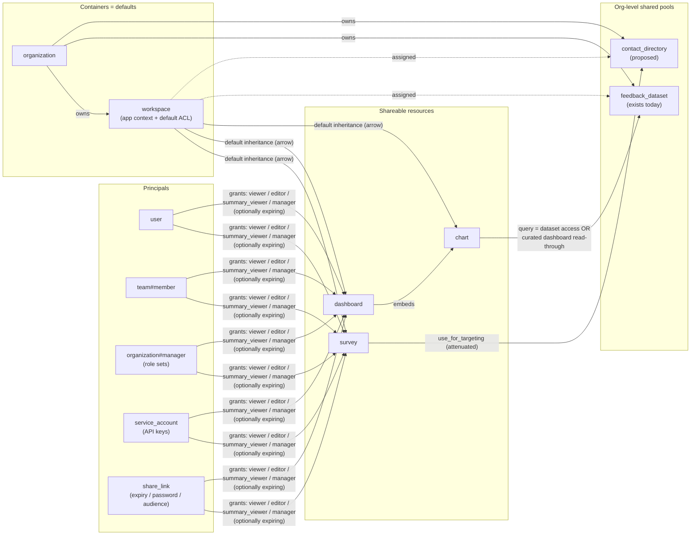

# Authorization Redesign — Research

> Research materials, July 2026. Status: **draft for discussion.** Inputs: BI/CMS enterprise requirements, the internal direction memo (hybrid RBAC + ReBAC + small ABAC, central `can()` layer), the decision to build on **SpiceDB**, and the [Figma sharing-UX starting point](https://www.figma.com/design/0Pzfoc0QjX481WBjqIZVgr/Formbricks-UI?node-id=8545-459).

This folder was split out of one large research document into focused docs, each with a single objective and audience. Start with whichever matches your role. This README is the index plus the shared technical foundation (SpiceDB primer + target-model straw-man) that the other docs reference.

**Project framing:** the Project Team has decided **not to change anything from the product angle for now** and to do the **technical implementation first**. **Scope 1 is complete when the current access approach is running on SpiceDB and we can progressively refactor it** to meet the BI/product requirements. So the migration (below) is plumbing-only; the product direction is documented as direction, explicitly deferred.

## Document map

| # | Doc | Objective | Audience |
|---|-----|-----------|----------|
| 01 | [Status Quo](./01-status-quo.md) | Show how messy/limited authorization is today — entity maps, the 7 enforcement stacks, the full issue inventory (I-1…I-35), model appendix. | Everyone onboarding to the problem |
| 02 | [Product Lens](./02-product-lens.md) | Product direction & reasoning to share with Design: decisions D1–D8, why we're *not* Linear (product-inherent dependencies), BI-requirements mapping, and **questions to clarify with BI (Thursday)**. Explicitly *not* near-term scope. | Product + Design |
| 03 | [Migration Plan](./03-migration-plan.md) | The plan to get **today's behavior** onto SpiceDB (Scope 1): Phase 0 `can()` choke point → backfill + shadow → cutover, plus the codebase refactors to do *now*. | Eng |
| 04 | [Shadow-Mode Proposal](./04-shadow-mode-proposal.md) | Proposal (product → eng): run SpiceDB in shadow mode and diff against today's logic as our internal validation harness — not a public dual-release. | Eng |
| 05 | [Competitive Reference](./05-competitive-reference.md) | How the incumbents (Qualtrics, Medallia, SurveyMonkey, Sprig/Typeform, Looker/Metabase/Tableau) solve dashboard-vs-data sharing, share-vs-move, distributions & brand kits. Fact-checked. | Product + Design |
| 06 | [Non-SpiceDB Issues](./06-non-spicedb-issues.md) | Standalone bugs/security/tech-debt found during research, in ticket-ready form — carved out so they don't clutter the SpiceDB critical path. | Triage / ticket creation |
| — | [`spicedb-schema-draft.zed`](./spicedb-schema-draft.zed) | Runnable SpiceDB schema straw-man with the day-0 parity mapping at the bottom. | Eng |

The two sections below (SpiceDB primer, target model) are shared foundation kept here because they underpin several docs rather than belonging to one.

---

## SpiceDB primer — how Zanzibar / SpiceDB thinks

*(Skip if you know SpiceDB; the target model below applies this to Formbricks.)*

SpiceDB is a database for one specific data model: **relationships** (`document:readme#viewer@user:anna`) plus a **schema** that says how relationships combine into **permissions**. The app asks one question: `CheckPermission(resource, permission, subject)` → yes/no. Everything else (roles, sharing, inheritance, groups) is *modeling*, not features you bolt on.

The schema language, in 30 seconds:

```zed
definition team {
  relation member: user
}

definition workspace {
  relation org: organization
  relation viewer: user | team#member        // subjects can be users OR whole groups
  permission view = viewer + org->admin      // union + follow-an-edge ("arrow")
}

definition survey {
  relation workspace: workspace
  relation viewer: user | team#member | share_link
  permission view = viewer + workspace->view // per-object grant OR container inheritance
}
```

The features that matter for our case:

| SpiceDB concept | What it gives Formbricks |
|---|---|
| **Subject relations** (`team#member`) | Teams-as-subjects for any grant — "share survey with team" is one tuple, membership changes propagate automatically. Also works for org-role sets: `organization:acme#manager` = "all managers", which is exactly the Figma "Roles" tab. |
| **Arrows** (`workspace->view`) | Container inheritance as *one* schema line instead of N re-implementations. The org-admin bypass (I-11) becomes a single `org->admin` term. |
| **Union `+` semantics** | "Each user's access is the sum of their role, team, and individual access" — the exact sentence in the Figma draft. Zanzibar models are additive by default. (Exclusions `-` exist but should stay out of v1 — "deny for this one person despite team grant" is a UX and model trap.) |
| **Caveats** (CEL expressions on relationships) | Small ABAC predicates: grant context stored on the relationship + request context → conditional permission. Fits region predicates (and, later, response thresholds) without inventing a policy engine. |
| **Expiring relationships** (`use expiration`, `expires_at` per tuple) | Time-boxed grants natively ("until 20 Jan 2027"), GC'd automatically. First-class in current SpiceDB. |
| **`LookupResources` / `LookupSubjects`** | "All surveys this user can view" (list pages, I-25) and "everyone with access to this survey" (the share dialog's People tab). |
| **ZedTokens / consistency levels** | Tunable read-after-write: default `minimize_latency`, use the write's ZedToken (`at_least_as_fresh`) right after ACL mutations so the share dialog never shows stale state (the "new enemy" problem). |
| **`Watch` API** | Stream of relationship changes → grant-change audit trail comes almost for free (decision-level audit still needs app logging at the `can()` gateway). |
| **`ImportBulk` / `ExportBulk`** | Backfill from Prisma and recurring reconciliation jobs. |

What SpiceDB is deliberately **not** for us:

- **Not the row filter.** Per-response / per-contact rules (cross-border, manager scoping, and later thresholds over 3–4M rows) stay in SQL/Cube predicates. SpiceDB answers *"may this actor run this query shape at all"*; the data layer shapes the rows. (Caveats can carry the parameters.)
- **Not the plan/entitlement system.** Billing limits and EE license gates stay app-level (they're org-attributes, not relationships) — this also cleanly decouples I-15.
- **Not the delivery gate.** Whether an anonymous respondent may *answer* a survey (status, pin, singleUse, segment targeting) is runtime product logic, not ACL.
- **Operationally:** one extra stateful service (Go binary + its Postgres). Cloud can use managed AuthZed or self-run; self-hosted CE ships it in docker-compose/helm pointing at the same Postgres instance (separate database). This is a real cost — decided as a hard dependency (see [Product Lens](./02-product-lens.md), decision D1 / Q13).

---

## Target model (straw-man)

*This is the end-state design the migration progresses toward — a straw-man to be challenged, and largely deferred product direction. Phase 1 (see [Migration Plan](./03-migration-plan.md)) ships none of the new capabilities; it only makes today's behavior run on this shape.*

### Design principles

1. **One vocabulary.** Every actor (user, team, org-role set, API key, share link) × every resource goes through the same `can(actor, action, resource)` gateway; the five vocabularies of I-10 become relations in one schema.
2. **Containers become defaults, not prisons.** Workspace/org grants keep working exactly as today (day-0 parity), but stop being the *only* path — per-object grants sit beside them, additively.
3. **Dependencies are explicit and attenuated:** sharing a survey never silently grants contact-PII or dataset query rights.
4. **Coarse objects only.** Tuples exist for org / workspace / team / survey / dashboard / chart / dataset / directory / service-account / share-link. Never for responses, contacts, or records (I-26).
5. **Machine principals are first-class but never special.** API keys and MCP tokens hold grants like users do — attenuation (PAT-style), not privilege escalation.

### The reorganized entity graph



What got *simpler* vs. today: one grant mechanism instead of four; org-admin bypass is one schema line; teams become ordinary subjects (they stop being the only sharing tool, fixing I-12); "personal workspace" needs no new machinery (it's a workspace whose only manager is one user — product packaging, not schema). What got *more versatile*: any principal type can hold any grant on any shareable resource, with expiry; datasets and (proposed) contact directories are org-pools assigned to workspaces — the `FeedbackDirectory` pattern generalized.

### The schema draft

See [`spicedb-schema-draft.zed`](./spicedb-schema-draft.zed) — commented, with the day-0 parity mapping at the bottom. Highlights:

- `survey` gets `editor` / `viewer` / `summary_viewer` relations whose allowed subject types are exactly the Figma tabs: `user` (People), `team#member` (Teams), `organization#manager|member` (Roles), `share_link` (Links) — plus `service_account`. Grants can carry `expiration`.
- `permission view_summary = summary_viewer + view_responses` models "can view summary but not individual responses" as a *separate verb* the app enforces by serving only aggregates (an optional `min_responses` caveat is available for a later phase — thresholds are deferred).
- `chart.query = dataset->view_records + dashboard->view` encodes the dashboard decision (D5/Q6): dataset access *or* deliberately-curated dashboard read-through — in which case the app pins the query to the chart's stored definition (no ad-hoc pivots through a shared dashboard).
- `contact_directory` separates `view_contacts` (PII) from `use_for_targeting` (evaluate segments / list attribute keys) — the attenuation seam (D4/Q7a).

### Day-0 parity

Every existing grant maps mechanically onto the schema (full table at the bottom of the `.zed` file): `Membership` → org relations, `TeamUser` → team relations, `WorkspaceTeam.read/readWrite/manage` → workspace `viewer/editor/manager` with `team#member` subjects, `ApiKeyWorkspace` → the same with `service_account` subjects, `FeedbackDirectoryWorkspace` → `feedback_dataset#workspace_access`. Backfill is a deterministic script over five Prisma tables; the [Migration Plan](./03-migration-plan.md) sequences this, and shadow-mode diffing ([Shadow-Mode Proposal](./04-shadow-mode-proposal.md)) proves parity before any enforcement flips.

### Worked examples (BI scenarios as tuples)

**External agency user edits exactly one survey** (the core BI ask):

```
survey:S1#editor@user:agency_anna[expiration:2027-01-20T00:00:00Z]
```

Anna gets edit + view_responses on S1. She does *not* get workspace access, contact PII, other surveys, or dataset queries. Open UX consequence: the targeting section of the editor must render read-only/hidden for her (she lacks `use_for_targeting`) — D4/Q7a.

**Dashboard-only viewer without dataset leak** (fixes I-3):

```
dashboard:D1#viewer@user:exec_bob
chart:C1#dashboard@dashboard:D1        // written when chart is added to D1
```

Bob sees D1 and its charts render (read-through via `dashboard->view`), but he cannot query `feedback_dataset:F1` directly, list records, or build new charts on it.

**Share link, audience-restricted** (Figma: "only team members of Leadership can edit"):

```
survey:S1#editor@share_link:L1[expiration:…]
```

Redemption flow (app-level): verify password → if the link has an audience constraint, require session user ∈ `team:leadership` (one extra Check) → act as `share_link:L1`. Revoke = delete the tuple; the Links tab lists them via `ReadRelationships`.
