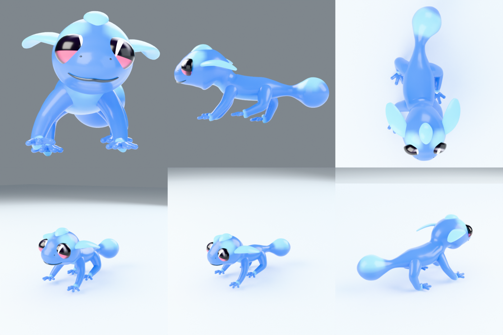
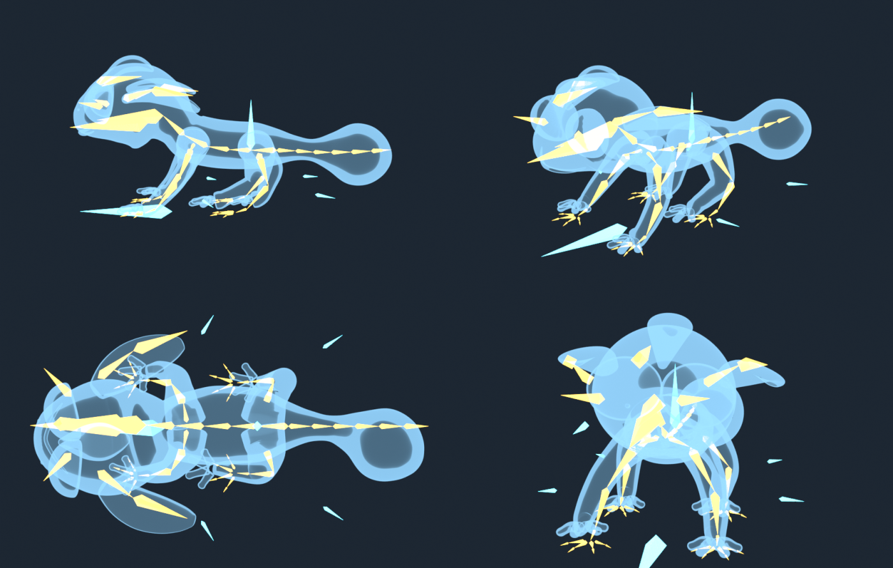
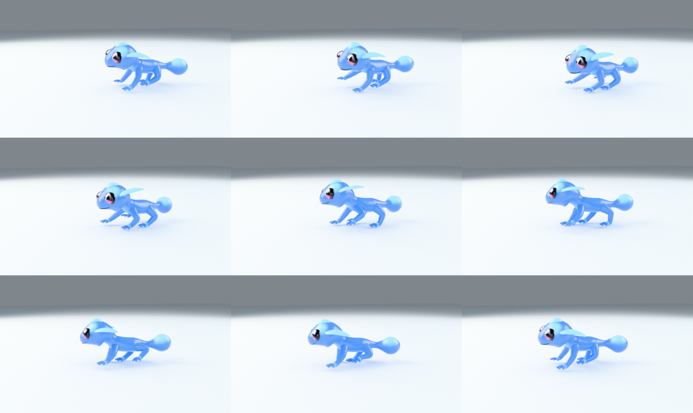

# Water Gecko

A rigged 3D model of the blue water gecko from the reference art: chibi
proportions, big pink-and-black eyes, pale cyan ear fins, a water-droplet crest
on the skull and a droplet-tipped tail. Built in Blender 4.5 LTS, and built
*procedurally* - the whole character, rig and walk cycle come out of the scripts
in `src/`, so any proportion can be changed and the file rebuilt in about
fifteen seconds.



## Files

| File | What it is |
| --- | --- |
| `water_gecko.blend` | The asset. Mesh + skeleton at rest pose, materials, a lit preview camera. The walk is stashed inside but not assigned. |
| `water_gecko_walk.blend` | Same file with `ACT_walk` assigned and the frame range set - open it and press space. |
| `water_gecko.glb` | Portable export: subdivision baked, skinning intact, walk baked to plain bone transforms. Drops into three.js, Godot, Unity, Blender, a glTF viewer. |
| `tex_gecko_eye.png` | The eye texture. Also packed inside the `.blend`, so the files are self-contained. |
| `src/` | Every script. `build.py` regenerates both `.blend` files from nothing. |
| `preview/` | `turnaround.png`, `face.png`, `rig.png`, `walk_sheet.png` and `water_gecko_walk.webm` (4 s, 24 fps). |

Rebuild everything:

```shell
blender --background --factory-startup --python src/build.py -- --out water_gecko.blend
blender -b water_gecko_walk.blend --python src/export_gltf.py -- --out water_gecko.glb
```

## The skeleton



77 bones: 66 that deform the mesh, 11 controls. Sorted into bone collections
(`Body`, `Head`, `Tail`, `Arms`, `Legs`, `Digits`, `Controls`) and colour-coded,
so you can isolate one region while animating.

```
root                        master; move/rotate the whole character
└── ctrl_body               centre of gravity
    ├── pelvis
    │   ├── spine_01 → spine_02 → spine_03
    │   │   ├── clavicle.L/R → upperarm → forearm → hand → 4 × finger{1..4}_01 → _02
    │   │   └── neck → head
    │   │       ├── jaw, crest, eye.L/R, ctrl_eyes
    │   │       └── ear_01.L/R → ear_02.L/R
    │   ├── tail_01 … tail_06
    │   └── thigh.L/R → shin → foot → 4 × toe{1..4}_01 → _02
    └── ctrl_hand_ik.L/R, ctrl_foot_ik.L/R, ctrl_elbow.L/R, ctrl_knee.L/R
```

This is the layout a sprawling reptile wants rather than a mammal one: the limbs
splay sideways from the body before dropping to the ground, so the elbow and
knee point out and back, and the spine carries a six-bone tail that can whip
independently of the hips.

### Controls

- **IK limbs.** Each limb is a two-bone IK chain solved to `ctrl_hand_ik` /
  `ctrl_foot_ik`, with `ctrl_elbow` / `ctrl_knee` as pole targets. The mid joint
  is a true hinge (Y and Z locked, X limited to -4°…152°) so it can never bend
  backwards or pop. Move a foot control and the limb follows; the hand or foot
  itself keeps the control's orientation, so a planted foot stays flat.
- **IK/FK blend.** Two custom properties on the `root` bone, `ik_front` and
  `ik_hind`, both 0..1 and driving the constraints through drivers. At 1 the
  limbs are IK, at 0 you pose `upperarm` / `forearm` / `thigh` / `shin` directly.
- **Eyes.** `eye.L` and `eye.R` aim at `ctrl_eyes`, which sits just in front of
  the face and is parented to the head. Move it and the gaze follows.
- **Everything else** is plain FK: spine, neck, head, jaw, tail, ear fins, crest,
  and every one of the 32 digit bones.

**Rotation convention: +X pitches up, everywhere.** Positive X on a tail bone
lifts the tail, on the spine arches the back, on an ear fin raises it. The jaw
follows the same rule, which means the mouth *opens* on negative X.

### Skinning

Weights are computed analytically, not painted or heat-diffused. Every piece of
geometry is a sweep along a centreline that records the arc position of each
ring, and every bone is defined as an interval of that same parameter - so a
vertex's weights come straight from where it sits along the limb, blended across
each joint with a width that scales with the local thickness. Two hand-tuned
passes on top: the chin and throat are handed to `jaw` by a smooth mask, and the
torso skin picks up a little of `upperarm` / `thigh` around the shoulder and hip
so those joints do not crease.

Every vertex has at most four influences, which is what real-time engines want.

## Geometry

| | |
| --- | --- |
| Size | 33 cm nose to tail tip, 17 cm tall, modelled to real-world scale |
| Cage | 8,008 verts, 7,742 faces - 7,684 quads plus 58 n-gon end caps, zero triangles, watertight (no non-manifold or boundary edges) |
| Rendered | Subdivision surface: 31k faces at viewport level 1, 126k at render level 2 |
| UVs | `UVMap` (per-part cylindrical, for painting) and `UVEye` (the eye decal) |
| Attributes | `accent` - the pale-cyan marking mask; `Col` - the same thing baked to vertex colour for exporters |
| Materials | `MAT_gecko_skin`, `MAT_gecko_eye`, `MAT_gecko_ink` (mouth line, nostrils) |

The skin colour is a mix between two swatches driven by the `accent` attribute,
so the whole palette changes from two colour pickers in the material rather than
from a texture. The eye is a small procedurally drawn image - dark upper iris,
pink lower band, the big downward catchlight and a vignette that keeps the iris
from smearing onto the cheek where the eye dome re-enters the skull.

## The walk



`ACT_walk` is 97 frames at 24 fps - three cycles of a **lateral-sequence walk**,
the gait sprawling reptiles actually use: hind-left, front-left, hind-right,
front-right, each a quarter cycle apart. The feet plant properly (they are
counter-animated against the root's forward travel, so a stance foot is
motionless on the ground rather than sliding), the spine carries a standing
lateral wave that the tail continues past the hips with a lag, the toes curl
during swing, and the head counter-rotates to stay level while the shoulders
swing under it. All of it is one phase variable in `src/walkcycle.py`.

Use it as-is, retime it, or delete it and key your own - it is an ordinary
action, stashed with a fake user so it survives even when nothing is using it.

## Known limitations

- No facial shape keys. The jaw bone opens the mouth; blinks would need either
  eyelid geometry or a second eye texture, neither of which is modelled.
- The eyes, ear fins, crest, mouth line and nostrils are separate closed shells
  overlapping the body rather than one welded surface. That is deliberate - it
  keeps the quad flow clean and skins reliably - but it means a boolean or a
  3D-print export wants a voxel remesh first.
- glTF cannot carry the `accent` node graph, the IK constraints or the drivers.
  The export swaps in a vertex-colour material and bakes the animation per
  frame, so it looks and moves right, but the exported rig is FK-only.
- `UVMap` islands are laid out in bands and do overlap between parts. Fine for
  procedural or vertex-colour work; unwrap again before painting a texture atlas.
