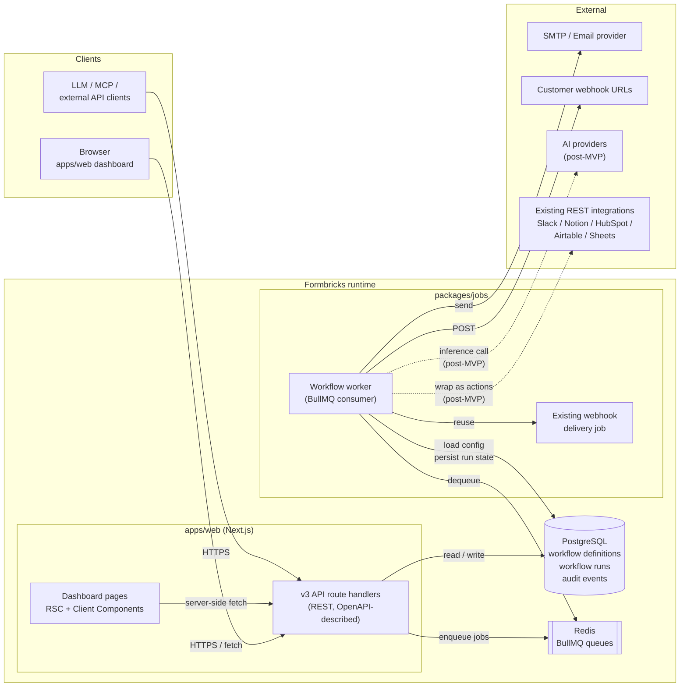
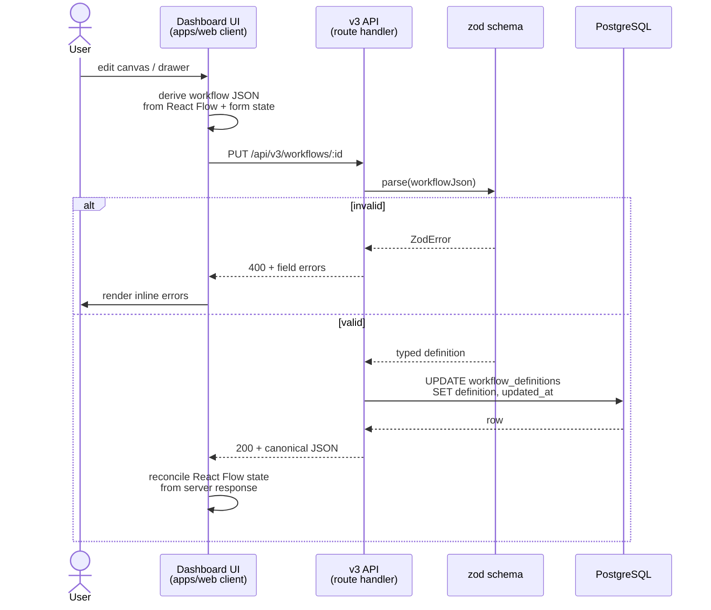
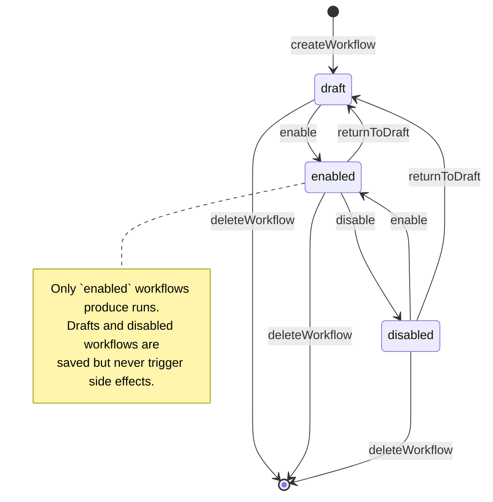
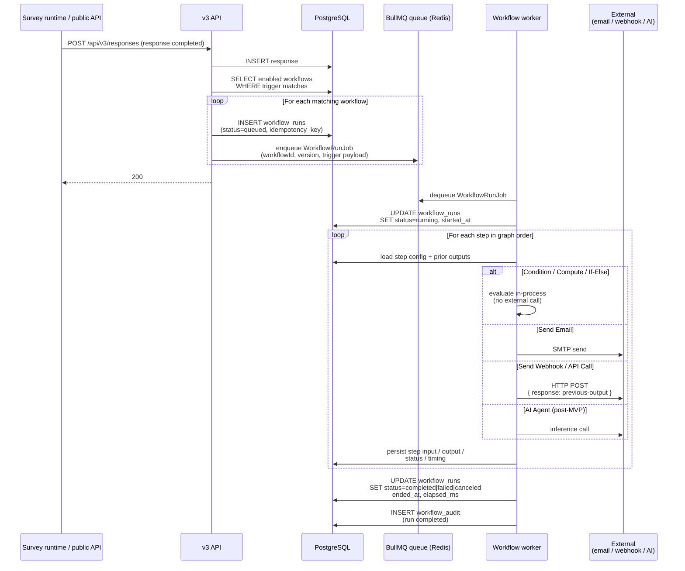
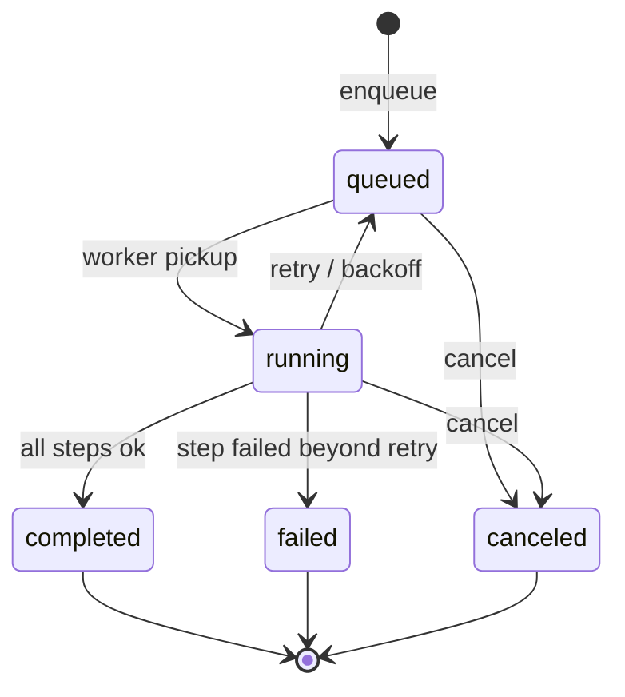
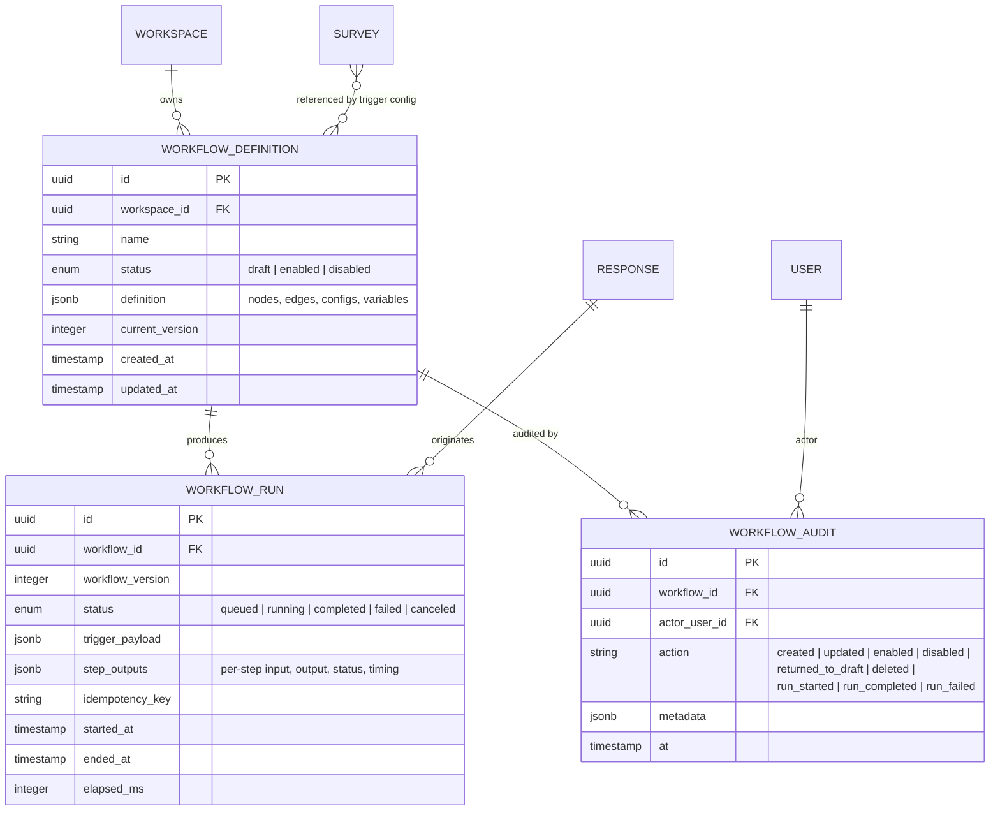
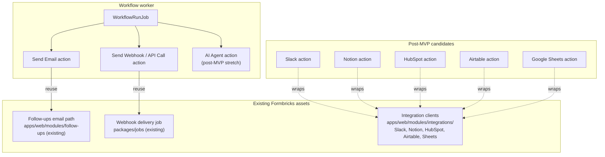

# Architecture Diagrams

Mermaid diagrams that describe how the Workflows feature wires the dashboard, the v3 API, the job
system, and the database together. The diagrams capture the **target architecture** decided in
[`decisions/001-workflows-api-first-backend-contract.md`](../../blueprint/decisions/001-workflows-api-first-backend-contract.md)
and [`decisions/002-workflows-tech.md`](../../blueprint/decisions/002-workflows-tech.md); they are not a snapshot of
what's already built.

PoC scope note: [Decision 003](../../blueprint/decisions/003-workflows-mvp-is-proof-of-concept.md) and
[Plan 001-010](../../cowork/plans/001-010-workflows-poc-vertical-slice.md) use these diagrams as the
target architecture, but the first PoC intentionally stops before real email/webhook side effects,
audit-event persistence, idempotency/retries, dry runs, OpenAPI generation, and migration of existing
Follow-ups/Webhooks.

All shapes follow the same conventions:

- Solid arrows = synchronous in-process or HTTP calls.
- Dashed arrows = asynchronous, planned, or post-MVP relationships.
- `(…)` cylinders = persistent stores. `[[ … ]]` = queues.
- Boxes inside the **Formbricks runtime** band run inside our deployment; anything in the **External**
  band lives outside our control.

---

## 1. System Component Map

The dashboard, the v3 API, and the job system are co-deployed inside `apps/web` and `packages/jobs`.
The dashboard is a **client of the v3 API**, not a special-cased peer of the backend, so an LLM, MCP,
or external customer can call the same endpoints.

**Reading the diagram:**

- The dashboard's React Server Components fetch from the same v3 API surface that external clients
  use. There are no Next.js server actions in the path for any user-facing workflow operation.
- Workflow execution is always async: the API enqueues a job; the worker drains it. The customer-
  facing request path never blocks on email, webhooks, or AI calls.
- The worker reuses `packages/jobs`' existing webhook-delivery code instead of building a new HTTP
  client.
- `INTEG` is shown dashed because no existing third-party connector is exposed as a workflow action
  in the MVP. The connection is forward-compatibility only.

---

## 2. Create / Edit Workflow Request Flow

The dashboard never writes to the database directly; it builds a workflow JSON document from the
canvas and drawer state and sends it through the v3 API.

**Reading the diagram:**

- The JSON document is the source of truth. The canvas is a view; on save, the UI reconciles its
  state from the server's canonical response rather than trusting its local copy.
- Validation lives in zod and runs on every write. The same schema feeds OpenAPI generation, so the
  v3 API contract and the workflow JSON definition can't drift.
- Lifecycle transitions (enable / disable / return-to-draft) are **separate** endpoints, not
  implicit consequences of `PUT`. See state machine in §3.

---

## 3. Workflow Lifecycle State Machine

Per the milestone and business rules, every workflow exists in exactly one of three states. Only
`enabled` workflows respond to trigger events. Transitions are enforced both in the data model and on
the v3 API.

**Reading the diagram:**

- `draft -> draft` self-edits don't appear because they aren't state transitions; they're regular
  `PUT` updates.
- `returnToDraft` is a single semantic transition exposed twice on the diagram because both `enabled`
  and `disabled` workflows can be re-opened for breaking edits.
- Delete is a terminal transition from any state. The API plan decides whether deletion is hard or
  soft.

---

## 4. Run Execution Flow

A trigger event (initially a survey response) becomes a queued job, then a worker drains it and walks
the workflow graph. Every step's input/output and status is persisted into the run record so the run
detail UI can replay execution.

**Reading the diagram:**

- The customer-facing response path is short and always returns before any side effect runs.
- One trigger event can fan out to many workflow runs — one per matching enabled workflow — each with
  its own idempotency key.
- The Send Webhook payload in MVP is a fixed envelope whose `response` field carries the previous
  action's output (or the trigger payload at the first step). Templating `{{response.x}}` into a
  user-authored body is post-MVP — see the milestone.
- The audit insert at the bottom is intentionally one row per terminal transition, not per step. Step
  detail lives inside `workflow_runs`, not in the audit log.

---

## 5. Run Status State Machine

The run status vocabulary from [`decisions/002-workflows-tech.md`](../../blueprint/decisions/002-workflows-tech.md):

**Reading the diagram:**

- Retries are represented as `running -> queued` rather than a new `retrying` status. Retry count is
  metadata on the run, not a separate phase.
- Timeouts terminate as `failed`, not as a distinct status.
- Cancellation is allowed from both `queued` and `running`. Cancelling a step does not auto-fail
  prior completed steps — their outputs remain in the run record.

---

## 6. Indicative Data Model

The exact column shape is decided in
[`plans/001-003-workflow-schema-data-model-and-permissions.md`](../../cowork/plans/001-003-workflow-schema-data-model-and-permissions.md);
the diagram below names the entities and the load-bearing relationships only.

**Reading the diagram:**

- Two tables for the two lifecycles: `WORKFLOW_DEFINITION` (mutable config) and `WORKFLOW_RUN`
  (append-heavy, per-execution). They're split to keep pagination and retention policies independent.
- `workflow_version` on the run record is what makes "enabled runs execute against the version that
  was live when triggered" possible even when no version UI ships in MVP.
- `idempotency_key` is the dedupe handle the worker uses to avoid duplicate side effects on retry.
- Names are indicative — the data-model plan owns the final column and table names.

---

## 7. Existing Asset Reuse (MVP + Post-MVP)

The MVP intentionally limits itself to two existing primitives: the webhook delivery code in
`packages/jobs` and the Follow-ups email path. Other connectors stay in place and are post-MVP
candidates for being wrapped as workflow actions later.

**Reading the diagram:**

- The two solid reuse arrows (`SE -> FU`, `SW -> WD`) are the only MVP integrations. Existing
  Follow-ups behavior must not regress; existing webhook delivery semantics must be preserved.
- The five dashed arrows describe shape, not commitments. They are the reason the workflow action
  interface in [decision 002](../../blueprint/decisions/002-workflows-tech.md) is required to absorb new connectors
  without redesign.

---

## Cross-references

- [E001 Workflows epic](../../blueprint/epics/E001-workflows.md)
- [001 Workflows MVP milestone](../../blueprint/milestones/001-workflows-mvp.md)
- [Decision 001 — API-first backend contract](../../blueprint/decisions/001-workflows-api-first-backend-contract.md)
- [Decision 002 — Technical architecture](../../blueprint/decisions/002-workflows-tech.md)
- [Business rules — glossary and scope](../../blueprint/business-rules/001-workflows-glossary-and-scope.md)
- [Plan 001-002 — API requirements and OpenAPI contract](../../cowork/plans/001-002-api-requirements-and-openapi-contract.md)
- [Plan 001-003 — Workflow schema, data model, and permissions](../../cowork/plans/001-003-workflow-schema-data-model-and-permissions.md)
- [Plan 001-004 — Execution engine and jobs](../../cowork/plans/001-004-execution-engine-and-jobs.md)
- [Plan 001-006 — Dashboard workflow builder UI](../../cowork/plans/001-006-dashboard-workflow-builder-ui.md)
- [Design guidelines — Workflows builder](../../blueprint/guidelines/design-guidelines-workflows.md)
